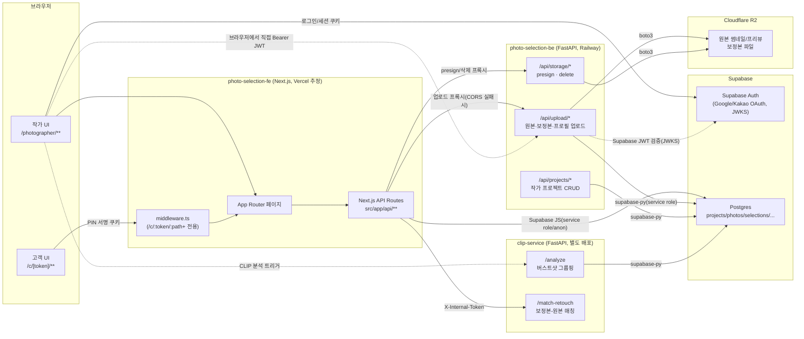
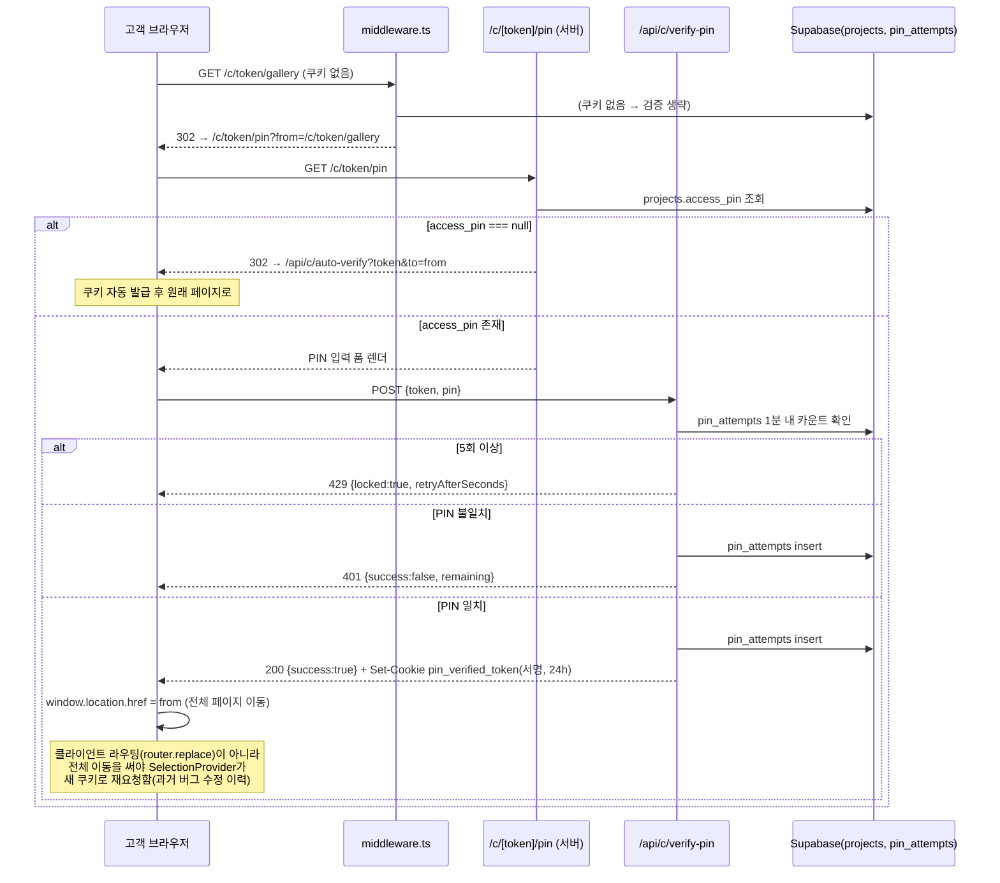
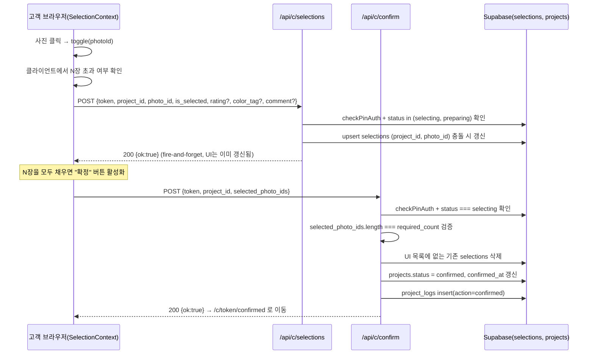

# 시스템 아키텍처

> 이 문서는 2026-07-13 기준 `photo-selection-fe`(Next.js)와 `photo-selection-be`(FastAPI, `clip-service` 포함) 실제 코드를 근거로 작성되었습니다.
> 추측이 필요한 부분은 모두 **`확인 필요`**로 표시했습니다. 값이 확인되었더라도 실제 운영 환경(Railway/Vercel/Supabase 대시보드) 설정까지 코드로 검증할 수 없는 항목은 별도로 표시합니다.
> 저장 위치는 FE 저장소(`photo-selection-fe/docs/`)이지만, 내용은 FE + BE 전체 프로젝트를 대상으로 합니다.

---

## 1. 전체 시스템 개요

**A컷(가칭)**은 사진 작가와 고객 사이의 "사진 셀렉(선택) → 보정 → 납품" 워크플로우를 디지털화한 SaaS입니다. 작가가 원본 사진을 업로드하면, 고객은 별도 회원가입 없이 PIN으로 보호된 링크로 접속해 사진을 선택·평가하고, 작가가 보정본을 전달하면 고객이 이를 검토(승인/재보정 요청)하는 구조입니다.

레포지토리는 **3개의 독립적으로 배포되는 코드베이스**로 구성됩니다.

| 구성요소 | 저장소/경로 | 역할 | 배포처 |
|---|---|---|---|
| 프론트엔드 | `photo-selection-fe` (git 저장소) | 작가/고객 UI 전체 + 자체 API 라우트(Supabase 직접 접근) | Vercel (추정, 근거는 §14) |
| 메인 백엔드 | `photo-selection-be/app` (git 저장소, 하위 폴더) | 사진/보정본 업로드 처리, R2 스토리지, 프로젝트 CRUD, JWT 인증 | Railway (`Procfile`) |
| CLIP 서비스 | `photo-selection-be/clip-service` (같은 git 저장소, 완전히 독립된 앱) | 사진 유사도(버스트샷) 그룹핑, 보정본-원본 매칭 | Railway 별도 서비스 (`clip-service/README.md` 근거, 실제 배포 여부는 `확인 필요`) |

프론트엔드는 두 가지 서로 다른 방식으로 데이터를 다룹니다.

1. **Next.js API 라우트(`src/app/api/**`) → Supabase(Postgres) 직접 접근**: 프로젝트 CRUD, 상태 전이, 고객 PIN 인증, 셀렉/별점/코멘트 저장, 보정본 검토 제출 등 대부분의 비즈니스 로직.
2. **브라우저 또는 Next API 라우트 → FastAPI 백엔드(`photo-selection-be`) 직접 HTTP 호출**: 원본 사진 업로드, 보정본 업로드, 프로필 이미지 업로드, R2 파일 삭제, presigned URL 발급 등 **이미지 바이트/파일 스토리지가 관여하는 작업 전부**.

즉 FastAPI 백엔드는 "메인 API 서버"가 아니라 **이미지 처리·R2 스토리지 전담 서비스**에 가깝고, 나머지 애플리케이션 로직(프로젝트 상태 머신, 고객 인증, DB CRUD)은 Next.js 쪽에 있습니다.

### 1.1 전체 시스템 구성도



---

## 2. 프로젝트 디렉터리 구조와 책임

### 2.1 `photo-selection-fe/`

```
src/
  app/
    photographer/**        작가 전용 페이지 (App Router)
    c/[token]/**            고객 전용 페이지 (PIN 게이트 대상)
    api/
      auth/**                Supabase Auth 콜백, 테스트 로그인
      c/**                    고객용 API (PIN 인증, 셀렉, 확정, 리뷰 등) — Supabase 직접 접근
      photographer/**         작가용 API — Supabase 직접 접근 + FastAPI 프록시
      projects/[id]/route.ts  레거시 프로젝트 수정 엔드포인트(인증 없음, §12 참고)
  components/                UI 컴포넌트 (고객/작가 공용 및 전용)
  contexts/                  SelectionContext(고객 셀렉 상태), ReviewContext(보정본 검토 상태) 등
  lib/                       Supabase 클라이언트, PIN 서명, presign 프록시, 상태 머신 등 서버/공용 유틸
  middleware.ts              /c/[token]/** 경로의 PIN 쿠키 게이트
  types/                     TS 타입, Supabase 생성 타입(`types/supabase.ts`)
supabase/migrations/         일부 증분 마이그레이션 (전체 스키마 덤프 아님, §5 참고)
tests/
  e2e/customer/**            고객 플로우 Playwright 테스트
  e2e/photographer/**        작가 플로우 Playwright 테스트
  helpers/                   테스트 로그인/픽스처 생성 헬퍼
docs/                        문서 (본 문서 포함)
```

### 2.2 `photo-selection-be/`

```
app/
  main.py            FastAPI 앱 생성, CORS 설정, 라우터 마운트, /health
  dependencies.py     Supabase JWT(JWKS) 검증 → photographer_id 조회
  database.py         Supabase 클라이언트 싱글톤 (service role)
  storage.py          R2(boto3) 및 GCS(미사용 추정) 클라이언트, presign/삭제 유틸
  routers/
    projects.py        작가 프로젝트 CRUD, R2 일괄 삭제
    upload.py           원본/보정본/프로필 이미지 업로드 (Pillow 리사이즈 포함, 769줄로 최대 파일)
    storage.py           R2 삭제·presign 엔드포인트
  models/              비어 있음 (ORM 모델 없음 — Supabase 클라이언트로 직접 쿼리)
clip-service/          완전히 독립된 FastAPI 앱 (별도 배포 단위)
  app/
    main.py             /analyze, /match-retouch, /analyze/{id}/status
    clip_model.py        CLIP(ViT-B-32-quickgelu) 임베딩
    grouping.py           인접 사진 코사인 유사도 union-find 그룹핑
    quality.py             OpenCV 블러/노출 점수로 대표컷 선정
    matcher.py              보정본 파일 ↔ 원본 사진 CLIP 유사도 매칭
    analyzer.py             전체 파이프라인 오케스트레이션
  migration.sql        수동 실행용 DDL (photo_groups 테이블 등, ORM/마이그레이션 도구 미사용)
```

---

## 3. 프론트엔드 기술 스택과 실행 구조

- **프레임워크**: Next.js `16.1.6` (App Router), React `19.2.3`, TypeScript, Tailwind CSS 4 (`package.json`).
- **React Compiler**: `next.config.ts`에서 `reactCompiler: true` 활성화 — 별도 커스텀 헤더/리다이렉트/이미지 도메인 설정은 없음.
- **폼**: `react-hook-form` + `zod`.
- **가상 스크롤**: `@tanstack/react-virtual` (대량 사진 갤러리 렌더링용, 정확한 사용처는 갤러리 페이지로 추정 — 상세 코드 라인은 `확인 필요`).
- **로컬 실행**: `npm run dev` → `next dev -p 3001` (포트 3001 고정). `dev:no-turbopack` 대안 스크립트 존재.
- **인증 클라이언트**: `@supabase/ssr` — 서버(`src/lib/supabase/server.ts`, 쿠키 기반 `createServerClient`)와 브라우저(`src/lib/supabase/client.ts`, `createBrowserClient`) 두 종류의 클라이언트를 분리해 사용. 별도로 서비스 롤 키를 쓰는 관리자 클라이언트(`src/lib/supabase-admin.ts`)가 API 라우트 내부에서 사용됨.
- **미들웨어**: `src/middleware.ts` — matcher가 `/c/:token/:path+` 하나뿐이라 **`/photographer/**` 경로는 미들웨어 보호 대상이 아님** (§11에서 상세).

---

## 4. 백엔드 기술 스택과 실행 구조

- **프레임워크**: FastAPI (버전 미고정, `requirements.txt`에 버전 핀 없음), `uvicorn`으로 구동.
- **Python**: 3.11 (`runtime.txt`, `Dockerfile`).
- **실행 명령**: `Procfile` — `uvicorn app.main:app --host 0.0.0.0 --port $PORT`. Railway는 `nixpacks.toml`을 사용(Dockerfile은 대안 빌드 경로로 존재).
- **이미지 처리**: `Pillow` + `pillow-heif`(HEIC/HEIF), `ThreadPoolExecutor`(기본 8 워커, 환경변수로 조정)로 CPU 바운드 리사이즈를 비동기 이벤트 루프에서 오프로드.
- **스토리지 클라이언트**: `boto3` S3 호환 클라이언트로 Cloudflare R2 접근(`app/storage.py`). GCS 관련 코드도 존재하나 어떤 라우터에서도 호출되지 않는 것으로 확인됨(죽은 코드로 추정).
- **DB 접근**: ORM 없음. 공식 `supabase` Python 클라이언트(PostgREST 기반)로만 접근. `app/models/`는 빈 패키지.
- **CLIP 서비스**: `clip-service/`는 메인 앱과 완전히 분리된 별도 FastAPI 앱(자체 `Dockerfile`, `requirements.txt`에 `torch`/`torchvision`/`open_clip_torch`/`opencv-python-headless` 포함). 메인 백엔드 코드(`app/`)는 어디에서도 `clip-service`를 호출하지 않음 — **프론트엔드가 `CLIP_SERVICE_URL`로 clip-service를 직접 호출**한다.
- **테스트**: 백엔드에는 자동화 테스트가 전혀 없음 (`app/`, `clip-service/` 어디에도 test 파일 없음, pytest 등 의존성 없음).

---

## 5. 주요 도메인과 데이터 모델

DB는 Supabase Postgres이며, **전체 스키마를 한 번에 덤프한 마이그레이션 파일이 없어** 아래 테이블 구조는 프론트엔드/백엔드 코드의 실제 쿼리(`select`/`insert`/`update`)와 `src/types/supabase.ts` 생성 타입에서 역으로 재구성한 것입니다. `supabase/migrations/`에는 증분 변경분만 존재합니다(예: 컬럼 추가). **DB 대시보드의 실제 제약조건(FK, NOT NULL, 기본값)과 RLS 정책 전문은 코드만으로 확인할 수 없어 `확인 필요`로 표시합니다.**

| 테이블 | 코드에서 확인된 주요 컬럼 | 비고 |
|---|---|---|
| `photographers` | `id, auth_id, email, name, profile_image_url, bio, instagram_url, portfolio_url, contact_phone, created_at` | `auth_id`는 Supabase Auth의 `user.id`. 회원가입 시 자동 생성(`src/app/auth/callback/route.ts`). |
| `projects` | `id, photographer_id, name, customer_name, shoot_date, deadline, required_count, photo_count, status, access_token, access_pin, confirmed_at, delivered_at, customer_cancel_count, max_revision_count, revision_round, review_deadline, shoot_type, customer_phone, clip_analysis_status, display_id, created_at, updated_at` | `status`는 8가지 값의 상태 머신(§9). `access_token`이 고객 링크의 토큰, `access_pin`이 4자리 PIN(nullable). |
| `photos` | `id, project_id, number, r2_thumb_url, r2_preview_url, original_filename, file_size, memo, similarity_group_id, blur_variance, is_blurry, face_detected, eyes_closed, created_at` | `number`는 `insert_photos_with_numbers` RPC로 원자적 할당(경쟁 조건 방지, `photo-selection-be/app/routers/upload.py`). `blur_variance/is_blurry/face_detected/eyes_closed`는 `clip-service/migration_002_quality_flags.sql`에서 추가된 흔들림/눈감음 경고 배지 전용 컬럼(정보성, 자동 삭제/제외 없음) — §176 아래 콜아웃 참고. |
| `selections` | `project_id, photo_id, rating, color_tag, comment, is_selected` | `(project_id, photo_id)` unique 제약으로 upsert. |
| `photo_versions` | `id, photo_id, version(1\|2), r2_url, r2_thumb_url, file_size, filename, created_at` | `(photo_id, version)` conflict로 upsert. |
| `version_reviews` | `photo_version_id, photo_id, status("approved"\|"revision_requested"), customer_comment, reviewed_at` | `photo_version_id` unique(conflict 대상). 보정본 재업로드 시 관련 행 삭제됨. |
| `project_logs` | `id, project_id, photographer_id, action, created_at` | 상태 변경 이력. |
| `pin_attempts` | `project_token, ip_address, attempted_at` | PIN 시도 rate-limit(1분 내 5회)용. |
| `photo_groups` | `id, project_id, representative_photo_id, photo_count` | CLIP 유사도 그룹. `src/types/supabase.ts` 생성 타입에는 **없음**(수동 캐스팅으로 접근). 사진 삭제 시 `delete_photo_and_resolve_group` RPC(`supabase/migrations/20260720_delete_photo_group_cleanup.sql`)가 대표컷 재지정/`photo_count` 갱신/그룹 해체를 원자적으로 처리 — `insert_photos_with_numbers`와 동일한 이유(PostgREST 다중 호출의 비원자성 방지)로 RPC화됨. |
| `deleted_photographers` | `id, deleted_at, project_count, join_month` | 계정 삭제 시 익명화 통계로 남김. |
| `photos.clip_embedding` | (컬럼) | `clip-service/migration.sql`에서 추가. CLIP 임베딩 저장. |
| `photos.blur_variance` / `is_blurry` / `face_detected` / `eyes_closed` | (컬럼) | `clip-service/migration_002_quality_flags.sql`에서 추가. 흔들림/눈감음 경고 배지용 — §6.4 참고. |

`src/types/supabase.ts` 생성 타입에 등록된 테이블은 8개(`projects, pin_attempts, photos, selections, project_logs, photographers, photo_versions, version_reviews`)뿐이며, `photo_groups`·`deleted_photographers`·`clip_analysis_*`·흔들림/눈감음 품질 컬럼들은 타입 생성 이후 추가된 것으로 보입니다(타입 재생성 여부 `확인 필요`) — FE 코드는 이 컬럼들을 전부 수동 `as {...}` 캐스팅으로 접근합니다(`src/lib/db.ts`, `src/lib/customer-api-server.ts`).

### 5.1 프로젝트 상태 머신

`src/lib/project-status.ts`의 `canTransition()`으로 실제 코드에 구현되어 있으며, `PROJECT_STATUS.md`(기존 문서)의 설명과 일치함을 확인했습니다.

| 상태 | 의미 | 다음 상태 |
|---|---|---|
| `preparing` | 작가가 프로젝트 생성, 원본 업로드 중 | `selecting` |
| `selecting` | 고객이 N장 선택 중 | `confirmed` |
| `confirmed` | 고객 확정 완료, 작가 보정 대기 | `editing`, `selecting`(확정 취소) |
| `editing` | 작가 V1 보정 중 | `reviewing_v1` |
| `reviewing_v1` | 고객 V1 검토 중 | `delivered`, `editing_v2`(재보정 한도 있을 때만) |
| `editing_v2` | 작가 V2(재보정) 작업 중 | `reviewing_v2` |
| `reviewing_v2` | 고객 V2 검토 중 | `delivered`, `editing_v2`(라운드 한도 이내 재요청 시) |
| `delivered` | 납품 완료, 종료 상태 | (없음) |

재보정 가능 여부는 `max_revision_count`(0~2)와 `revision_round`로 판단하며, 실제 상태 전이는 `submitVersionReviews()`(`src/lib/db.ts`)에서 `hasRevision && maxRevisionCount > 0 && currentRound < maxRevisionCount` 조건으로 계산됩니다.

---

## 6. 주요 페이지와 라우트

### 6.1 작가(`/photographer/**`)

| 라우트 | 파일 | 설명 |
|---|---|---|
| `/photographer/dashboard` | `src/app/photographer/dashboard/page.tsx` | 대시보드 요약 |
| `/photographer/projects` | `src/app/photographer/projects/page.tsx` | 프로젝트 목록/검색/필터 |
| `/photographer/projects/new` | `src/app/photographer/projects/new/page.tsx` | 프로젝트 생성 폼 (PIN·재보정 횟수 포함) |
| `/photographer/projects/[id]` | `ProjectNexusPageClient.tsx` | 프로젝트 상세 허브 (상태, 초대 링크, PIN, 삭제) |
| `/photographer/projects/[id]/upload` | `upload/page.tsx` | 원본 사진 업로드/관리 (메인 업로드 UI). CLIP 분석 완료 후 흔들림/눈감음 의심 사진에 경고 배지 표시(정보성, 셀렉/업로드 차단 없음) — `src/lib/photo-quality.ts`. AI 유사컷 분석 트리거는 `preparing`/`selecting` 상태 모두에서 노출(`canUploadOriginals`) — 초대 링크 활성화 이후 추가 업로드된 사진도 재분석 가능. 완료 후에는 버튼이 "새 사진 분석"으로 바뀌며 직전 분석 이후 신규 사진만 증분 분석 |
| `/photographer/projects/[id]/workflow` | `WorkflowPageClient.tsx` | **보정본 V1/V2 업로드·전달을 포함한 실사용 통합 화면.** 실제 업로드 UI는 하위 컴포넌트 `src/components/photographer/UploadVersionsPanel.tsx`가 담당하며, `src/lib/version-mapping.ts`(파일-사진 매칭)와 `src/lib/retouch-clip-match.ts`(CLIP 폴백 매칭)를 사용한다. `ProjectNexusPageClient.tsx`의 모든 보정 관련 버튼은 이 라우트로만 연결된다. |
| `/photographer/projects/[id]/results` | `results/page.tsx` | 최종 납품 결과 화면(CSV/TXT 내보내기). `confirmed`/`editing` 상태에서는 "보정 시작하기"/"보정본 업로드" 버튼과 진행단계 사이드바가 `/workflow`로 이동시킨다(2026-07-13부터 — 이전에는 `/upload-versions`로 이동했음, 아래 삭제 이력 참고). |
| `/photographer/settings` | `settings/page.tsx` | 프로필 설정, 프로필 이미지 업로드, 계정 삭제 |
| `/auth/callback` | `src/app/auth/callback/route.ts` | OAuth 콜백, `photographers` 행 자동 생성 |

**삭제된 레거시 라우트(2026-07-13)**: `/auth`(no-op 리다이렉트), `/photographer/projects/[id]/upload_backup`, `/photographer/projects/[id]/edit/start`, `/photographer/projects/[id]/edit/progress`, `/photographer/projects/[id]/upload-versions`, `/photographer/projects/[id]/upload-versions/v2`, `api/photographer/upload-versions`(프록시). 전부 코드베이스 전체 grep으로 들어오는 링크가 0건임을 확인 후 삭제했으며, `/upload-versions` 계열은 `results/page.tsx`의 버튼 3곳이 `/workflow`로 가도록 함께 수정했다. `upload/page.tsx`의 관련 미사용 변수(`editVersionsPath` 등)도 함께 정리.

### 6.2 고객(`/c/[token]/**`, 모두 PIN 게이트 대상)

| 라우트 | 설명 |
|---|---|
| `/c/[token]` | 진입점. 서버에서 `delivered` 여부·PIN 쿠키 존재 여부 우선 확인 후 클라이언트에서 상태별 재분기 |
| `/c/[token]/pin` | PIN 입력 폼 (PIN 없는 프로젝트는 `/api/c/auto-verify`로 자동 통과) |
| `/c/[token]/about` | 고객 온보딩/도움말 |
| `/c/[token]/gallery` | 사진 선택 그리드. 흔들림/눈감음 의심 사진에 경고 배지 표시(정보성, 선택/확정 차단 없음). 유사도분석이 완료된 프로젝트는 "유사컷 대표이미지 적용" 토글도 노출(기본 OFF) — 켜면 그룹별 대표컷만 보이고 나머지 멤버는 "+N" 배지를 눌러야 펼쳐짐. 가시성에 직접 영향을 주는 기능 |
| `/c/[token]/viewer/[photoId]` | 선택 단계 전체화면 뷰어(별점/색상/코멘트/선택) |
| `/c/[token]/confirmed` | 확정 직후 화면, 확정 취소(최대 3회) |
| `/c/[token]/locked` | 보정 중(`editing`/`editing_v2`) 등 읽기 전용 상태 화면 |
| `/c/[token]/review` | 보정본 검토 갤러리(모바일) / 영수증형(재보정 0회) / 데스크톱은 `/review/[photoId]`로 리다이렉트 |
| `/c/[token]/review/[photoId]` | 개별 보정본 승인/재보정 요청 뷰어 |
| `/c/[token]/delivered` | 납품 완료 화면 |

### 6.3 백엔드(FastAPI)

`/health`, `/health/db`, `/api/projects`, `/api/projects/{id}`, `/api/projects/{id}/r2`(DELETE), `/api/upload/photos`, `/api/upload/profile-image`, `/api/upload/versions`, `/api/storage/delete`, `/api/storage/presign` — 상세는 §7 참고.

### 6.4 CLIP 서비스

`/health`, `/analyze`, `/analyze/{project_id}/status`, `/match-retouch` — 모두 `X-Internal-Token` 헤더(`CLIP_INTERNAL_TOKEN`)로 보호(단 `/health` 제외).

`/analyze`의 백그라운드 파이프라인(`app/analyzer.py`)은 CLIP 유사컷 그룹핑 외에, 분석 대상이 된 모든 사진(그룹 여부 무관)에 대해 흔들림(`app/quality.py`의 절대 Laplacian 분산 임계값)과 눈감음(`app/eyes.py`, mediapipe Face Mesh 기반 Eye Aspect Ratio) 경고 플래그를 계산해 `photos.blur_variance/is_blurry/face_detected/eyes_closed`에 저장한다. 요청/응답 스펙 변경은 없음 — 결과는 기존 `photos` 조회 경로로 FE에 전달된다. 정보성 배지 전용이며 자동 삭제/제외는 하지 않는다.

**증분 분석의 배치 경계 스티칭**: 증분 분석(신규 사진끼리만 비교)은 원래 직전 배치의 마지막 사진(경계)을 비교 대상에서 제외해, 배치 경계를 넘는 연속 촬영본이 영구히 그룹화되지 않는 한계가 있었다. 이제 경계 사진의 저장된 임베딩(`photos.clip_embedding`, 재다운로드/재계산 없음)을 이번 배치 임베딩 배열 맨 앞에 포함해 함께 그룹핑한 뒤, 경계가 포함된 연결 요소만 따로 처리한다: 경계 사진이 이미 기존 그룹의 멤버였으면 신규 연결된 사진들을 그 그룹에 편입(대표컷 유지, `photo_count`만 증가), 경계 사진이 그룹에 속한 적 없었으면 경계 사진을 포함한 신규 그룹을 생성한다(이 경우에 한해 경계 사진 썸네일을 온디맨드로 1장 다운로드해 대표컷 화질 점수를 계산). `grouping.py`의 인접 비교+union-find 로직 자체는 변경 없음.

---

## 7. 주요 API 엔드포인트

### 7.1 Next.js API 라우트 (`src/app/api/**`) — Supabase 직접 접근

| 라우트 | 메서드 | 인증 | 설명 |
|---|---|---|---|
| `api/c/verify-pin` | POST | 없음(엔드포인트 자체가 인증 발급) | PIN 검증, rate limit(1분 5회), 서명 쿠키 발급 |
| `api/c/auto-verify` | GET | 없음 | PIN 없는 프로젝트에 쿠키 자동 발급 |
| `api/c/photos` | GET | PIN 쿠키 | 갤러리용 프로젝트+사진+선택+그룹 조회 |
| `api/c/selections` | POST | PIN 쿠키 | 별점/색상/코멘트/선택 upsert (`selecting`/`preparing` 상태만 허용) |
| `api/c/confirm` | POST | PIN 쿠키 | 선택 확정 → `confirmed`. `selected_photo_ids.length === required_count` 서버 재검증 |
| `api/c/cancel-confirm` | POST | PIN 쿠키 | `confirmed → selecting`, `customer_cancel_count` +1(최대 3) |
| `api/c/review`, `api/c/review-result` | GET | PIN 쿠키(review-result는 `확인 필요`, 코드 인용 부족) | 보정본 검토 데이터/결과 조회 |
| `api/c/review/submit` | POST | PIN 쿠키 | 보정본 검토 일괄 제출 → `delivered` 또는 `editing_v2` |
| `api/c/review-submit` | POST | `확인 필요` | 레거시/모크 폴백 경로로 추정(프론트 조사 보고 근거) |
| `api/c/photographer` | GET | 없음 | 토큰으로 작가 공개 프로필 조회 |
| `api/photographer/profile` | GET/PATCH | 세션 | 작가 프로필 CRUD |
| `api/photographer/account` | DELETE | 세션 | 계정 삭제(통계 익명화 후 Auth 사용자 삭제) |
| `api/photographer/projects/[id]` | PATCH/DELETE | 세션+소유권 | 프로젝트 수정(상태 전이 포함)/삭제(+FastAPI R2 정리 호출) |
| `api/photographer/projects/[id]/status` | PATCH | 세션+소유권 | 상태 전이 전용(제한적) |
| `api/photographer/projects/[id]/photos` | GET/DELETE | 세션+소유권 | 사진 목록/일괄 삭제(`preparing`만) |
| `api/photographer/projects/[id]/photo-groups` | GET | 세션+소유권 | CLIP 유사 그룹 조회 |
| `api/photographer/projects/[id]/versions` | GET | 세션+소유권 | 보정본+리뷰 조회 |
| `api/photographer/projects/[id]/versions/[versionId]` | DELETE | 세션+소유권 | 보정본 1건 삭제 |
| `api/photographer/projects/[id]/clip-analysis` | POST/GET | 세션+소유권 | CLIP 분석 트리거/폴링(clip-service 프록시) |
| `api/photographer/projects/[id]/retouch-match` | POST | 세션+소유권 | 보정본↔원본 CLIP 매칭(clip-service 프록시) |
| `api/photographer/photos/[photoId]` | DELETE | 세션+소유권 | 사진 1건 삭제(`preparing`만). RPC `delete_photo_and_resolve_group`을 호출해 소속 유사컷 그룹도 원자적으로 정리 — 대표컷 삭제 시 `blur_variance` 기준 근사치로 재지정, 멤버가 1명 이하로 줄면 그룹 해체 |
| `api/photographer/photos/[photoId]/memo` | PATCH | 세션+소유권 | 작가 메모 저장 |
| `api/photographer/upload/photos` | POST | 클라이언트 Bearer 전달(자체 검증 없음) | FastAPI 업로드 프록시(CORS 우회용). 보정본용 프록시(`api/photographer/upload-versions`)는 호출하는 곳이 없어 2026-07-13 삭제됨 — 실제 보정본 업로드는 `UploadVersionsPanel.tsx`가 FastAPI를 직접 호출 |
| `api/projects/[id]` | PATCH | **없음** | 레거시 엔드포인트, §12 위험 항목 참고 |

### 7.2 FastAPI 백엔드 (`photo-selection-be/app`)

| 메서드 | 경로 | 인증 | 설명 |
|---|---|---|---|
| GET | `/health` | 없음 | 생존 확인 |
| GET | `/health/db` | 없음 | DB 연결 확인(응답에 `photographers` 샘플 1행 포함 — §12) |
| GET/POST | `/api/projects` | Supabase JWT | 작가 프로젝트 목록/생성(베타 최대 10개) |
| GET | `/api/projects/{id}` | Supabase JWT+소유권 | 프로젝트 단건 조회 |
| DELETE | `/api/projects/{id}/r2` | Supabase JWT+소유권 | R2 객체 일괄 삭제 |
| POST | `/api/upload/photos` | Supabase JWT | 원본 업로드+썸네일/프리뷰 생성+R2 업로드+DB insert(베타 최대 3000장/프로젝트) |
| POST | `/api/upload/profile-image` | Supabase JWT | 프로필 이미지 업로드(400px) |
| POST | `/api/upload/versions` | Supabase JWT | 보정본 업로드(1500px/2MB 상한, 베타 최대 2라운드) |
| POST | `/api/storage/delete` | **없음** | R2 키 목록 삭제 — §12 위험 항목 |
| POST | `/api/storage/presign` | 정적 시크릿(`INTERNAL_PRESIGN_SECRET`) | R2 키 목록 presigned GET URL 발급 |

### 7.3 CLIP 서비스

| 메서드 | 경로 | 인증 | 설명 |
|---|---|---|---|
| GET | `/health` | 없음 | 생존 확인 |
| POST | `/analyze` | `X-Internal-Token` | 프로젝트 CLIP 유사도 분석(백그라운드 작업, 202 응답) |
| GET | `/analyze/{project_id}/status` | `X-Internal-Token` | 분석 상태 폴링 |
| POST | `/match-retouch` | `X-Internal-Token` | 보정본 파일↔원본 CLIP 매칭 |

---

## 8. 프론트엔드에서 백엔드 API를 호출하는 흐름

FE가 FastAPI(`NEXT_PUBLIC_API_URL`/`API_URL`/`BACKEND_URL`)를 호출하는 지점은 **이미지 파일이 관여하는 작업**으로 한정됩니다.

| 기능 | 호출 방식 | 대상 |
|---|---|---|
| 원본 사진 업로드 | **브라우저 → FastAPI 직접**(멀티파트+Bearer JWT), CORS/네트워크 실패(`TypeError`) 시 **Next API 프록시**(`api/photographer/upload/photos`)로 폴백 | `POST /api/upload/photos` |
| 보정본 업로드(V1/V2) | 브라우저 → FastAPI 직접 (프록시 라우트도 존재하지만 업로드 페이지들은 직접 호출을 우선 사용) | `POST /api/upload/versions` |
| 프로필 이미지 업로드 | 브라우저 → FastAPI 직접 | `POST /api/upload/profile-image` |
| R2 파일 삭제(프로젝트/사진/보정본 삭제 시) | Next API 라우트(서버) → FastAPI | `POST /api/storage/delete`, `DELETE /api/projects/{id}/r2` |
| 고객 뷰어/썸네일 presigned URL | Next API 라우트(서버, `src/lib/presign-server.ts`) → FastAPI, 서비스 시크릿 사용 | `POST /api/storage/presign` |
| CLIP 유사 그룹 분석/매칭 | Next API 라우트(서버) → **clip-service**(FastAPI 백엔드가 아님) | `POST /analyze`, `POST /match-retouch` |

**정리**: FastAPI 백엔드가 죽어도 로그인/프로젝트 CRUD/고객 PIN 인증/셀렉/보정본 검토 제출 등 대부분의 "쓰기" 기능은 Supabase가 살아있는 한 동작합니다. 다만 **원본/보정본 업로드, R2 파일 삭제, 고객 뷰어 이미지 조회(presign)**는 FastAPI가 반드시 떠 있어야 동작합니다.

### 8.1 인증 방식의 이원화

- Next.js API 라우트는 **Supabase 세션 쿠키**로 작가를 식별합니다.
- 브라우저가 FastAPI를 직접 호출할 때는 **Supabase 클라이언트에서 얻은 `access_token`(JWT)을 `Authorization: Bearer`로 직접 전달**하며, FastAPI는 이를 JWKS로 자체 검증합니다(`app/dependencies.py`). 즉 photographer의 신원 확인 로직이 FE(세션 쿠키 조회)와 BE(JWT 서명 검증)에 **각각 독립적으로 구현**되어 있습니다.
- FE→BE의 R2 삭제 프록시 호출 다수는 **Authorization 헤더 자체를 보내지 않음**(§12).

---

## 9. 고객 인증, PIN, 쿠키/토큰 처리 흐름

- 고객은 회원가입 없이 `access_token`(UUID, 링크 경로의 `[token]`)만으로 프로젝트에 접근합니다.
- 프로젝트에 `access_pin`(4자리, nullable)이 설정되어 있으면 PIN 입력이 필요하고, 없으면 자동 통과(`/api/c/auto-verify`)합니다.
- 인증 성공 시 `pin_verified_${token}`이라는 **HttpOnly, `sameSite=lax` 서명 쿠키**(HMAC-SHA256, `PIN_COOKIE_SECRET`)가 발급되며 유효기간은 24시간(`maxAge: 86400`)입니다.
- 서명 검증 로직은 **두 곳에 중복 구현**되어 있습니다: `src/middleware.ts`(Edge 런타임, Web Crypto 사용)와 `src/lib/customer-auth-server.ts`(Node 런타임, `crypto` 모듈 사용). 두 구현이 어긋나면 미들웨어 통과 여부와 실제 API 인증 결과가 달라질 수 있습니다.
- `src/middleware.ts`의 matcher는 `/c/:token/:path+`(하위 경로 1개 이상 필수)이므로, `/c/[token]` 자체(하위 경로 없음)는 미들웨어를 거치지 않습니다. 대신 서버 컴포넌트(`src/app/c/[token]/page.tsx`)가 쿠키의 **존재 여부만** 직접 확인하고(서명 검증은 하지 않음), 실제 데이터 조회(`/api/c/photos` 등)는 여전히 `checkPinAuth`로 서명까지 검증하므로 위조 쿠키로 데이터를 읽을 수는 없습니다.
- PIN 오답은 `pin_attempts` 테이블에 IP와 함께 기록되어 **토큰 기준 1분에 5회**로 제한됩니다(락아웃 시 429 + `retryAfterSeconds`).

### 9.1 고객 PIN 인증 시퀀스



---

## 10. 사진 업로드, 저장, 조회 및 썸네일 처리 흐름

1. **선택/사전 압축(브라우저)**: `src/lib/upload-client-compress.ts`에서 최대 3200px, JPEG q=0.82로 리사이즈(600KB 미만 파일은 스킵).
2. **배치 전송**: PC 8장×동시5, 모바일 3장×동시2 배치로 `XMLHttpRequest` 멀티파트 전송, `Authorization: Bearer <Supabase access_token>` 포함.
3. **전송 대상**: 우선 `NEXT_PUBLIC_API_URL` (FastAPI) 직접 호출 → 네트워크/CORS 오류 시 Next API 프록시(`/api/photographer/upload/photos`)로 폴백.
4. **백엔드 처리(`photo-selection-be/app/routers/upload.py`)**:
   - Content-Type 미확인 시 확장자로 추론.
   - EXIF 방향 보정 → 썸네일(300px, JPEG 75%) + 프리뷰(1200px, JPEG 82%) 생성(Pillow, 4000px 초과 이미지는 draft 모드로 사전 축소).
   - R2에 병렬 업로드(`photos/{photographer_id}/{project_id}/{photo_id}_(thumb|preview).jpg`), `Cache-Control: public, max-age=31536000, immutable` 적용.
   - `insert_photos_with_numbers` RPC로 `photos.number`를 원자적으로 할당하며 DB insert(경쟁 조건 방지).
   - `projects.photo_count` 갱신.
   - 베타 한도: 프로젝트당 최대 3000장(`BETA_MAX_PHOTOS_PER_PROJECT`).
5. **조회(고객 갤러리)**: `SelectionContext`가 `/api/c/photos`(Next.js, Supabase 직접 조회)를 호출해 `r2_thumb_url`/`r2_preview_url`을 그대로 사용. 별도로 뷰어의 대형 프리뷰는 `GET /api/c/presign-preview`(Next → FastAPI `/api/storage/presign` 프록시)로 서명 URL을 받아 사용하는 경로도 존재.
6. **보정본(V1/V2) 업로드**: 동일하게 브라우저 → FastAPI 직접(`/api/upload/versions`), 1500px/최대 2MB(품질 85%→60% 단계적 하향)로 리사이즈 + 400px 썸네일. `versions/{project_id}/v{version}/{photo_id}_{filename}` 키로 저장. `photo_versions` upsert 후 해당 사진의 기존 `version_reviews` 삭제(재검토 유도).
   - **파일-사진 매칭 우선순위**(`src/lib/version-mapping.ts`, `src/lib/retouch-clip-match.ts`, `UploadVersionsPanel.tsx`의 `runClipMatchPass`): ① `exact`(확장자 제외 파일명 완전 일치) → ② `fuzzy`(편집 툴 접미사·1~2자리 버전 번호 제거 후 stem 일치, 2026-07-13부터 3자리 이상 원본 순번은 보존하도록 수정 — BUG-02 참고) → ③ `clip`/`clip_low`(clip-service 이미지 유사도, 임계값 0.85/0.60) → ④ `order`(2026-07-13 추가: 위 세 단계 모두 실패한 잔여 타깃과 잔여 파일을 순서대로 짝짓는 최후 폴백). ④는 매칭 근거가 없으므로 UI에 항상 별도의 "순서" 배지(호박색, exact/fuzzy/AI의 초록·에메랄드와 구분)로 표시되어 작가가 "변경"으로 재지정할 수 있다.
7. **삭제**: 프로젝트/사진/보정본 삭제 시 Next API가 FastAPI `POST /api/storage/delete`(§12: 인증 헤더 없음)를 호출해 R2 객체를 먼저 지운 뒤 DB 행을 삭제.

---

## 11. 사진 셀렉, 별점, 코멘트 저장 흐름

- 클라이언트 상태는 `SelectionContext`(`src/contexts/SelectionContext.tsx`)가 전역으로 관리하며, `/api/c/photos`로 최초 로드합니다.
- **선택 토글**(`toggle()`): 클라이언트에서 `requiredCount(N)` 초과 선택을 막습니다(이미 N장을 채운 상태에서 새 사진 선택 시도는 무시). 별점/색상/코멘트는 건드리지 않고 `is_selected`만 전송합니다.
- **별점/색상/코멘트 저장**(`updatePhotoState()`): 사진 상태가 바뀔 때마다 fire-and-forget으로 `/api/c/selections`에 POST(낙관적 UI, 실패해도 화면은 즉시 반영되고 콘솔에만 에러 로그).
- **서버 측**(`/api/c/selections`): `checkPinAuth`로 PIN 쿠키 검증 → `validateTokenAndProject`로 토큰/프로젝트 일치 확인 → `status`가 `selecting` 또는 `preparing`일 때만 허용 → `selections` 테이블에 `(project_id, photo_id)` 기준 upsert. **N장 초과 선택에 대한 서버 측 카운트 검증은 이 엔드포인트에는 없고**, 최종 확정 시점(`/api/c/confirm`)에서만 `selected_photo_ids.length === required_count`를 강제합니다.
- **확정**(`/api/c/confirm`): PIN 인증 + `status === "selecting"` 확인 + 개수 일치 확인 후, DB에 남아있는 선택 중 UI가 보낸 목록에 없는 것만 삭제(별점/코멘트가 남아있는 다른 선택은 보존) → `projects.status = "confirmed"` → `project_logs` 기록.
- **확정 취소**(`/api/c/cancel-confirm`): `status === "confirmed"`일 때만, `customer_cancel_count < 3`일 때만 허용, `confirmed → selecting` 되돌리고 카운트 +1.

### 11.1 사진 셀렉 저장 시퀀스



---

## 12. 외부 서비스와 스토리지 연동

| 서비스 | 용도 | 연동 위치 |
|---|---|---|
| Supabase Auth | 작가 로그인(Google/Kakao OAuth), 세션 관리 | FE: `AuthModal.tsx`, `src/lib/supabase/*`; BE: JWKS 기반 JWT 검증(`app/dependencies.py`) |
| Supabase Postgres | 전체 도메인 데이터 저장 | FE: `@supabase/supabase-js`(anon/service role); BE: `supabase`(Python, service role) |
| Cloudflare R2 | 원본 썸네일/프리뷰, 보정본 파일, 프로필 이미지 저장 | BE: `boto3` S3 호환 클라이언트(`app/storage.py`) |
| Google Cloud Storage | 코드상 클라이언트는 존재하나 호출부 없음 | `app/storage.py` — 사용 여부 `확인 필요`(죽은 코드로 추정) |
| CLIP(OpenAI ViT-B-32) | 버스트샷 그룹핑, 보정본-원본 매칭 | `clip-service/` (별도 배포) |
| OpenCV | 블러/노출 기반 대표컷 자동 선정 | `clip-service/app/quality.py` |

**주의**: `AUTH_SETUP.md`(기존 문서)는 "Google 로그인"만 안내하지만, 현재 `AuthModal.tsx` 코드는 `provider: "google" | "kakao"` 두 가지를 모두 지원합니다. 다만 Kakao 프로바이더가 Supabase 대시보드에서 실제로 활성화되어 있는지는 코드로 확인할 수 없어 **`확인 필요`**입니다(기존 `ACUT_OVERVIEW.md`에는 "카카오 미구현"이라고 적혀 있어 문서 간에도 서로 불일치 — 최신 코드 기준으로 재확인 필요).

---

## 13. 권한 및 데이터 격리 구조

- **작가 데이터 격리**: 거의 모든 작가용 API 라우트가 "세션에서 `auth_id` 추출 → `photographers.id` 조회 → 대상 리소스의 `photographer_id`와 일치 확인" 패턴을 반복 구현합니다(공용 미들웨어/헬퍼로 통합되어 있지 않고 각 라우트 파일에 개별 구현).
- **`/photographer/**` 페이지 자체는 미들웨어로 보호되지 않습니다.** `src/middleware.ts`의 matcher가 `/c/:token/:path+` 하나뿐이므로, 인증되지 않은 사용자도 페이지 셸은 렌더링될 수 있고, 실제 데이터는 각 API 호출이 401을 반환할 때 비로소 막힙니다(레이아웃 자체의 렌더 타임 인증 체크는 없음).
- **레거시 미인증 라우트**: `src/app/api/projects/[id]/route.ts`(PATCH)는 세션/소유권 확인이 전혀 없이 `src/lib/db.ts`의 `updateProject()`를 직접 호출합니다. 같은 기능을 하는 `src/app/api/photographer/projects/[id]/route.ts`는 세션+소유권 검증을 하므로, 이 레거시 경로는 사용되지 않는 것으로 보이나 **엔드포인트 자체는 살아있어 확인 필요**합니다.
- **FastAPI `/api/storage/delete`는 인증 의존성이 전혀 없습니다.** 요청 가능한 누구나 임의의 R2 키 목록을 삭제 요청할 수 있는 구조입니다(코드상 사실이며, 실제 배포 환경에서 네트워크 격리 등으로 외부 접근이 막혀 있는지는 `확인 필요`).
- **고객 데이터 격리**: 고객은 `access_token` 단위로만 접근하며, 모든 고객 API가 `checkPinAuth` + `validateTokenAndProject`(토큰과 `project_id`가 실제로 같은 행을 가리키는지)를 확인합니다. 다만 `access_token` 자체가 노출되면(예: URL 공유) 그 프로젝트에는 PIN이 없거나 PIN을 아는 사람은 완전히 접근 가능합니다 — 이는 설계상 의도된 동작으로 보입니다.
- **Postgres RLS**: `AUTH_SETUP.md`가 "RLS 정책이 없으면 INSERT가 실패한다"고 언급하고 있어 RLS가 활성화되어 있을 가능성이 있으나, 정책 원문은 Supabase 대시보드에만 있고 레포지토리 코드에는 없어 **`확인 필요`**입니다. 프론트엔드 일부 클라이언트 읽기(`src/lib/db.ts`의 anon 클라이언트 사용)는 이 RLS에 의존하는 구조로 보입니다.

---

## 14. 로컬 개발, 테스트, 빌드 및 배포 구조

### 14.1 로컬 개발

- FE: `npm run dev` → `next dev -p 3001` (포트 3001 고정).
- BE: `uvicorn app.main:app --reload`로 추정되나 로컬 실행 스크립트가 레포에 명시되어 있지 않음(**확인 필요** — `Procfile`은 배포용 커맨드만 정의).
- CLIP 서비스: 로컬 실행 방법은 `clip-service/README.md`에 근거하나 본 조사에서 실행 커맨드 원문은 확인하지 않음(**확인 필요**).
- FE→BE 연동을 로컬에서 테스트하려면 `NEXT_PUBLIC_API_URL`/`BACKEND_URL`을 `http://localhost:8000`으로(기본값), CORS 허용 목록(`app/main.py`)에 `localhost:3001`이 이미 포함되어 있음.

### 14.2 테스트

- **FE**: Playwright E2E만 존재(`tests/e2e/customer/**`, `tests/e2e/photographer/**`), 단위 테스트 프레임워크는 확인되지 않음. `playwright.config.ts`는 `workers: 1`(DB 상태 일관성을 위해 순차 실행), CI가 아니면 `npm run dev -- -p 3001`을 자동 기동. 테스트 전용 API(`/api/auth/test-login`, `/api/auth/test-setup`)가 `ENABLE_TEST_LOGIN=true`일 때만 활성화됨.
- **BE / clip-service**: 자동화 테스트가 전혀 없음(코드 조사로 확인된 사실).

### 14.3 빌드/배포

- FE: `next build`/`next start`. `next.config.ts`에 별도 `output` 모드 없음. 레포에 `vercel.json`이 없어 Vercel 표준 자동 감지 방식을 쓰는 것으로 추정(**확인 필요**, 근거: `src/app/api/photographer/upload/photos/route.ts`의 `maxDuration = 60` 주석이 "Vercel Hobby 플랜 최대 60초"를 명시).
- BE: `Dockerfile` + `Procfile` + `nixpacks.toml` 모두 존재, Railway 배포로 기존 문서(`ACUT_OVERVIEW.md`)와 코드 정황(nixpacks 우선) 모두 일치.
- CLIP 서비스: `clip-service/README.md`에 따르면 Railway에 **별도 서비스**(Root Directory=`clip-service`)로 배포 — 실제 배포/가동 여부는 **확인 필요**.
- CORS 허용 목록(`app/main.py`): `localhost:3000/3001`, `127.0.0.1:3000/3001`, `https://acut.vercel.app`, `ALLOWED_ORIGINS` 환경변수의 추가 origin, 그리고 정규식 `https://*.vercel.app`(모든 Vercel 프리뷰 배포 허용, `allow_credentials=True`와 결합).

### 14.4 환경변수 (이름만, 값은 기록하지 않음)

| 범주 | FE | BE |
|---|---|---|
| Supabase | `NEXT_PUBLIC_SUPABASE_URL`, `NEXT_PUBLIC_SUPABASE_ANON_KEY`, `SUPABASE_SERVICE_ROLE_KEY` | `SUPABASE_URL`(+`NEXT_PUBLIC_SUPABASE_URL` fallback), `SUPABASE_SERVICE_ROLE_KEY`(+`SUPABASE_SECRET_KEY`/`SUPABASE_PUBLISHABLE_KEY` fallback) |
| 백엔드 연동 | `NEXT_PUBLIC_API_URL`, `API_URL`, `BACKEND_URL` | — |
| CLIP | `CLIP_SERVICE_URL`, `CLIP_INTERNAL_TOKEN` | `CLIP_INTERNAL_TOKEN`, `CLIP_SIMILARITY_THRESHOLD`, `CLIP_MODEL_NAME`, `CLIP_MODEL_PRETRAINED`, `DOWNLOAD_CONCURRENCY`, `EMBEDDING_BATCH_SIZE`, `MAX_CONCURRENT_PROJECTS` |
| PIN 인증 | `PIN_COOKIE_SECRET` | — |
| 스토리지 | `R2_HOST`(URL 파싱 화이트리스트) | `R2_ACCOUNT_ID`, `R2_ACCESS_KEY_ID`, `R2_SECRET_ACCESS_KEY`, `R2_BUCKET_NAME`, `R2_PUBLIC_URL`, `GCS_CREDENTIALS_JSON`, `GCS_BUCKET_NAME`(미사용 추정) |
| 서비스 간 시크릿 | `INTERNAL_PRESIGN_SECRET` | `INTERNAL_PRESIGN_SECRET` |
| 테스트 | `ENABLE_TEST_LOGIN`, `TEST_PHOTOGRAPHER_EMAIL`, `TEST_PHOTOGRAPHER_PASSWORD` | — |
| 기타 | `NODE_ENV`, `NEXT_PUBLIC_BLOCK_VIEWER_IMAGE_DOWNLOAD` | `ALLOWED_ORIGINS`, `UPLOAD_PHOTOS_CONCURRENCY`, `VERSION_UPLOAD_CONCURRENCY`, `IMAGE_EXECUTOR_MAX_WORKERS`, `PORT` |

---

## 15. 현재 코드에서 발견되는 주요 기술적 위험

우선순위 없이 코드에서 관찰된 사실만 나열합니다(심각도 판단은 실제 배포 환경 확인 후 별도 필요).

1. **`POST /api/storage/delete`(FastAPI)에 인증이 전혀 없음.** 이 엔드포인트에 도달할 수 있는 누구나 R2 키를 지정해 파일을 삭제할 수 있습니다. `/api/storage/presign`은 `INTERNAL_PRESIGN_SECRET`으로 보호되는 것과 대조적입니다.
2. **`/api/projects/[id]`(Next.js, PATCH)에 인증/소유권 검사가 없음.** 같은 목적의 `/api/photographer/projects/[id]`는 검증이 있어, 레거시 경로가 남아있는 것으로 보입니다.
3. **PIN 쿠키 서명 검증 로직이 두 곳(Edge/Node)에 중복 구현**되어 있어 드리프트 시 인증 우회 또는 정상 사용자 오탐 락아웃 가능성이 있습니다.
4. **FE→BE R2 삭제 프록시 호출 다수가 `Authorization` 헤더를 보내지 않음**(`versions/[versionId]`, `photos/route.ts`, `photos/[photoId]/route.ts`) — 이는 대상 엔드포인트(`/api/storage/delete`)가 애초에 인증을 요구하지 않기 때문에 발생하는 결과로 보이며, 항목 1과 같은 원인입니다.
5. **`/api/c/review-submit`(레거시)이 클라이언트가 보낸 `result` 문자열을 그대로 신뢰**하여 개별 검토 내역 검증 없이 프로젝트를 `delivered`로 전환할 수 있는 경로가 존재합니다(프론트 조사 보고 근거, 코드 재검증 권장).
6. **`/health/db`(FastAPI)가 인증 없이 `photographers` 테이블 샘플 1행을 응답 본문에 포함**합니다.
7. **`CORS allow_origin_regex`가 `https://*.vercel.app` 전체를 `allow_credentials=True`와 함께 허용**하여, 신뢰 경계가 이 프로젝트의 배포뿐 아니라 Vercel에 배포된 임의의 앱까지 넓어질 수 있습니다.
8. **서비스 간 시크릿(`INTERNAL_PRESIGN_SECRET`, `CLIP_INTERNAL_TOKEN`) 비교가 문자열 `==`/`!=` 비교**로 구현되어 있어 상수 시간 비교가 아닙니다.
9. **`selections` 저장 API에는 N장 초과 선택에 대한 서버 측 검증이 없고**, 클라이언트 로직에만 의존합니다(확정 시점에는 검증됨).
10. **대량 `print()`/`console.log` 디버그 로그가 프로덕션 경로에 남아있음** — BE의 업로드 경로 메모리 진단 로그, FE의 프로필/업로드 프록시 라우트 로그(토큰 앞 20자 등 일부 민감할 수 있는 정보 포함).
11. **백엔드/CLIP 서비스 모두 자동화 테스트가 전혀 없음** — 회귀는 FE의 Playwright E2E(주로 Supabase 직접 경로)로만 일부 커버됩니다. 업로드/삭제/presign 등 FastAPI 로직 자체를 검증하는 테스트는 없습니다.
12. **`GalleryPageClient`/뷰어 등 고객 UI 상세 코드는 이번 조사에서 표면적으로만 확인**했습니다 — 가상 스크롤 구현 세부사항, 무한 스크롤 여부 등은 §16 참고.
13. ~~레거시 페이지 `/photographer/projects/[id]/upload-versions`, `.../upload-versions/v2`~~ — 2026-07-13 삭제됨(§6.1 삭제 이력 참고). 해당 페이지 고유의 매칭 렌더링 버그도 코드와 함께 제거되어 더 이상 해당 없음.

---

## 16. 확인이 필요한 불명확한 부분

- Supabase 테이블의 실제 컬럼 제약(NOT NULL, 기본값, FK), 인덱스, 그리고 **RLS 정책 전문** — 코드에는 정책 원문이 없어 Supabase 대시보드 확인 필요.
- `clip-service`가 현재 Railway에 실제로 배포·가동 중인지, 가동 중이라면 `CLIP_SERVICE_URL`이 프로덕션 환경변수에 정확히 설정되어 있는지.
- Kakao OAuth 프로바이더가 Supabase Auth 대시보드에서 실제로 활성화되어 있는지(코드는 지원하지만 기존 문서와 불일치, §12).
- FE가 실제로 Vercel에 배포되는지에 대한 결정적 설정 파일(`vercel.json` 등)이 레포에 없어 정황 증거(코드 주석)로만 추정.
- 로컬에서 `photo-selection-be`/`clip-service`를 기동하는 정확한 커맨드(README 존재 여부와 내용은 이번 조사에서 전문 확인하지 않음).
- `/api/storage/delete`가 실제 운영 환경에서 Railway 프라이빗 네트워크 등으로 외부 접근이 제한되어 있는지(코드만으로는 "인증 없음"만 확인 가능, 네트워크 계층 보호 여부는 별개).
- `/api/c/review-result`, `/api/c/review-submit`의 정확한 호출 조건과 `mock-data.ts` 폴백이 실제로 트리거되는 상황(토큰 오타 등) — 프론트 조사 보고에 근거했으며 직접 코드 재검증은 하지 않음.
- `TanStack Virtual`이 실제로 어느 페이지의 가상 스크롤에 적용되어 있는지 구체적 파일:라인.
- `src/types/supabase.ts` 타입이 최신 스키마(예: `photo_groups`, `clip_analysis_*` 컬럼 포함) 기준으로 재생성되었는지 여부.
- 로컬 개발 시 `photo-selection-be`와 `clip-service`를 동시에 띄워야 전체 기능이 동작하는지, 아니면 CLIP 관련 기능만 선택적으로 비활성화되는지(에러 핸들링 여부).
