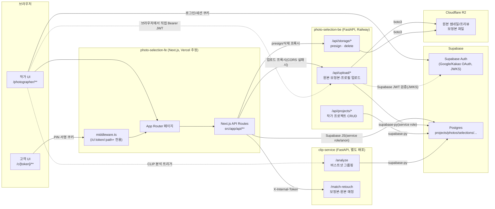
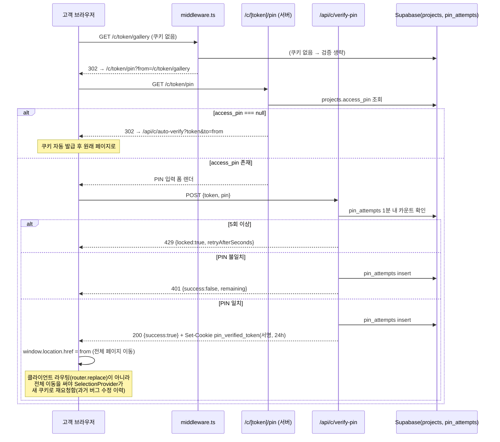
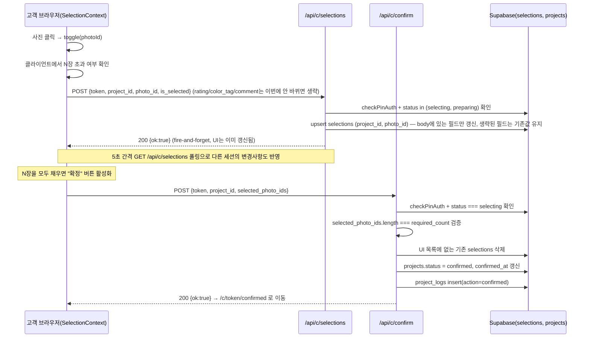

# 시스템 아키텍처

> 이 문서는 2026-07-13 기준 `photo-selection-fe`(Next.js)와 `photo-selection-be`(FastAPI, `clip-service` 포함) 실제 코드를 근거로 작성되었습니다.
> 추측이 필요한 부분은 모두 **`확인 필요`**로 표시했습니다. 값이 확인되었더라도 실제 운영 환경(Railway/Vercel/Supabase 대시보드) 설정까지 코드로 검증할 수 없는 항목은 별도로 표시합니다.
> 저장 위치는 FE 저장소(`photo-selection-fe/docs/`)이지만, 내용은 FE + BE 전체 프로젝트를 대상으로 합니다.

---

## 1. 전체 시스템 개요

**A컷(가칭)**은 사진 작가와 고객 사이의 "사진 셀렉(선택) → 보정 → 납품" 워크플로우를 디지털화한 SaaS입니다. 작가가 원본 사진을 업로드하면, 고객은 별도 회원가입 없이 PIN으로 보호된 링크로 접속해 사진을 선택·평가하고, 작가가 보정본을 전달하면 고객이 이를 검토(승인/재보정 요청)하는 구조입니다.

레포지토리는 **3개의 독립적으로 배포되는 코드베이스**로 구성됩니다.

| 구성요소 | 저장소/경로 | 역할 | 배포처 |
|---|---|---|---|
| 프론트엔드 | `photo-selection-fe` (git 저장소) | 작가/고객 UI 전체 + 자체 API 라우트(Supabase 직접 접근) | Vercel (추정, 근거는 §14) |
| 메인 백엔드 | `photo-selection-be/app` (git 저장소, 하위 폴더) | 사진/보정본 업로드 처리, R2 스토리지, 프로젝트 CRUD, JWT 인증 | Railway (`Procfile`) |
| CLIP 서비스 | `photo-selection-be/clip-service` (같은 git 저장소, 완전히 독립된 앱) | 사진 유사도(버스트샷) 그룹핑, 보정본-원본 매칭 | Railway 별도 서비스 (`clip-service/README.md` 근거, 실제 배포 여부는 `확인 필요`) |

프론트엔드는 두 가지 서로 다른 방식으로 데이터를 다룹니다.

1. **Next.js API 라우트(`src/app/api/**`) → Supabase(Postgres) 직접 접근**: 프로젝트 CRUD, 상태 전이, 고객 PIN 인증, 셀렉/별점/코멘트 저장, 보정본 검토 제출 등 대부분의 비즈니스 로직.
2. **브라우저 또는 Next API 라우트 → FastAPI 백엔드(`photo-selection-be`) 직접 HTTP 호출**: 원본 사진 업로드, 보정본 업로드, 프로필 이미지 업로드, R2 파일 삭제, presigned URL 발급 등 **이미지 바이트/파일 스토리지가 관여하는 작업 전부**.

즉 FastAPI 백엔드는 "메인 API 서버"가 아니라 **이미지 처리·R2 스토리지 전담 서비스**에 가깝고, 나머지 애플리케이션 로직(프로젝트 상태 머신, 고객 인증, DB CRUD)은 Next.js 쪽에 있습니다.

### 1.1 전체 시스템 구성도


```mermaid
flowchart LR
    subgraph Client["브라우저"]
        Photographer["작가 UI\n/photographer/**"]
        Customer["고객 UI\n/c/[token]/**"]
    end

    subgraph FE["photo-selection-fe (Next.js, Vercel 추정)"]
        Pages["App Router 페이지"]
        ApiRoutes["Next.js API Routes\nsrc/app/api/**"]
        Middleware["middleware.ts\n(/c/:token/:path+ 전용)"]
    end

    subgraph BE["photo-selection-be (FastAPI, Railway)"]
        Upload["/api/upload/*\n원본·보정본·프로필 업로드"]
        Storage["/api/storage/*\npresign · delete"]
        Projects["/api/projects/*\n작가 프로젝트 CRUD"]
    end

    subgraph CLIP["clip-service (FastAPI, 별도 배포)"]
        Analyze["/analyze\n버스트샷 그룹핑"]
        Match["/match-retouch\n보정본-원본 매칭"]
    end

    subgraph Supabase["Supabase"]
        Auth["Supabase Auth\n(Google/Kakao OAuth, JWKS)"]
        DB["Postgres\nprojects/photos/selections/..."]
    end

    subgraph R2["Cloudflare R2"]
        Objects["원본 썸네일/프리뷰\n보정본 파일"]
    end

    Photographer -->|"로그인/세션 쿠키"| Auth
    Photographer --> Pages
    Customer -->|"PIN 서명 쿠키"| Middleware
    Middleware --> Pages
    Pages --> ApiRoutes
    ApiRoutes -->|"Supabase JS(service role/anon)"| DB
    ApiRoutes -->|"presign/삭제 프록시"| Storage
    ApiRoutes -->|"업로드 프록시(CORS 실패 시)"| Upload
    Photographer -.->|"브라우저에서 직접 Bearer JWT"| Upload
    Photographer -.->|"CLIP 분석 트리거"| Analyze
    ApiRoutes -->|"X-Internal-Token"| Match
    Upload -->|"boto3"| Objects
    Storage -->|"boto3"| Objects
    Upload -->|"supabase-py(service role)"| DB
    Projects -->|"supabase-py"| DB
    Analyze -->|"supabase-py"| DB
    Upload -.->|"Supabase JWT 검증(JWKS)"| Auth
```

---

## 2. 프로젝트 디렉터리 구조와 책임

### 2.1 `photo-selection-fe/`

```
src/
  app/
    photographer/**        작가 전용 페이지 (App Router)
    c/[token]/**            고객 전용 페이지 (PIN 게이트 대상)
    api/
      auth/**                Supabase Auth 콜백, 테스트 로그인
      c/**                    고객용 API (PIN 인증, 셀렉, 확정, 리뷰 등) — Supabase 직접 접근
      photographer/**         작가용 API — Supabase 직접 접근 + FastAPI 프록시
      projects/[id]/route.ts  레거시 프로젝트 수정 엔드포인트(인증 없음, §12 참고)
  components/                UI 컴포넌트 (고객/작가 공용 및 전용)
  contexts/                  SelectionContext(고객 셀렉 상태), ReviewContext(보정본 검토 상태) 등
  lib/                       Supabase 클라이언트, PIN 서명, presign 프록시, 상태 머신 등 서버/공용 유틸
  middleware.ts              /c/[token]/** 경로의 PIN 쿠키 게이트
  types/                     TS 타입, Supabase 생성 타입(`types/supabase.ts`)
supabase/migrations/         일부 증분 마이그레이션 (전체 스키마 덤프 아님, §5 참고)
tests/
  e2e/customer/**            고객 플로우 Playwright 테스트
  e2e/photographer/**        작가 플로우 Playwright 테스트
  helpers/                   테스트 로그인/픽스처 생성 헬퍼
docs/                        문서 (본 문서 포함)
```

### 2.2 `photo-selection-be/`

```
app/
  main.py            FastAPI 앱 생성, CORS 설정, 라우터 마운트, /health
  dependencies.py     Supabase JWT(JWKS) 검증 → photographer_id 조회
  database.py         Supabase 클라이언트 싱글톤 (service role)
  storage.py          R2(boto3) 및 GCS(미사용 추정) 클라이언트, presign/삭제 유틸
  routers/
    projects.py        작가 프로젝트 CRUD, R2 일괄 삭제
    upload.py           원본/보정본/프로필 이미지 업로드 (Pillow 리사이즈 포함, 769줄로 최대 파일)
    storage.py           R2 삭제·presign 엔드포인트
  models/              비어 있음 (ORM 모델 없음 — Supabase 클라이언트로 직접 쿼리)
clip-service/          완전히 독립된 FastAPI 앱 (별도 배포 단위)
  app/
    main.py             /analyze, /match-retouch, /analyze/{id}/status
    clip_model.py        CLIP(ViT-B-32-quickgelu) 임베딩
    grouping.py           인접 사진 코사인 유사도 union-find 그룹핑
    quality.py             OpenCV 블러/노출 점수로 대표컷 선정
    matcher.py              보정본 파일 ↔ 원본 사진 CLIP 유사도 매칭
    analyzer.py             전체 파이프라인 오케스트레이션
    gemini_client.py        (2026-07-28 추가) Gemini 멀티모달 임베딩 API 래퍼 — POC 전용
    gemini_analyzer.py       (2026-07-28 추가) Gemini 파이프라인 오케스트레이션 + threshold 재계산
    gemini_embeddings_store.py (2026-07-28 추가) gemini_embeddings 테이블 CRUD
    gemini_state.py           (2026-07-28 추가) Gemini 전용 in-flight 가드 (OpenCLIP과 별도)
    gemini_quality_client.py     (2026-07-28 추가) Gemini Flash 품질 판정 API 래퍼 — POC 전용
    gemini_quality_analyzer.py    (2026-07-28 추가) Flash 품질 판정 파이프라인
    gemini_quality_store.py        (2026-07-28 추가) gemini_quality_assessments 테이블 CRUD
    gemini_quality_state.py          (2026-07-28 추가) Flash 품질 판정 전용 in-flight 가드(3번째 독립 세트)
  migration.sql        수동 실행용 DDL (photo_groups 테이블 등, ORM/마이그레이션 도구 미사용)
  migration_002_quality_flags.sql  흔들림/눈감음 경고 배지용 컬럼
  migration_003_gemini_poc.sql     (2026-07-28 추가) Gemini Embedding POC 전용 신규 테이블 2개, 기존 스키마 무변경
  migration_004_gemini_quality_poc.sql  (2026-07-28 추가) Gemini Flash 품질 판정 POC 전용 신규 테이블 2개
  migration_005_gemini_embedding_cache_fields.sql  (2026-07-28 추가, 베타 전환) gemini_embeddings에 embedding_version/source_object_key 컬럼 추가, UNIQUE 제약을 (project_id, photo_id, embedding_model, dimension, embedding_version)로 재정의
```

---

## 3. 프론트엔드 기술 스택과 실행 구조

- **프레임워크**: Next.js `16.1.6` (App Router), React `19.2.3`, TypeScript, Tailwind CSS 4 (`package.json`).
- **React Compiler**: `next.config.ts`에서 `reactCompiler: true` 활성화 — 별도 커스텀 헤더/리다이렉트/이미지 도메인 설정은 없음.
- **폼**: `react-hook-form` + `zod`.
- **가상 스크롤**: `@tanstack/react-virtual` (대량 사진 갤러리 렌더링용, 정확한 사용처는 갤러리 페이지로 추정 — 상세 코드 라인은 `확인 필요`).
- **로컬 실행**: `npm run dev` → `next dev -p 3001` (포트 3001 고정). `dev:no-turbopack` 대안 스크립트 존재.
- **인증 클라이언트**: `@supabase/ssr` — 서버(`src/lib/supabase/server.ts`, 쿠키 기반 `createServerClient`)와 브라우저(`src/lib/supabase/client.ts`, `createBrowserClient`) 두 종류의 클라이언트를 분리해 사용. 별도로 서비스 롤 키를 쓰는 관리자 클라이언트(`src/lib/supabase-admin.ts`)가 API 라우트 내부에서 사용됨.
- **미들웨어**: `src/middleware.ts` — matcher가 `/c/:token/:path+` 하나뿐이라 **`/photographer/**` 경로는 미들웨어 보호 대상이 아님** (§11에서 상세). PIN 미인증 시 `/pin?from=<pathname+search>`로 리다이렉트하며 원래 URL의 쿼리스트링까지 보존한다(`pathname + req.nextUrl.search`) — PIN 인증 완료 후 `PinForm`이 `from`으로 복귀하므로, 쿼리 파라미터가 붙은 딥링크(예: 뷰어의 `?grouped=1`)로 최초 접근해도 인증 왕복 후 그대로 유지된다.

---

## 4. 백엔드 기술 스택과 실행 구조

- **프레임워크**: FastAPI (버전 미고정, `requirements.txt`에 버전 핀 없음), `uvicorn`으로 구동.
- **Python**: 3.11 (`runtime.txt`, `Dockerfile`).
- **실행 명령**: `Procfile` — `uvicorn app.main:app --host 0.0.0.0 --port $PORT`. Railway는 `nixpacks.toml`을 사용(Dockerfile은 대안 빌드 경로로 존재).
- **이미지 처리**: `Pillow` + `pillow-heif`(HEIC/HEIF), `ThreadPoolExecutor` 3개로 CPU/I/O 작업을 비동기 이벤트 루프에서 오프로드.
  - `_executor`(`IMAGE_EXECUTOR_MAX_WORKERS`, 기본 8): `/api/upload/photos`(썸네일/프리뷰 생성) 외 나머지 전체 — 보정본 리사이즈+R2 업로드, 원본 압축(`/originals/*`), 프로필 이미지 리사이즈+업로드, R2 head/get/delete가 공용으로 사용. 변경 없음.
  - `_cpu_executor`(`PILLOW_EXECUTOR_MAX_WORKERS`, 기본 4) / `_r2_executor`(`R2_EXECUTOR_MAX_WORKERS`, 기본 6): `/api/upload/photos`의 `_process_one`(썸네일/프리뷰 Pillow 생성 → R2 PUT 2건) 전용으로 분리. 단일 요청 실측에서는 큐 대기 ~0ms로 차이가 없었지만, **동시 2요청** 실측에서 공유 `_executor` 경쟁으로 Pillow/R2 큐 대기가 수백 ms까지 증가하는 것을 확인해 분리함 — R2 큐 대기 -78~87%, 전체 처리시간 -9%(2026-08-04, `app/routers/upload.py`).
  - 스레드 상한 총합은 8 → 8(공용, 변경 없음)+4(CPU)+6(R2)=18로 늘었음. **전체 프로세스의 Pillow 동시성이 줄어든 것은 아니다** — `_executor`(8)는 원본 압축(`_process_original_sync`)·프로필 이미지·보정본 리사이즈 등 다른 CPU 작업을 여전히 그대로 처리하므로, `/api/upload/photos` 썸네일/프리뷰 생성이 `_cpu_executor`로 옮겨간 뒤에는 **그 경로만 놓고 보면 동시 실행 수가 4로 제한**될 뿐이고(기존엔 세마포어 `UPLOAD_PHOTOS_CONCURRENCY`=5가 사실상 상한), `_executor`의 다른 CPU 작업과 `_cpu_executor`가 서로 다른 스레드풀에서 동시에 물리 코어를 나눠 쓰는 상황 자체는 이전보다 더 생길 수 있다. R2 풀(6)은 압축된 JPEG 바이트(수십~수백 KB)만 들고 네트워크를 기다리는 순수 I/O라 스레드 수 증가가 메모리 위험으로 이어지지 않음.
  - **혼합 부하 검증(2026-08-04)**: `/api/upload/photos`(썸네일/프리뷰, `_cpu_executor`+`_r2_executor`)와 원본 압축 워커(`original_compress_worker` → `_process_original_sync`, `_executor`)가 동시에 도는 상황을 재현 — 원본 8건(각 21MB PNG, 강제로 Pillow 인코드 유발) pending 전환 직후 일반 25장(12MP) 업로드를 병행 실행. 결과: 일반 업로드 처리시간 5.37s(단독 실행 시 5.31s와 동일 수준, 유의미한 지연 없음), CPU는 두 작업이 겹치는 구간에서 최대 277%(멀티코어)까지 순간적으로 튀었다가 이후 유휴로 복귀, peak RSS 695MB, 원본 job 8건 전부 `completed`, 에러/OOM/프로세스 재시작 없음(같은 PID 유지). 실측(fresh 프로세스, 단일 요청 기준) peak RSS는 12MP 약 640MB(기준 152MB, +488MB), 24MP(draft 디코드 경로) 약 578MB(기준 233MB, +345MB) — 두 경우 모두 에러/OOM 없음. `IMAGE_EXECUTOR_MAX_WORKERS` 자체는 이번에 조정하지 않음.
- **스토리지 클라이언트**: `boto3` S3 호환 클라이언트로 Cloudflare R2 접근(`app/storage.py`). GCS 관련 코드도 존재하나 어떤 라우터에서도 호출되지 않는 것으로 확인됨(죽은 코드로 추정).
- **DB 접근**: ORM 없음. 공식 `supabase` Python 클라이언트(PostgREST 기반)로만 접근. `app/models/`는 빈 패키지.
- **CLIP 서비스**: `clip-service/`는 메인 앱과 완전히 분리된 별도 FastAPI 앱(자체 `Dockerfile`, `requirements.txt`에 `torch`/`torchvision`/`open_clip_torch`/`opencv-python-headless` 포함). 메인 백엔드 코드(`app/`)는 어디에서도 `clip-service`를 호출하지 않음 — **프론트엔드가 `CLIP_SERVICE_URL`로 clip-service를 직접 호출**한다.
- **Gemini Embedding — 베타 유사컷 분석 엔진** (2026-07-28 도입, 같은 날 베타 전환): 같은 `clip-service` 프로세스 안에 OpenCLIP 파이프라인과 완전히 독립된 `/analyze/gemini*` 엔드포인트로 추가됨(별도 서비스 아님). 최초에는 관리자 전용 POC(OpenCLIP과 결과 비교 목적)로 도입됐으나, 같은 날 **베타 공개 시점에 작가 업로드 화면의 `[AI 유사도 분석]` 버튼이 호출하는 대상 자체가 OpenCLIP(`/analyze`)에서 Gemini(`/analyze/gemini`)로 전환**되어 지금은 모든 베타 사용자가 쓰는 실사용 엔진이다. `google-genai` SDK로 `gemini-embedding-2` 멀티모달 모델을 호출해 이미지 임베딩을 생성하고, 그룹핑 알고리즘(`grouping.py`)은 OpenCLIP과 동일하게 재사용한다. 임베딩 자체는 신규 테이블(`gemini_analysis_runs`, `gemini_embeddings`)에만 저장하지만, 계산된 그룹 결과는 `sync_groups_to_db()`가 **기존 운영 스키마(`photo_groups`/`photos.similarity_group_id`)에 그대로 반영(persist)**한다 — 작가 업로드 화면과 고객 갤러리의 "유사컷 대표이미지 적용" 관련 코드는 엔진이 무엇이든 동일한 스키마를 읽으므로 전혀 수정할 필요가 없었다. 흔들림/눈감음 품질 판정(OpenCV/MediaPipe)은 이 전환에 포함되지 않으며 베타 흐름에서 완전히 빠졌다(§6.4/§6.6 참고, 향후 재도입 시에는 §6.7의 Gemini Flash를 쓴다). §6.6, §7.4 참고.
- **테스트**: 백엔드에는 자동화 테스트가 전혀 없음 (`app/`, `clip-service/` 어디에도 test 파일 없음, pytest 등 의존성 없음).

---

## 5. 주요 도메인과 데이터 모델

DB는 Supabase Postgres이며, **전체 스키마를 한 번에 덤프한 마이그레이션 파일이 없어** 아래 테이블 구조는 프론트엔드/백엔드 코드의 실제 쿼리(`select`/`insert`/`update`)와 `src/types/supabase.ts` 생성 타입에서 역으로 재구성한 것입니다. `supabase/migrations/`에는 증분 변경분만 존재합니다(예: 컬럼 추가). **DB 대시보드의 실제 제약조건(FK, NOT NULL, 기본값)과 RLS 정책 전문은 코드만으로 확인할 수 없어 `확인 필요`로 표시합니다.**

| 테이블 | 코드에서 확인된 주요 컬럼 | 비고 |
|---|---|---|
| `photographers` | `id, auth_id, email, name, profile_image_url, bio, instagram_url, portfolio_url, contact_phone, created_at, beta_status("not_invited"\|"active"\|"ended"\|"suspended"), beta_start_date, beta_end_date, admin_note, total_projects_created` | `auth_id`는 Supabase Auth의 `user.id`. 회원가입 시 자동 생성(`src/app/auth/callback/route.ts`). 등급(관리자/베타/일반) 컬럼은 2026-07-26 베타 등급 시스템에서 추가(`supabase/migrations/20260726_beta_tier_system.sql`) — 기존 가입자도 그랜드파더링 없이 `beta_status='not_invited'`(일반)로 시작. `total_projects_created`는 삭제해도 감소하지 않는 누적 생성 카운터로 설계됐으나, 2026-07-26 정책 변경(커밋 `2b2e241`/`818affc`)으로 일반 사용자 한도 판정이 "현재 보유 수" 기준으로 바뀌면서 **더 이상 어떤 검증 로직에서도 읽히지 않는 컬럼**이 됐다(계속 +1은 되지만 사용처 없음) — §6.3, §13 참고. |
| `projects` | `id, photographer_id, name, customer_name, shoot_date, deadline, required_count, photo_count, status, access_token, access_pin, confirmed_at, delivered_at, customer_cancel_count, max_revision_count, revision_round, review_deadline, shoot_type, customer_phone, clip_analysis_status, display_id, include_original, original_archive_status, original_download_started_at, original_archive_processing_started_at, created_at, updated_at` | `status`는 8가지 값의 상태 머신(§9). `access_token`이 고객 링크의 토큰, `access_pin`이 4자리 PIN(nullable). `original_archive_status`(신규, `20260731_original_archive_download.sql`, `NULL/pending/processing/ready/failed`)는 납품용 원본 다운로드 ZIP 아카이브 생성 상태 — `include_original=true`이고 `original_download_started_at`(신규, 초대 링크 최초 활성화 시각, 재전달로 초기화 안 됨)가 있어야 고객 화면에 다운로드가 노출된다. 아카이브 생성 흐름은 `user-flow.md` §8.2 참고. |
| `photos` | `id, project_id, number, r2_thumb_url, r2_preview_url, original_filename, file_size, memo, similarity_group_id, blur_variance, is_blurry, face_detected, eyes_closed, r2_original_url, original_ready_at, original_status, original_compressed_size, created_at` | `number`는 `insert_photos_with_numbers` RPC로 원자적 할당. `similarity_group_id`는 이제 Gemini(`sync_groups_to_db`)가 채우는 살아있는 컬럼(§6.6). `blur_variance/is_blurry/face_detected/eyes_closed`는 원래 OpenCLIP 파이프라인(`analyzer.py`)이 채우던 흔들림/눈감음 경고 배지 전용 컬럼인데, **베타 버튼이 Gemini로 전환(2026-07-28)되며 더 이상 어떤 실행에서도 채워지지 않는다** — 과거 OpenCLIP으로 분석된 프로젝트에 한해 값이 남아있을 뿐 신규 분석 대상은 아님(§6.5/§13). `original_status`(`awaiting_upload`→`pending`→`processing`→`completed`/`failed`)는 원본 파일 비동기 검증 상태 — `include_original=true` 업로드 시에만 설정됨. **(2026-08-06 정정)** `original_compress_worker`는 재압축을 하지 않으므로 `r2_original_url`은 브라우저가 presigned PUT으로 올린 `originals/source/{project_id}/{hex}.{ext}` 키를 그대로 가리킨다(별도 압축 사본이 아님). `original_ready_at`은 검증 완료 시각. `original_compressed_size`(2026-07-31 추가)는 재압축 단계가 있던 시절 그 결과 바이트 크기를 저장하던 컬럼인데, 재압축이 제거된 지금은 **어떤 업로드에서도 채워지지 않아 항상 NULL** — 이 값을 쓰던 화면(고객 다운로드 "총 용량", `app/archive.py` 아카이브 파트 용량 산정)은 고정 추정치(`_FALLBACK_PHOTO_BYTES`)로 계산한다. 기존 `file_size`는 여전히 썸네일+프리뷰 바이트 합계로 별개 용도다. 상세: `docs/upload-flow.md`. |
| `original_jobs` | `id, photo_id, project_id, job_type, r2_source_key, source_content_type, original_filename, original_file_size, original_last_modified, original_content_type, status, attempts, max_attempts, last_error, next_attempt_at, processing_started_at, completed_at, created_at` | 원본 압축 비동기 job queue. `(photo_id, job_type)` UNIQUE 제약. 5상태(`awaiting_upload/pending/processing/completed/failed`). `SELECT FOR UPDATE SKIP LOCKED`로 worker가 원자적 클레임. `r2_source_key`에 브라우저가 직접 PUT한 미압축 원본 R2 key(`originals/source/{project_id}/{hex32}.{ext}`) 저장. `original_filename/original_file_size/original_last_modified/original_content_type`는 브라우저 원본 파일 메타데이터(복구 매칭용: filename+size+lastModified 조합). **(2026-08-06 정정)** worker는 이 `r2_source_key` 객체를 재압축·재업로드하지 않고 그대로 납품 원본으로 확정하므로, source 파일은 삭제되지 않고 계속 보존된다(과거 "압축 완료 후 source 삭제" 서술은 재압축 로직이 있던 시절 기준으로 현재 코드와 다름). `supabase/migrations/20260724_original_jobs_and_photos_status.sql`. |
| `selections` | `project_id, photo_id, rating, color_tag, comment, is_selected` | `(project_id, photo_id)` unique 제약으로 upsert. |
| `photo_versions` | `id, photo_id, version(1\|2), r2_url, r2_thumb_url, file_size, filename, created_at` | `(photo_id, version)` conflict로 upsert. |
| `version_reviews` | `photo_version_id, photo_id, status("approved"\|"revision_requested"), customer_comment, reviewed_at` | `photo_version_id` unique(conflict 대상). 보정본 재업로드 시 관련 행 삭제됨. |
| `project_logs` | `id, project_id, photographer_id, action, created_at` | 상태 변경 이력. `action` CHECK 제약이 8개 상태 전이 전부(`created/uploaded/selecting/confirmed/editing/reviewing_v1/editing_v2/reviewing_v2/delivered`)를 허용(`supabase/migrations/20260726_project_logs_expand_actions.sql`, 2026-07-26 이전엔 5개만 허용됐음). |
| `feedback` | `id, reporter_type("photographer"\|"customer"), photographer_id, project_id, category("bug"\|"suggestion"), message, page_url, status("new"\|"reviewing"\|"resolved"), created_at` | 베타 운영 피드백(신규, `supabase/migrations/20260726_feedback.sql`). 현재는 작가만 제출(§6.3). RLS 활성화, 정책 없음 — 서버(service role/세션 검증 라우트)만 접근. |
| `beta_invitations` | `id, email(unique), invited_at, consumed_at, admin_note` | 가입 전 이메일 사전 등록(신규, `20260726_beta_tier_system.sql`). `consumed_at IS NULL`이면 대기 중 — 해당 이메일로 가입하면 `src/app/auth/callback/route.ts`가 자동으로 베타를 부여하고 `consumed_at`을 채운다. |
| `admin_audit_logs` | `id, photographer_id, actor("admin"\|"system"), action, detail(jsonb), created_at` | 베타 부여/종료/중지/기간변경(관리자 행위) + 프로젝트/업로드 제한 발생(시스템 이벤트) 감사 로그(신규, `20260726_beta_tier_system.sql`). `project_logs`는 `project_id NOT NULL`이라 프로젝트와 무관한 사용자 단위 이벤트를 담을 수 없어 별도 테이블로 분리. |
| `app_settings` | `id(=1 고정, 싱글턴), general_max_projects, general_max_photos_per_project, beta_max_projects_total, beta_max_photos_per_project, beta_max_revision_count, beta_default_duration_days, updated_at, updated_by` | 관리자 설정(`/admin/settings`)에서 실시간 편집 가능한 이용 한도 값(신규, `20260726_app_settings.sql`). 항상 `id=1` 행 하나만 존재. `ADMIN_EMAILS`는 여기 포함하지 않고 계속 코드 하드코딩 유지(§6.3). RLS 활성화, 정책 없음 — service-role 클라이언트만 접근. |
| `beta_survey_responses` | `id, photographer_id, project_id, survey_type("link_sent"\|"project_created"\|"original_uploaded"\|"selection_received"\|"first_delivery"\|"second_delivery"), answers(jsonb), later_until, skipped_at, submitted_at, created_at, updated_at` | 베타 5·6단계(신규, `20260727_beta_survey_responses.sql` + `20260727b_beta_survey_responses_add_micro_types.sql`로 `survey_type` CHECK 확장, plan/beta-system.md §7). `(photographer_id, survey_type)` UNIQUE — 설문 시점별 1행. 트리거·문항이 실제로 구현된 값은 `project_created`·`original_uploaded`·`selection_received`·`first_delivery`·`second_delivery` 5개(①`link_sent`만 문항 미확정이라 §13 보류). 상태는 별도 컬럼 없이 `later_until`(나중에, 24h 후 재노출)/`skipped_at`(영구 건너뛰기)/`submitted_at`(제출 완료) 세 시각의 존재 여부로 판단. RLS 활성화, 정책 없음 — service-role만 접근. |
| `delivery_files` | (제거됨) | **2026-07-23 `DROP TABLE`로 완전히 제거됨** — 과거 `delivered` 상태 이후 별도 업로드하던 납품 파일 저장소였으나, 지금은 `include_original` 아키텍처(아래 `original_archive_parts` 등)로 대체됐다. |
| `original_archive_parts` | `id, project_id, part_number, r2_key, file_count, byte_size, manifest(jsonb, photo_id 배열), status(pending\|processing\|completed\|failed), attempts, max_attempts, last_error, processing_started_at, completed_at, deleted_at, created_at`, UNIQUE(`project_id, part_number`) | (신규, `20260731_original_archive_download.sql`) 납품용 원본 고객 다운로드 ZIP 아카이브 — `original_jobs`와 동일한 큐 패턴(claim/complete/fail RPC). `projects.original_archive_status`가 프로젝트 단위 집계 상태를 겸한다. §9 참고. |
| `pin_attempts` | `project_token, ip_address, attempted_at` | PIN 시도 rate-limit(1분 내 5회)용. |
| `photo_groups` | `id, project_id, representative_photo_id, photo_count` | 유사컷 그룹 — 엔진에 무관한 범용 스키마(테이블 자체에 OpenCLIP/Gemini 전용 컬럼 없음). 2026-07-28 베타 전환 이전에는 OpenCLIP `analyzer.py`가 채웠고, 이후에는 **Gemini의 `sync_groups_to_db()`가 매 실행마다 프로젝트 단위로 전체 삭제 후 재삽입**한다(§6.6). `src/types/supabase.ts` 생성 타입에는 **없음**(수동 캐스팅으로 접근). 사진 1건 삭제 시 `delete_photo_and_resolve_group` RPC(`supabase/migrations/20260720_delete_photo_group_cleanup.sql`, OpenCLIP 시절 그대로, 수정 없음)가 대표컷 재지정/`photo_count` 갱신/그룹 해체를 원자적으로 처리한 뒤, Gemini 사용 프로젝트라면 곧이어 clip-service의 `sync-groups`가 best-effort로 재정합화한다(§6.6). 프로젝트 전체 사진 삭제("전체삭제") 시에는 `api/photographer/projects/[id]/photos`가 이 테이블 행을 직접 정리한다. |
| `deleted_photographers` | `id, deleted_at, project_count, join_month` | 계정 삭제 시 익명화 통계로 남김. |
| `photos.clip_embedding` | (컬럼) | `clip-service/migration.sql`에서 추가. CLIP 임베딩 저장. |
| `photos.blur_variance` / `is_blurry` / `face_detected` / `eyes_closed` | (컬럼) | `clip-service/migration_002_quality_flags.sql`에서 추가. 흔들림/눈감음 경고 배지용 — §6.4 참고. |
| `gemini_analysis_runs` | `id, project_id, status, requested_image_limit, embedding_model, embedding_dimension, similarity_threshold, image_count, processed_count, failed_count, estimated_cost_usd, usage_metadata(jsonb), error, started_at, completed_at, duration_ms` | (2026-07-28 추가, `clip-service/migration_003_gemini_poc.sql`) Gemini 실행(run) 단위 메타데이터 — 도입 당시엔 POC 전용이었으나 베타 전환 이후 실사용 실행 기록도 여기 쌓인다. `projects` 테이블에는 컬럼을 추가하지 않음 — 진행 상태는 이 테이블의 최신 행으로만 조회. |
| `gemini_embeddings` | `id, project_id, photo_id, embedding_model, embedding(double precision[]), dimension, embedding_version, source_object_key, created_at`, UNIQUE(`project_id, photo_id, embedding_model, dimension, embedding_version`) | (2026-07-28 추가, 베타 전환 시 `migration_005`로 `embedding_version`/`source_object_key` 추가 + UNIQUE 재정의) `photos.clip_embedding`과 완전히 분리된 저장소. **이미지 단위 캐시**: `(project_id, photo_id, embedding_model, dimension, embedding_version)`이 모두 일치하면 재호출을 스킵 — dimension/model 변경은 새 조합이라 upsert 충돌 없이 별도 행이 쌓인다. `source_object_key`는 `r2_thumb_url`에서 `R2_PUBLIC_URL` 접두사를 제거한 R2 객체 key(URL 자체보다 안정적인 캐시 식별자, 값이 있으면 캐시 판정 시 함께 대조). threshold를 바꿔가며 재그룹핑할 때도 Gemini API를 재호출하지 않기 위한 캐시 역할을 겸함(`GET /analyze/gemini/{id}/groups?threshold=`). |
| `gemini_quality_runs` | `id, project_id, status, requested_image_limit, model, prompt_version, image_count, processed_count, failed_count, reused_count, estimated_cost_usd, usage_metadata(jsonb), error, started_at, completed_at, duration_ms` | (2026-07-28 추가, `clip-service/migration_004_gemini_quality_poc.sql`) Gemini Flash 품질 판정 실행(run) 단위 메타데이터. Embedding용 `gemini_analysis_runs`와 완전히 별개(§6.7). |
| `gemini_quality_assessments` | `id, project_id, photo_id, model, prompt_version, eyes_closed, blur_or_shake, focus_issue, face_occluded (각 ok\|possible\|likely\|unknown), primary_subject_detected, notes, raw_response(jsonb), created_at`, UNIQUE(`project_id, photo_id, model, prompt_version`) | (2026-07-28 추가) 사진별 Gemini Flash 품질 판정. `prompt_version`이 UNIQUE 키에 포함되어 프롬프트 변경 시 기존 결과를 덮어쓰지 않고 새 버전으로 쌓임(버전 관리). |

`src/types/supabase.ts` 생성 타입에 등록된 테이블은 9개(`projects, pin_attempts, photos, selections, project_logs, photographers, feedback, photo_versions, version_reviews`)뿐이며, `photo_groups`·`deleted_photographers`·`clip_analysis_*`·흔들림/눈감음 품질 컬럼들은 타입 생성 이후 추가된 것으로 보입니다(타입 재생성 여부 `확인 필요`) — FE 코드는 이 컬럼들을 전부 수동 `as {...}` 캐스팅으로 접근합니다(`src/lib/db.ts`, `src/lib/customer-api-server.ts`).

### 5.1 프로젝트 상태 머신

`src/lib/project-status.ts`의 `canTransition()`으로 실제 코드에 구현되어 있으며, `PROJECT_STATUS.md`(기존 문서)의 설명과 일치함을 확인했습니다.

| 상태 | 의미 | 다음 상태 |
|---|---|---|
| `preparing` | 작가가 프로젝트 생성, 원본 업로드 중 | `selecting` |
| `selecting` | 고객이 N장 선택 중 | `confirmed` |
| `confirmed` | 고객 확정 완료, 작가 보정 대기 | `editing`, `selecting`(확정 취소) |
| `editing` | 작가 V1 보정 중 | `reviewing_v1` |
| `reviewing_v1` | 고객 V1 검토 중 | `delivered`, `editing_v2`(재보정 한도 있을 때만) |
| `editing_v2` | 작가 V2(재보정) 작업 중 | `reviewing_v2` |
| `reviewing_v2` | 고객 V2 검토 중 | `delivered`, `editing_v2`(라운드 한도 이내 재요청 시) |
| `delivered` | 납품 완료, 종료 상태 | (없음) |

재보정 가능 여부는 `max_revision_count`(0~2)와 `revision_round`로 판단하며, 실제 상태 전이는 `submitVersionReviews()`(`src/lib/db.ts`)에서 `hasRevision && maxRevisionCount > 0 && currentRound < maxRevisionCount` 조건으로 계산됩니다.

---

## 6. 주요 페이지와 라우트

### 6.1 작가(`/photographer/**`)

| 라우트 | 파일 | 설명 |
|---|---|---|
| `/photographer/dashboard` | `src/app/photographer/dashboard/page.tsx` | 대시보드 요약. 프로젝트가 1개 이상 있고 5개 설문 트리거 중 하나라도 충족되면 베타 설문 모달(`BetaSurveyModal`, §7.1 목록의 `api/photographer/beta-survey/*`) 조건부 노출(§6.1b 베타 설문 참고) |
| `/photographer/projects` | `src/app/photographer/projects/page.tsx` | 프로젝트 목록/검색/필터 |
| `/photographer/projects/new` | `src/app/photographer/projects/new/page.tsx` | 프로젝트 생성 폼 (PIN·재보정 횟수 포함) |
| `/photographer/projects/[id]` | `ProjectNexusPageClient.tsx` | 프로젝트 상세 허브 (상태, 초대 링크, PIN, 삭제) |
| `/photographer/projects/[id]/upload` | `upload/page.tsx` | 원본 사진 업로드/관리 (메인 업로드 UI). **(2026-07-28 베타 전환)** `[AI 유사도 분석]` 버튼의 호출 대상이 OpenCLIP(`clip-analysis`)에서 Gemini Embedding(`gemini-analysis`)으로 바뀌었다 — 변수/함수명(`clipAnalysisStatus`, `handleStartClipAnalysis` 등)은 그대로 두고 내부 호출 대상만 바꿨다(레거시 네이밍, 최소 diff 목적). 흔들림/눈감음 경고 배지·필터 UI는 이 전환과 함께 **완전히 제거**됨(OpenCV/MediaPipe가 더 이상 실행되지 않아 신규 데이터가 없으므로) — `src/lib/photo-quality.ts` 관련 배지 참고는 더 이상 이 페이지에 해당하지 않음. 버튼 상태는 5단계 머신(최초 분석 필요/신규 이미지 분석 필요/일부 분석 실패/분석 중/전체 완료)으로 계산되며 "전체 완료" 상태 클릭 시에는 API 재호출 없이 토글만 켠다(이미 DB에 최신 결과가 있으므로). AI 유사컷 분석 트리거는 `preparing`/`selecting` 상태 모두에서 노출(`canUploadOriginals`) — 초대 링크 활성화 이후 추가 업로드된 사진도 이미지 단위로 재분석 가능(캐시 히트한 기존 사진은 Gemini API 재호출 없음, §6.6). 사진 삭제(1건/전체) 시 `photo_groups`가 Gemini 기준으로 재동기화된다. 관리자 등급에게만 같은 페이지 하단에 `GeminiAnalysisPanel`(`src/components/photographer/GeminiAnalysisPanel.tsx`) "Gemini 분석 (POC)" 바가 별도로 노출됨 — threshold 실험과 Gemini Flash 품질 판정(관리자 전용) 비교용, §6.6/§6.7 참고 |
| `/photographer/projects/[id]/workflow` | `WorkflowPageClient.tsx` | **보정본 V1/V2 업로드·전달을 포함한 실사용 통합 화면.** 실제 업로드 UI는 하위 컴포넌트 `src/components/photographer/UploadVersionsPanel.tsx`가 담당하며, `src/lib/version-mapping.ts`(파일-사진 매칭)와 `src/lib/retouch-clip-match.ts`(CLIP 폴백 매칭)를 사용한다. `ProjectNexusPageClient.tsx`의 모든 보정 관련 버튼은 이 라우트로만 연결된다. |
| `/photographer/projects/[id]/results` | `results/page.tsx` | 최종 납품 결과 화면(CSV/TXT 내보내기). `confirmed`/`editing` 상태에서는 "보정 시작하기"/"보정본 업로드" 버튼과 진행단계 사이드바가 `/workflow`로 이동시킨다(2026-07-13부터 — 이전에는 `/upload-versions`로 이동했음, 아래 삭제 이력 참고). |
| `/photographer/settings` | `settings/page.tsx` | 프로필 설정, 프로필 이미지 업로드, 계정 삭제 |
| `/auth/callback` | `src/app/auth/callback/route.ts` | OAuth 콜백, `photographers` 행 자동 생성 |

**삭제된 레거시 라우트(2026-07-13)**: `/auth`(no-op 리다이렉트), `/photographer/projects/[id]/upload_backup`, `/photographer/projects/[id]/edit/start`, `/photographer/projects/[id]/edit/progress`, `/photographer/projects/[id]/upload-versions`, `/photographer/projects/[id]/upload-versions/v2`, `api/photographer/upload-versions`(프록시). 전부 코드베이스 전체 grep으로 들어오는 링크가 0건임을 확인 후 삭제했으며, `/upload-versions` 계열은 `results/page.tsx`의 버튼 3곳이 `/workflow`로 가도록 함께 수정했다. `upload/page.tsx`의 관련 미사용 변수(`editVersionsPath` 등)도 함께 정리.

### 6.1a 베타 신청(`/beta/**`, 라우트는 공개지만 제출은 로그인 필수)

| 라우트 | 파일 | 설명 |
|---|---|---|
| `/beta/apply` | `src/app/beta/apply/page.tsx` + `src/components/beta/BetaApplyForm.tsx` | 클로즈드 베타 신청 폼(신규, 2026-07-26). **URL 자체는 로그인 여부와 무관하게 공개**이지만, 세션이 없으면 폼 대신 "구글/카카오로 로그인하고 신청하기" 안내 카드를 렌더링한다(2026-07-27부터 — 페이지 접근을 막는 게 아니라 화면 내용만 조건부). 로그인돼 있으면 세션 이메일을 읽기 전용 텍스트로 표시(입력 불가, 더 이상 `<input>`이 아님) |
| `/beta/apply/complete` | `src/app/beta/apply/complete/page.tsx` | 신청 완료 안내(정적) |

가입(`/photographer/dashboard` 등 기존 서비스 이용)과는 별개의 개념이다 — 신청 화면에 진입하는 것 자체는 가입의 필수 관문이 아니며, 승인/거절과 무관하게 누구나 기존처럼 즉시 가입해 "일반(Trial)" 등급으로 서비스를 쓸 수 있다(§6.3의 베타 등급 시스템과는 목적이 다른 별도 테이블, 상세는 아래 §6.3 안 "베타 신청서" 항목 참고). 다만 **"베타 신청서 제출" 그 자체는 2026-07-27부터 로그인이 선행 조건**이다 — 이메일을 신청자가 직접 입력하거나 관리자가 나중에 수동으로 매칭해야 하는 번거로움·오류 위험을 없애기 위해서다.

**OAuth 로그인 후 원래 페이지로 복귀시키는 방법(2026-07-27 추가, `src/lib/post-login-redirect.ts`)**: `/beta/apply`에서 로그인하면 완료 후 다시 `/beta/apply`로 돌아와야 하는데, Supabase의 `redirectTo` URL에 `?next=...` 쿼리스트링을 붙이는 방식은 **Supabase 프로젝트의 Redirect URLs 허용 목록과 정확히 일치해야 하므로 위험하다**(로컬 테스트에서 실제로 OAuth 콜백이 거부되고 에러 쿼리와 함께 `/`로 리다이렉트되는 문제가 발생함). 대신 로그인 시작 전에 돌아갈 경로를 `sessionStorage`에 저장해두고(`setPostLoginRedirect()`), `redirectTo` URL 자체는 항상 기존과 동일하게 유지한다. 로그인은 항상 기본 목적지(`/photographer/dashboard`)로 완료되고, 그 페이지의 `useEffect`가 저장된 경로를 소비(`consumePostLoginRedirect()`)해 `router.replace()`로 한 번 더 클라이언트 사이드 이동한다. `AuthModal`은 이제 `redirectPath?: string` prop을 받으며, 생략 시(기존 5개 호출부) 동작은 전혀 바뀌지 않는다. **대시보드 실제 콘텐츠가 잠깐 보였다 사라지는 깜빡임 방지(2026-07-27 추가)**: `DashboardPage`는 `useState(() => peekPostLoginRedirect())`로 첫 렌더 시점에 동기적으로(이펙트를 기다리지 않고) 대기 중인 리다이렉트 여부를 읽어, 있으면 실제 대시보드 트리 대신 기존 로딩 가드(`if (profileLoading || loading) return <PageLoader variant="full" />`)에 조건을 하나 추가해 `<PageLoader>`만 렌더한다. 실제 소비(제거)는 여전히 `useEffect` 안의 `consumePostLoginRedirect()`가 담당 — `peek`은 읽기 전용이라 두 번 읽어도 안전하다.

### 6.1b 베타 설문(별도 라우트 아님, `/photographer/dashboard`에 조건부 임베드)

`plan/beta-system.md` §7·§12(5·6단계). `BetaSurveyModal`(`src/components/photographer/BetaSurveyModal.tsx`)이 `PhotographerModal` 위에 올라가는 형태로, 대시보드에서 조건 충족 시에만 렌더된다. `src/lib/beta-survey.ts`의 `IMPLEMENTED_SURVEY_TYPES`가 생애주기 순서로 5개 타입을 등록하며(여러 개 동시 충족 시 가장 이른 것부터 노출), 현재 구현된 설문은:
- **마이크로 3종**(2026-07-27 추가, 각 1~2문항, "10초 안에" 답할 수 있는 것이 목표): `project_created`(첫 프로젝트 존재 시점, 1문항: 생성 과정 난이도 1~5점), `original_uploaded`(첫 프로젝트에 `project_logs.action='uploaded'` 존재, 2문항: 업로드 수월함 1~5점 + 불편한 점 자유서술), `selection_received`(첫 프로젝트에 `project_logs.action='confirmed'` 존재, 2문항: 확인 과정 편리함 1~5점 + 고객 피드백 자유서술). 뒤의 두 개는 ②③와 달리 `projects.status`가 아니라 **project_logs 존재 여부**로 트리거를 판단한다 — 고객이 `cancel-confirm`으로 확정을 취소해도 status만 되돌아갈 뿐 "이벤트가 있었다"는 사실은 남기 때문. 이 특성(되돌릴 수 없는 트리거) 때문에 한 번 트리거되면 사용자가 응답/건너뛰기 전까지 대시보드 방문마다 계속 노출된다(설계상 의도).
- ②"첫 프로젝트 납품 완료 후"(`survey_type='first_delivery'`) — 트리거는 photographer의 **첫 생성 프로젝트**(생성일 기준, 납품일 기준 아님)가 `status='delivered'`가 된 것. 문항(5개, 2026-07-27 재설계, plan/beta-system.md §7.1a): 실제 고객 사용 여부(예/아니오)·시간 절감 체감(1~5점)·가장 도움이 된 기능(복수선택+기타)·가장 불편했던 점(자유서술)·다음 프로젝트 사용 계획(1~5점, 조기 이탈 예측).
- ③"두 번째 프로젝트 납품 완료 후"(`survey_type='second_delivery'`) — 트리거는 **생성 순서 기준 두 번째 프로젝트**(완료 순서 아님, §6.1)가 `status='delivered'`가 된 것. 문항(8개, §7.1a): 계속 사용 의향(1~5점)·NPS(0~10)·"없어진다면 얼마나 아쉬울지"(1~5점, PMF/Sean Ellis test)·적정 가격(구간 선택)·유료 출시 시 구독 의향(1~5점)·추가 희망 기능(자유서술)·기타 의견(자유서술)·"정식 출시 시 먼저 안내받고 싶은지"(체크박스, 마지막 문항, 구매 의향 검증용). 5점 척도 문항은 전부 `FivePointScale`(1~5 숫자, 극성 통일)로 저장.

②③는 `projects.status`를 직접 확인해 트리거를 판별하고(`project_logs.action='delivered'`는 review-submit 라우트에서 best-effort로 기록돼 누락 가능성이 있어 신뢰하지 않음), 마이크로 3종 중 뒤 두 개는 반대로 `project_logs` 존재 여부로 판별한다(위 설명 참고 — 되돌릴 수 없는 이벤트라 로그가 더 정확). 노출 정책(§7.2): 조건이 켜져 있는 한 방문마다 노출(영구 1회 아님) → "나중에"는 24시간 재노출 억제 → "다시 묻지 않기"(건너뛰기)·"제출"은 영구 재노출 안 함. 5개 설문 모두 `(photographer_id, survey_type)`별로 완전히 독립적으로 상태가 관리된다. 상태는 `beta_survey_responses` 테이블(§5)에 저장되며 별도 노출 로그는 남기지 않는다. ①"셀렉 링크 전달 후"는 문항이 아직 미확정이라(§7.1, §13) 인프라만 범용으로 만들어 두고 트리거는 구현하지 않았다(`src/lib/beta-survey.ts`의 `IMPLEMENTED_SURVEY_TYPES`).

### 6.2 고객(`/c/[token]/**`, 모두 PIN 게이트 대상)

| 라우트 | 설명 |
|---|---|
| `/c/[token]` | 진입점. 서버에서 `delivered` 여부·PIN 쿠키 존재 여부 우선 확인 후 클라이언트에서 상태별 재분기 |
| `/c/[token]/pin` | PIN 입력 폼 (PIN 없는 프로젝트는 `/api/c/auto-verify`로 자동 통과) |
| `/c/[token]/about` | 고객 온보딩/도움말 |
| `/c/[token]/gallery` | 사진 선택 그리드. 흔들림/눈감음 의심 사진에 경고 배지 표시(정보성, 선택/확정 차단 없음) — 이 배지 UI 코드는 그대로 남아있지만, **베타 전환(2026-07-28) 이후 신규 분석에서는 관련 컬럼(`blur_variance` 등)이 더 이상 채워지지 않아** 과거 OpenCLIP으로 분석된 레거시 프로젝트에서만 실제로 보인다(§5, §6.5). 유사도분석이 완료된 프로젝트는 "유사컷 묶어보기" 토글도 노출(기본 OFF, 2026-07-30 이전 라벨은 "유사컷 대표이미지 적용"). **(2026-07-30 UX 개선)** 켜면 그룹별 표지 사진 1장만 보이고 나머지 멤버는 배지를 눌러야 펼쳐짐 — 표지는 그룹 내 선택이 없으면 내부 기본값(구 "대표컷", 화면에 문구 노출 안 함), 1장 이상 선택되면 개수와 무관하게 항상 선택된 사진 중 원래 순서가 가장 앞선 사진이다. 배지는 `+N`(표지 외 접힌 사진 수, 고정값)에 선택이 있으면 `· M/전체 선택`을 병기한다. 펼치면 항상 원래 orderIndex 순서로 표시되고, 선택/해제가 순서나 펼침 상태를 바꾸지 않는다(`src/lib/photo-groups.ts`의 `getGroupFrontPhotoId`/`buildGroupSelectionInfo`). 이 토글은 엔진 무관하게 `photo_groups`/`similarity_group_id`를 그대로 읽으므로, 베타 전환 이후에는 Gemini가 채운 결과로 동일하게 동작한다(§6.6). 가시성에 직접 영향을 주는 기능. 이 토글 상태는 사진 클릭 시 뷰어에 `?grouped=1`로 전달됨(`GalleryFilterState.groupedView`, `src/lib/gallery-filter.ts`). **필터 상태 전체(선택됨 탭/별점/색상/정렬/파일명 검색/품질/그룹핑)가 URL 쿼리와 동기화**되어 새로고침·뒤로가기 후에도 유지됨 — 마운트 시 1회 복원, 이후 `router.replace`로 반영(히스토리 미증가) |
| `/c/[token]/viewer/[photoId]` | 선택 단계 전체화면 뷰어(별점/색상/코멘트/선택). `?grouped=1`이면 필름스트립/좌우 이동/스와이프가 표지(front) 사진 단위로만 동작(그룹 멤버 skip) — 표지 하단 힌트(PC: pill+미니 스트립, 모바일: 플로팅 pill+바텀시트)를 펼쳐야 그룹 멤버를 볼 수 있음. **(2026-07-30 UX 개선)** 그룹별 펼침 상태는 세션 내내 기억되어(`groupExpandStateRef`), 그룹에 처음 진입할 때만 자동으로 1회 펼쳐지고 이후로는 사용자가 명시적으로 바꾸기 전까지(다른 그룹/미소속 사진에 갔다 돌아와도) 그대로 유지된다 — 그룹핑 토글을 껐다 켜야 초기화됨. 그룹 조회 로직은 갤러리와 `src/lib/photo-groups.ts`를 공용(§6-1 user-flow.md 참고) |
| `/c/[token]/confirmed` | 확정 직후 화면, 확정 취소(최대 3회) |
| `/c/[token]/locked` | 보정 중(`editing`/`editing_v2`) 등 읽기 전용 상태 화면 |
| `/c/[token]/review` | 보정본 검토 갤러리(모바일) / 영수증형(재보정 0회) / 데스크톱은 `/review/[photoId]`로 리다이렉트 |
| `/c/[token]/review/[photoId]` | 개별 보정본 승인/재보정 요청 뷰어 |
| `/c/[token]/delivered` | 납품 완료 화면 |

**납품용 원본 다운로드 진입점(신규, 2026-07-31)**: 개별 라우트가 아니라 `CustomerLayoutClient.tsx`(위 모든 `/c/[token]/**` 하위 페이지를 감싸는 공용 클라이언트 셸)에 `OriginalDownloadEntry.tsx`가 1회만 마운트되며, `pin`/`viewer/*`/`about` 서브경로에서만 숨겨지고 그 외에는 항상 노출된다(신규 라우트가 추가돼도 기본 노출). `include_original=false`이거나 아카이브가 `ready` 상태가 아니면 컴포넌트 자체가 아무것도 렌더링하지 않는다. §9 참고.

### 6.3 관리자(`/admin/**`, `ADMIN_EMAILS`에 등록된 운영자 계정 전용 베타 운영 백오피스)

| 라우트 | 파일 | 설명 |
|---|---|---|
| `/admin` | `src/app/admin/page.tsx` | Dashboard — 상태별 프로젝트 분포, 작가 수/이번 주 신규가입, 마감 임박·지연 프로젝트 목록 |
| `/admin/users` | `src/app/admin/users/page.tsx` | Beta Users — 전체 작가 목록(가입일·프로젝트 수·마지막 활동일·등급 배지), 베타 사전 초대 등록(`AdminBetaInvitations.tsx`) |
| `/admin/users/[id]` | `src/app/admin/users/[id]/page.tsx` | 작가 상세 — 보유 프로젝트 목록, 베타 상태/기간/메모 관리(`AdminBetaControl.tsx`), 관리 이력(`admin_audit_logs`) |
| `/admin/projects` | `src/app/admin/projects/page.tsx` | Projects — 전체 작가의 전체 프로젝트 목록(상태/사진·셀렉 수/기한) |
| `/admin/projects/[id]` | `src/app/admin/projects/[id]/page.tsx` | 프로젝트 상세 — 필드 전체 조회, PIN 재설정/제거(`AdminPinControl.tsx`), 활동 로그 타임라인 |
| `/admin/beta-applications` | `src/app/admin/beta-applications/page.tsx` | Beta Applications — 클로즈드 베타 신청 목록(신규, 2026-07-26). 상태 필터(`?status=`)/이름·번호 검색(`?q=`)은 GET 쿼리스트링 기반 |
| `/admin/beta-applications/[id]` | `src/app/admin/beta-applications/[id]/page.tsx` | 신청자 상세 — 입력 항목 전체 조회, 상태(신청완료→검토중→승인/보류/거절)·연락완료·메모 변경(`AdminBetaApplicationControl.tsx`), 매칭된 가입 계정이 있으면 배지로 표시 |
| `/admin/feedback` | `src/app/admin/feedback/page.tsx` | Feedback — 작가가 제출한 버그 제보/기능 제안 목록, 상태 변경(`AdminFeedbackStatusControl.tsx`) |
| `/admin/logs` | `src/app/admin/logs/page.tsx` | Activity Logs — 전체 작가 대상 `project_logs` 조회 |
| `/admin/settings` | `src/app/admin/settings/page.tsx` + `AdminSettingsForm.tsx` | Settings — 등급별(일반/베타) 이용 한도를 편집 가능한 폼으로 제공(신규, 2026-07-26). `PATCH /api/admin/settings`로 `app_settings` 테이블을 갱신하며, 재배포 없이 즉시 반영된다(§6.3). 관리자 계정(`ADMIN_EMAILS`)은 여전히 읽기 전용 표시(하드코딩 유지). |

- 레이아웃 `src/app/admin/layout.tsx`(서버 컴포넌트)에서 `src/lib/admin-auth.ts`의 `getAdminUser()`로 접근 제어를 수행한다. 비로그인은 `/`로, 로그인했지만 허용 이메일(`ADMIN_EMAILS`, 코드 상수 하드코딩)이 아니면 `/photographer/dashboard`로 리다이렉트한다. 별도의 관리자 회원/역할·권한 테이블은 없다.
- 셸/사이드바는 `src/components/admin/AdminShell.tsx`, `AdminSidebar.tsx`, 메뉴 배열은 `src/lib/admin-nav.ts`. `/photographer/**`의 접기형 사이드바와 달리 데스크톱 전용 고정폭 사이드바로 단순화했다. `metadata.robots.index = false`로 검색엔진 노출 차단.
- **조회 전용 화면**(Dashboard/Beta Users/Projects 목록·상세/Activity Logs/Feedback 목록)은 전부 `src/lib/admin-db.ts`의 서버 전용 함수가 `getAdminClient()`(service role, RLS 우회)로 직접 조회한다 — 별도 API 라우트 없음.
- **개입(쓰기) 동작**만 `/api/admin/**` Route Handler로 분리되어 있고, 각 라우트가 자체적으로 `getAdminUser()`를 다시 호출해 인가를 검증한다(레이아웃의 서버 가드는 페이지 렌더링에만 적용되고 API 라우트에는 자동 적용되지 않으므로): `PATCH /api/admin/projects/[id]/pin`(PIN 재설정/제거), `PATCH /api/admin/feedback/[id]`(피드백 상태 변경), `PATCH /api/admin/users/[id]/beta`(베타 상태/기간/메모 변경 + `admin_audit_logs` 기록), `POST /api/admin/beta-invitations` / `DELETE /api/admin/beta-invitations/[id]`(사전 초대 등록/취소).
- **작가용 피드백 제출**: `POST /api/feedback`(세션 기반, `src/lib/db.ts`류 패턴과 동일하게 `photographer_id`를 세션에서 조회해 저장). 제출 UI는 `src/components/photographer/FeedbackModal.tsx`(`FeedbackButton`)이며 `Sidebar.tsx` 하단(로그아웃 버튼 위)에 "문의하기"로 노출된다.
- **베타 신청서(`beta_applications` 테이블, 신규, 2026-07-26, `supabase/migrations/20260726_beta_applications.sql`)**: `plan/beta-system.md`의 1~4단계 구현. `name`/`phone`(UNIQUE, 신청자 식별 키)/`email`/`genre`/`monthly_shoot_count`/`avg_photos_per_project`/`current_workflow`/`reason`/`privacy_consent_at`/`contact_consent_at`/`status`(applied→reviewing→approved/on_hold/rejected)/`admin_note`/`contacted`/`matched_photographer_id`(FK, `ON DELETE SET NULL`). **§6.3의 베타 등급 시스템(`photographers.beta_status`)과는 완전히 별개** — 신청 승인이 `beta_status`를 자동으로 바꾸지 않는다. **제출은 로그인 필수**(`POST /api/beta/applications`, 세션 없으면 401, 2026-07-27부터 — 상세는 §6.1a)이며, 이메일과 `matched_photographer_id`는 항상 서버가 세션에서 가져온 값이라 제출 즉시 100% 매칭된다(클라이언트가 이메일을 보내는 경로 자체가 없음). 전화번호는 `src/lib/phone.ts`로 정규화(숫자만) 후 저장하며, 같은 번호 재신청은 신규 레코드를 만들지 않고 409로 거부한다. 이메일은 `beta_invitations`와 동일하게 소문자로 정규화해 저장한다. RLS는 활성화되어 있으나 정책이 없어(feedback 테이블과 동일 컨벤션) anon/authenticated 직접 접근은 차단된다. `email`/`matched_photographer_id` 컬럼 자체는 여전히 nullable(2026-07-27 정책 도입 이전의 레거시 행 1건이 이미 존재해 NOT NULL로 조이지 않음).
  - **가입 시점 매칭(2026-07-26 추가, `src/app/auth/callback/route.ts`)**: 신청은 이제 항상 로그인 후에 일어나 정상 흐름에서는 실행될 일이 거의 없지만, 레거시 데이터 등 예외 상황을 위한 방어 코드로 그대로 남겨뒀다. 같은 이메일로 신규 가입하면 `photographers` 행 생성 직후 `matched_photographer_id IS NULL`인 신청 레코드를 찾아 새 계정과 연결한다. 기존 `photographer` 행 생성과 같은 try/catch로 감싸여 있어 실패해도 로그인 자체는 막히지 않는다.
  - **관리자 승인→가입 연결 UI(2026-07-26 추가, 2026-07-27 재작성, `AdminBetaApplicationControl.tsx`)**: 상태가 `approved`이고 매칭된 계정이 아직 베타가 아닐 때만 노출. **"베타 초대 등록"(가입 전 이메일 사전등록) 버튼은 폐기** — 신청자가 이미 가입돼 있는 지금 구조에서는 호출할 때마다 "이미 가입된 사용자입니다" 오류만 반환하기 때문. 대신 **"베타 부여" 버튼**이 기존 `PATCH /api/admin/users/[id]/beta`를 그대로 호출해 `{beta_status:'active'}`만 전송한다(날짜 없이 무기한 부여 — `beta-policy.ts`의 `isBetaActive()`가 `betaEndDate` null을 "무기한 유효"로 처리). **"계정 매칭"(이메일로 수동 검색) 입력창은 완전히 제거**됐다 — 신청 시점에 항상 자동 매칭되므로 더 이상 필요 없다고 판단(사용자 확인, 예외 상황용 폴백도 남기지 않기로 함). `matched_photographer_id`가 비어 있는 예외 상황(정상 흐름에서는 발생 안 함)은 경고 문구만 표시.
- **핵심 사용 행동 집계(`beta_usage_events` 테이블, 신규, 2026-07-27, `supabase/migrations/20260727_beta_usage_events.sql`)**: `project_logs`가 커버 못하는 프로젝트 비종속 이벤트(`signup_completed`/`first_login`) + 조회성 이벤트(`customer_link_visited`) 3종만 기록한다 — 프로젝트 생성/사진업로드/셀렉완료/납품완료 등은 이미 `project_logs`/`projects`로 확인 가능해 여기 다시 담지 않는다. `photographer_id`/`project_id` 둘 다 nullable, 어느 한쪽만 채워짐. 기록은 `src/lib/beta-usage-events.ts`의 `recordBetaUsageEvent()`(never-throw, best-effort) 하나로 통일:
  - `signup_completed`: `auth/callback/route.ts`의 신규 가입(`!existing`) 분기에서만 기록.
  - `first_login`: 같은 라우트에서 신규/기존 가입 여부와 무관하게 매 로그인마다 insert를 시도 — 작가당 1건만 허용하는 부분 유니크 인덱스(`photographer_id, event_type WHERE project_id IS NULL`)가 있어 이미 기록됐으면 23505로 걸러지고 조용히 무시된다(매번 별도 SELECT 없이 insert-and-ignore 방식).
  - `customer_link_visited`: **`src/app/c/[token]/page.tsx`(인덱스)가 아니라 `src/app/c/[token]/layout.tsx`에서 기록한다.** 처음에는 인덱스 페이지에 뒀으나, PIN 인증 후 딥링크(예: 북마크된 `/c/[token]/gallery`로 직접 진입)는 인덱스를 거치지 않아 놓친다는 걸 실제 링크로 검증하다 발견해 모든 하위 경로를 감싸는 layout으로 옮겼다. App Router는 같은 동적 세그먼트 하위의 클라이언트 내비게이션에서 layout을 재실행하지 않으므로(사진 클릭 등 내부 이동마다 다시 도는 게 아니라 최초 진입 시 1회) 고객 트래픽 부하 우려도 크지 않다. 프로젝트당 1건만 허용하는 유니크 인덱스(`project_id, event_type WHERE project_id IS NOT NULL`)로 멱등 처리 — 고객이 여러 번 재접속해도 "최초 접속" 1건만 남는다(실제 링크로 재방문시켜 중복 없이 1건만 유지됨을 확인). 서버리스 환경에서는 응답 종료 후 백그라운드 실행이 보장되지 않아 `await`한다(인덱스 조회 1회 수준의 지연).
  - 관리자 화면 반영: `/admin/beta-applications/[id]`에 "사용 현황" 섹션(매칭된 계정이 있을 때만 노출) — 첫 로그인 시각(`beta_usage_events`), 생성한 프로젝트 수(`projects` 테이블 카운트, 기존 데이터 재사용), 고객이 접속한 프로젝트 수(`beta_usage_events` 카운트).
- **`feedback` 테이블**(신규, `supabase/migrations/20260726_feedback.sql`): `reporter_type`(photographer/customer, 현재는 photographer만 사용) · `photographer_id` · `project_id`(nullable) · `category`(bug/suggestion) · `message` · `page_url` · `status`(new/reviewing/resolved). RLS는 활성화되어 있으나 정책이 없어 anon/authenticated 롤의 직접 접근은 차단되고, 모든 접근은 서버(service role 또는 세션 검증된 API 라우트)를 통해서만 이뤄진다.
- **`project_logs` 액션 커버리지 확장**(`supabase/migrations/20260726_project_logs_expand_actions.sql`): 기존 5개(`created/uploaded/selecting/confirmed/editing`)에 `reviewing_v1/editing_v2/reviewing_v2/delivered` 4개를 추가해 CHECK 제약을 8개 상태 전이 전부로 확장했다. 기록 지점: `reviewing_v1`/`reviewing_v2`는 작가가 `WorkflowPageClient.tsx`에서 고객 검토를 시작할 때(`POST /api/photographer/project-logs`), `editing_v2`/`delivered`는 고객이 `POST /api/c/review-submit`으로 검토 결과를 제출할 때 서버에서 직접 기록한다(둘 다 실패해도 상태 전환 자체는 막지 않음).
- **베타 등급/이용량 제한 시스템**(2026-07-26, `supabase/migrations/20260726_beta_tier_system.sql`): 등급은 관리자(`ADMIN_EMAILS` 이메일 일치, 무제한) / 베타(`photographers.beta_status='active'` AND 기간 유효) / 일반(그 외 전부) 3단계이며, 사용자별 override 없이 전원 동일한 정책이 적용된다. 프로젝트 10개·사진 2000장(베타), 프로젝트 1개·사진 500장(일반) 등 구체적인 한도 값은 **더 이상 코드 상수가 아니라 `app_settings` DB 테이블(id=1 싱글턴)에서 읽는다** — `/admin/settings`에서 관리자가 값을 바꾸면 재배포 없이 즉시 반영된다(2026-07-26, `20260726_app_settings.sql`). 판정 로직은 FE `src/lib/beta-policy.ts`(순수 함수, DB에서 읽은 `AppSettings`를 인자로 받음) + `src/lib/app-settings.ts`(`getAppSettings()`, DB 조회 실패 시 `src/lib/beta-limits.ts`의 `DEFAULT_*` 상수로 폴백), BE `app/beta_policy.py`(`_get_settings()`가 동일한 `app_settings` 테이블 조회, 실패 시 `DEFAULT_*` 상수 폴백)에 각각 단일 소스로 모아뒀다(런타임이 둘이라 코드 공유 불가 — `ADMIN_EMAILS`는 이번 실시간화 범위에서 제외해 계속 두 언어에 하드코딩 중복). 표시용 화면(대시보드 진행바, 재보정 패널, 업로드 사전 경고)도 신규 공개 `GET /api/limits`로 같은 값을 실시간 조회한다. **"베타 이용중" 배지(2026-07-27 추가)**: 대시보드 우측 사용량 패널이 `GET /api/photographer/quota`의 `tier` 필드를 조회해 `tier === "beta"`일 때만 "사용량" 라벨 옆에 배지를 표시한다(`src/app/photographer/dashboard/page.tsx`) — 그 전까지는 작가 본인이 자신의 등급(관리자/베타/일반)을 화면 어디서도 확인할 방법이 없었다.
  - **프로젝트 생성**: 기존엔 `src/lib/db.ts`의 `createProject()`가 브라우저에서 Supabase에 직접 INSERT해 서버 검증이 전혀 없었다. 신규 `POST /api/photographer/projects`로 옮기고 여기서 등급별 한도를 검증한 뒤 생성한다(`new/page.tsx`가 이 API를 호출하도록 변경). **모든 등급이 `COUNT(*) FROM projects`(현재 보유 수) 기준으로 판정한다** — 일반 사용자도 프로젝트를 삭제하면 즉시 슬롯이 다시 확보된다(2026-07-26 커밋 `2b2e241`/`818affc`에서 결정됨). 처음 설계 단계에서는 "삭제 후 재생성 우회 방지"를 위해 일반 사용자만 `photographers.total_projects_created`(누적, 삭제해도 감소 안 함)로 판정하도록 만들었으나, 이후 정책이 단순화되어 두 등급 모두 동일하게 현재 보유 수 기준을 쓴다 — `total_projects_created` 컬럼은 남아있지만 더 이상 읽히지 않는다.
  - **사진 업로드**: `FastAPI POST /api/upload/photos`가 기존 전역 상수 대신 `app/beta_policy.get_max_photos_per_project()`로 요청자의 등급별 한도를 조회해 검증한다.
  - **가입 전 사전 초대**: `beta_invitations` 테이블에 이메일을 등록해두면, 그 이메일로 가입하는 순간(`src/app/auth/callback/route.ts`) 자동으로 `beta_status='active'`가 부여되고 초대가 소진 처리된다. 이미 가입된 이메일은 초대 등록 자체가 거부된다(관리자가 상세 화면에서 직접 부여해야 함).
  - **그랜드파더링 없음**: 이 마이그레이션 시점에 이미 가입된 작가도 `beta_status`/`total_projects_created` 모두 컬럼 기본값(`not_invited`/0)에서 시작한다 — 기존 데이터(프로젝트 등)는 전혀 건드리지 않고, "추가 생성"만 새 정책의 적용을 받는다.
  - 사용자 안내 문구(예: "무료 체험에서는 프로젝트 1개까지 생성할 수 있습니다.")는 `src/lib/beta-limits.ts`의 `parseBetaLimitError()` 계약(`{error:"beta_limit_exceeded", limit_type, current, max, message}`)을 그대로 재사용 — 업로드 페이지가 이미 이 계약으로 서버 메시지를 표시하던 기존 경로를 그대로 탄다.

### 6.4 백엔드(FastAPI)

`/health`, `/health/db`, `/api/projects`, `/api/projects/{id}`, `/api/projects/{id}/r2`(DELETE), `/api/upload/photos`, `/api/upload/profile-image`, `/api/upload/versions`, `/api/storage/delete`, `/api/storage/presign` — 상세는 §7 참고.

### 6.5 CLIP 서비스 (OpenCLIP — 2026-07-28부터 베타 흐름에서 미사용, 코드는 보존)

`/health`, `/analyze`, `/analyze/{project_id}/status`, `/match-retouch` — 모두 `X-Internal-Token` 헤더(`CLIP_INTERNAL_TOKEN`)로 보호(단 `/health` 제외).

**2026-07-28 베타 전환 이후 `/analyze`(및 이를 호출하던 FE `clip-analysis` 프록시 라우트)는 어떤 FE 화면에서도 더 이상 호출되지 않는다** — 작가 업로드 화면의 `[AI 유사도 분석]` 버튼이 §6.6의 Gemini 엔드포인트를 호출하도록 바뀌었기 때문이다. `/analyze`의 백그라운드 파이프라인(`app/analyzer.py`)은 CLIP 유사컷 그룹핑 외에, 분석 대상이 된 모든 사진(그룹 여부 무관)에 대해 흔들림(`app/quality.py`의 절대 Laplacian 분산 임계값)과 눈감음(`app/eyes.py`, mediapipe Face Mesh 기반 Eye Aspect Ratio) 경고 플래그를 계산해 `photos.blur_variance/is_blurry/face_detected/eyes_closed`에 저장했었다 — 이 경로가 더 이상 호출되지 않으므로 신규 사진에는 값이 채워지지 않는다(과거 분석 데이터는 DB에 그대로 남아 있음, §5). 코드(`clip_model.py`/`analyzer.py`/`quality.py`/`eyes.py`)와 관련 Python 패키지(`torch`/`torchvision`/`open_clip_torch`/`opencv-python-headless`/`mediapipe`)는 이번 전환에서 **삭제하지 않고 보존**한다 — `matcher.py`(보정본↔원본 매칭, §6.4 언급)가 `photos.clip_embedding`이 없을 때 OpenCLIP으로 즉석 계산하는 폴백으로 여전히 의존하기 때문이다. 향후 흔들림/눈감음 같은 품질 기능을 다시 낸다면 OpenCV/MediaPipe가 아니라 §6.7의 Gemini Flash를 사용하는 방향으로 정리하기로 했다(패키지/파일 삭제는 영향 범위·롤백 가능성 검토 후 별도 승인 필요, §13).

**증분 분석의 배치 경계 스티칭**: 증분 분석(신규 사진끼리만 비교)은 원래 직전 배치의 마지막 사진(경계)을 비교 대상에서 제외해, 배치 경계를 넘는 연속 촬영본이 영구히 그룹화되지 않는 한계가 있었다. 이제 경계 사진의 저장된 임베딩(`photos.clip_embedding`, 재다운로드/재계산 없음)을 이번 배치 임베딩 배열 맨 앞에 포함해 함께 그룹핑한 뒤, 경계가 포함된 연결 요소만 따로 처리한다: 경계 사진이 이미 기존 그룹의 멤버였으면 신규 연결된 사진들을 그 그룹에 편입(대표컷 유지, `photo_count`만 증가), 경계 사진이 그룹에 속한 적 없었으면 경계 사진을 포함한 신규 그룹을 생성한다(이 경우에 한해 경계 사진 썸네일을 온디맨드로 1장 다운로드해 대표컷 화질 점수를 계산). `grouping.py`의 인접 비교+union-find 로직 자체는 변경 없음.

### 6.6 Gemini Embedding — 베타 유사컷 분석 엔진 (2026-07-28 도입, 같은 날 베타 전환)

원래는 OpenCLIP 방식(§6.5)과 그룹핑 품질을 비교하기 위한 관리자 전용 실험 기능으로 `clip-service` 프로세스 안에 완전히 독립된 모듈로 추가됐다. **같은 날 베타 공개 시점에 작가 업로드 화면의 `[AI 유사도 분석]` 버튼 자체가 이 엔드포인트를 호출하도록 바뀌면서 지금은 모든 베타 사용자의 실사용 엔진이다.** OpenCLIP 파이프라인·엔드포인트·DB 스키마는 전혀 수정하지 않았다(공존).

- **엔드포인트**: `/analyze/gemini`(POST), `/analyze/gemini/{project_id}/status`(GET), `/analyze/gemini/{project_id}`(DELETE), `/analyze/gemini/{project_id}/groups?threshold=&include_quality=`(GET), `/analyze/gemini/{project_id}/sync-groups`(POST, 2026-07-28 베타 전환 시 추가) — 모두 `X-Internal-Token` 필요. §7.4 참고.
- **베타 전환 시 추가된 persist 단계(`sync_groups_to_db`)**: Gemini 임베딩 파이프라인 자체는 여전히 `gemini_analysis_runs`/`gemini_embeddings`에만 쓰지만, 실행이 끝날 때마다(또는 사진 삭제 시) `sync_groups_to_db(project_id)`가 **저장된 임베딩으로 그룹을 전부 다시 계산해 `photo_groups`/`photos.similarity_group_id`(운영 스키마)를 통째로 교체**한다 — OpenCLIP처럼 배치 경계를 넘나드는 증분 스티칭이 필요 없을 만큼 Gemini 재계산이 가볍기 때문에 채택한 방식. 교체 직전 해당 프로젝트의 `similarity_group_id`를 전부 NULL 처리한 뒤 새로 채워, 과거 OpenCLIP 그룹이 섞이지 않게 한다. `gemini_embeddings`가 프로젝트에 하나도 없으면(=이 프로젝트에서 Gemini를 아직 한 번도 안 돌림) 아무것도 하지 않고 종료해, OpenCLIP 전용 레거시 프로젝트의 `photo_groups`를 실수로 지우지 않는다. 이 설계 덕분에 작가 업로드 화면(`membersByGroup` 등)과 고객 갤러리는 엔진이 바뀐 것을 전혀 모른 채 기존 코드 그대로 동작한다.
- **이미지 단위 캐시(2026-07-28 베타 전환 시 정비)**: `(project_id, photo_id, embedding_model, dimension, embedding_version)`이 모두 일치하는 임베딩이 이미 있으면 그 사진은 재분석 대상에서 제외한다 — 새로 추가된 사진만 Gemini API를 호출한다. `GET /status` 응답에 `active_photo_count`/`already_analyzed_count`/`pending_count`가 포함되어(2026-07-28 추가) FE 버튼이 "최초 분석 필요"/"신규 이미지 분석 필요"/"전체 완료" 등 5단계 상태를 판단하는 근거가 된다(§6.1 upload 라우트 설명). 그룹 계산(`compute_groups`)은 이 캐시 판별/API 호출 경로와 완전히 분리되어 있어 **threshold 변경이나 사진 삭제는 Gemini API를 다시 호출하지 않는다**.
- **모델/SDK**: `google-genai` SDK, `gemini-embedding-2`(이미지 입력을 지원하는 Google 멀티모달 임베딩 모델, `gemini-embedding-001`은 텍스트 전용이라 사용 불가). 이미지 1장당 1회 `embed_content` 호출, 출력 차원 기본 3072(env `GEMINI_EMBEDDING_DIMENSION`로 조정 가능, Matryoshka 절단이라 응답을 정규화 후 저장).
- **입력 이미지**: OpenCLIP과 동일하게 `photos.r2_thumb_url`(300px 썸네일)을 재사용 — 새 이미지 생성/리사이징/추가 R2 업로드 없음.
- **그룹핑**: OpenCLIP과 동일한 `grouping.py`의 인접 코사인 유사도 + union-find를 재사용하되, threshold는 별도 env(`GEMINI_SIMILARITY_THRESHOLD`, 기본 0.96 — 실사용 테스트로 확인된 값)를 쓴다 — 두 임베딩 방식의 점수 분포가 달라 OpenCLIP의 0.92를 그대로 적용하지 않는다. `GET /analyze/gemini/{id}/groups?threshold=`는 **Gemini API를 재호출하지 않고** 저장된 임베딩(`gemini_embeddings`)만으로 그룹핑을 재계산하므로, threshold 실험은 추가 비용이 발생하지 않는다.
- **대표 이미지**: 그룹 내 다른 사진들과 평균 코사인 유사도가 가장 높은 실제 사진을 medoid로 선정(`gemini_analyzer.py`의 `_avg_similarity_per_index`/구 `_medoid_index`, 2026-07-28 추가) — 화질 평가가 아니라 임베딩상 그룹을 가장 잘 대표하는 사진을 고르는 순수 통계적 선택. `representative_photo_id` 필드, API 응답 구조 변경 없음.
- **저장**: 진행 상태/처리·실패 건수/소요시간/예상비용은 `gemini_analysis_runs`(실행 단위), 임베딩은 `gemini_embeddings`(사진 단위)에 저장된다. `projects.clip_analysis_*` 컬럼은 여전히 무변경(Gemini는 이 컬럼을 쓰지 않음)이지만, **`photos.similarity_group_id`/`photo_groups`는 베타 전환 이후 위 `sync_groups_to_db`가 실제로 갱신하는 운영 스키마다**(2026-07-28 이전 설명과 달라진 부분 — 도입 초기 POC 단계에서는 정말로 무변경이었음).
- **동시성/안정성**: 이미지별 임베딩 호출에 `GEMINI_CONCURRENCY`(기본 4) 세마포어, 실패 시 제한된 재시도(`GEMINI_MAX_RETRIES`, exponential backoff) + timeout(`GEMINI_TIMEOUT_SECONDS`). 프로젝트 단위 동시 실행 가드(`app/gemini_state.py`)는 OpenCLIP의 `app/state.py`와 완전히 분리된 별도 세트 — 두 분석은 서로를 막지 않는다. 동일 사진에 대한 임베딩은 `gemini_embeddings`에 이미 있으면 재호출을 스킵(POST body `force=true`로 강제 재계산 가능).
- **비용 확인**: `GEMINI_IMAGE_PRICE_USD` 1곳에서만 단가를 관리하고 `image_count * price`로 예상 비용을 계산해 `gemini_analysis_runs.estimated_cost_usd`에 기록. SDK 응답에 실제 usage 정보가 있으면 `usage_metadata`(jsonb)에 함께 남긴다.
- **접근 제어(2026-07-28 베타 전환으로 변경됨)**: `api/photographer/projects/[id]/gemini-analysis`(POST/GET/DELETE, 분석 트리거/폴링/취소)는 이제 모든 베타 사용자의 실사용 경로이므로 **일반 세션+프로젝트 소유권만 검증한다**(관리자 제한 없음 — `clip-analysis`와 동일한 검증 수준). 도입 초기에는 이 라우트도 `isAdminEmail()`로 막혀 있었으나, 업로드 화면 버튼이 이 엔드포인트를 직접 호출하도록 바뀌면서 일반 등급도 통과해야 정상 동작하므로 함께 풀었다. **관리자 전용으로 남은 것은 품질(Flash) 데이터가 섞여 나오는 `api/photographer/projects/[id]/gemini-analysis/groups?include_quality=true` 하나뿐**이다 — 이 라우트만 세션의 `session.user.email`을 `isAdminEmail()`로 재검증하고, `include_quality`는 클라이언트 입력을 신뢰하지 않고 서버가 직접 `true`로 고정한다(§6.7). `GeminiAnalysisPanel`(threshold 실험 + Flash 품질 POC 패널) 자체는 여전히 `GET /api/photographer/quota`의 `tier === "admin"`일 때만 렌더링(UI 편의용, §6.1 표 참고). clip-service 자체는 기존과 동일하게 `X-Internal-Token`으로만 보호(요청자 등급 판단은 전부 Next.js 라우트 계층 책임).

### 6.7 Gemini Flash 사진 품질 판정 — 관리자 전용 POC로 계속 유지 (2026-07-28 추가)

§6.6이 베타 실사용 엔진으로 전환된 것과 달리 **이 기능은 계속 관리자 전용 POC로만 남는다** — 사진별 품질(눈감음/흔들림/초점/얼굴판정)을 Gemini Flash로 판정해 유사컷 그룹 안에서 "품질 이슈가 적으면서 그룹을 잘 대표하는 사진"을 추천한다. **자동 삭제·숨김 기능이 아니며, 품질 이슈가 있는 사진도 그룹에서 제외되지 않는다** — 그룹 멤버 구성(`grouping.py`)은 전혀 건드리지 않고, 그룹이 정해진 뒤 "어떤 사진을 먼저 보여줄지"에만 관여한다. **베타 사용자의 대표컷 선정에는 절대 영향을 주지 않는다**: `compute_groups()`에 `include_quality: bool = False`(기본값)가 있어, 베타 경로(`sync_groups_to_db`, 버튼이 호출하는 일반 `/groups` 조회)는 이 값을 넘기지 않으므로 Flash 데이터를 아예 조회하지 않는다 — `include_quality=true`는 관리자 전용 `.../gemini-analysis/groups` 라우트가 서버에서 직접 고정하는 값이며, 클라이언트가 임의로 켤 수 없다(§6.6 접근 제어 문단).

- **엔드포인트**: `/analyze/gemini/quality`(POST), `/analyze/gemini/quality/{project_id}/status`(GET), `/analyze/gemini/quality/{project_id}`(DELETE) — Embedding 분석과 독립적으로 트리거/취소/재사용된다. 그룹 반영 결과는 §6.6의 `GET /analyze/gemini/{project_id}/groups`에 `recommended_photo_id`/`recommendation_tier`/`recommendation_reason`/`quality_by_photo`로 결합되어 응답한다(품질 분석이 없으면 `recommended_photo_id`는 기존 medoid `representative_photo_id`와 동일하게 나와 회귀 없음). **(2026-07-28 추가) `GET /analyze/gemini/quality/{project_id}/overview`**는 유사컷 그룹 소속 여부와 무관하게 **프로젝트 전체 사진**의 품질 판정을 반환한다 — Flash는 그룹핑과 무관하게 프로젝트 전체를 분석하는데, 그룹 API는 union-find로 묶인(2장 이상) 사진만 대상으로 하므로 싱글톤(그룹 미형성) 사진의 결과가 기존 방식으로는 화면에 노출되지 않던 문제를 해결하기 위함(`gemini_quality_analyzer.py`의 `compute_quality_overview`). 이 엔드포인트도 저장된 결과만 읽어 Gemini API를 재호출하지 않는다.
- **모델/SDK**: 같은 `google-genai` 클라이언트(`gemini_client.get_client()` 공유)로 `client.aio.models.generate_content()` 호출. 모델은 `gemini-3.5-flash-lite`(env `GEMINI_FLASH_MODEL`) — 2026-10-16 종료 예정인 2.5 계열을 피하고 현재 GA인 3.5 계열 중 가장 비용 효율적인 모델 채택. `response_schema`(Pydantic `PhotoQualityAssessment`)로 구조화된 JSON을 강제하고 `temperature=0`으로 판정 일관성을 확보한다.
- **판정 스키마**: `eyes_closed`/`blur_or_shake`/`focus_issue`/`face_occluded` 4축을 각각 `ok`/`possible`/`likely`/`unknown` 4단계로 판정(`unknown`="판정하기 어려움", 불량으로 단정하지 않음), `primary_subject_detected`(주요 인물 특정 가능 여부)와 `notes`(선택) 포함. 프롬프트는 "주요 인물(가장 크게/중앙에 나온 인물)" 기준 판단과 의도적 아웃포커싱·패닝 등은 문제로 보지 말라는 지침을 포함한다.
- **입력 이미지**: `photos.r2_preview_url`(1200px, 이미 존재하는 자산)을 사용 — Embedding이 쓰는 300px 썸네일보다 해상도가 높을수록 눈감음/흔들림/초점 같은 미묘한 신호의 판정 정확도가 오르기 때문(§7.4). 기존 OpenCV/MediaPipe(300px 기준)와 해상도가 다르므로 비교 시 UI에 caveat로 명시한다.
- **추천 로직(단계형/tiered)**: 그룹 내 각 후보를 신뢰도 버킷(0=검증된 이상없음 > 1=경미한 의심 > 2=판정불가/미분석 > 3=명확한 의심)으로 먼저 나누고, 같은 버킷 안에서만 issue_count → medoid 유사도(그룹 대표성) → number 순으로 결정적으로 tie-break한다(`gemini_analyzer.py`의 `_recommend_with_quality`, `_confidence_bucket`). "판정불가/미분석"을 "이상없음"과 별도 버킷으로 분리한 이유는 UNKNOWN이거나 분석 자체가 없는 사진이 우연히 뽑혀도 "품질 이슈 없음"으로 오인되지 않게 하기 위함(2026-07-28 수정 — 최초 구현은 UNKNOWN/미분석을 이상없음과 동점 처리해 이 오분류가 가능했음). 승자의 버킷에 따라 `recommendation_tier`(`clean`/`minor`/`unknown`/`major`/`unavailable`)와 안내 문구가 정해진다 — 점수 가중합 방식 대신 단계형을 택한 이유는 각 단계가 검증·설명하기 쉽기 때문.
- **저장/버전 관리**: `gemini_quality_runs`(실행 단위), `gemini_quality_assessments`(사진별 판정, `UNIQUE(project_id, photo_id, model, prompt_version)`) — `photos`/`gemini_embeddings`와 완전히 분리된 신규 테이블. `GEMINI_QUALITY_PROMPT_VERSION` 상수를 올리면 기존 판정을 덮어쓰지 않고 새 버전으로 나란히 쌓인다. 동일 model+prompt_version 재요청은 자동 스킵(재사용, API 재호출 없음).
- **비용**: `generate_content` 응답의 실제 `usage_metadata`(prompt/candidates 토큰)로 정확한 비용을 계산(추정치 아님) — `GEMINI_FLASH_INPUT_PRICE_PER_1M`/`GEMINI_FLASH_OUTPUT_PRICE_PER_1M` 두 상수로만 단가 관리.
- **동시성/안정성**: `GEMINI_QUALITY_CONCURRENCY`/`GEMINI_QUALITY_MAX_RETRIES`/`GEMINI_QUALITY_TIMEOUT_SECONDS`(Embedding과 별도 env). in-flight 가드(`app/gemini_quality_state.py`)는 OpenCLIP `state.py`, Embedding `gemini_state.py`와 완전히 분리된 세 번째 독립 세트 — 세 파이프라인은 서로를 막지 않는다.
- **화면**: `GeminiAnalysisPanel.tsx`에 두 번째 CTA "이미지 품질 확인 (POC)" 추가(같은 이미지 수 선택 재사용, 독립 폴링). 결과 모달은 **탭 2개**로 구성된다(2026-07-28 추가):
  - **"유사컷 그룹" 탭**: 그룹 대표 이미지(medoid, 보라 배지)와 별개로 품질 반영 추천 이미지(청록 "AI 추천" 배지)를 표시해 둘이 달라졌는지 한눈에 보이게 하고, 각 썸네일에 품질 요약 태그 + 툴팁(Gemini 판정과 기존 OpenCV/MediaPipe 판정 비교, 해상도 차이 명시)을 붙인다.
  - **"품질 확인" 탭**(기본 진입 탭): 유사컷 그룹 소속 여부와 무관하게 **프로젝트 전체 사진**(`/analyze/gemini/quality/{id}/overview` 조회)을 대상으로 필터 6종(전체/눈감음의심/흔들림의심/초점확인필요/얼굴판정어려움/품질분석실패·미분석) + 필터별 사진 수 배지를 제공한다. 한 사진이 여러 축에서 의심되면 해당하는 모든 필터에 중복으로 나타난다("possible"/"likely" 둘 다 "의심" 필터에 포함, "unknown"은 해당 축 필터에는 포함되지 않고 전축 UNKNOWN이거나 미분석인 사진만 "미분석" 필터에 잡힘 — `has_signal` 플래그 기준). 사진 클릭 시 원본 URL을 새 탭으로 열고, 필터 선택/사진 열람 두 지점에 `logQualityInteraction()` 훅을 남겨 향후 베타 지표 연동 시 이 지점만 실제 로깅 대상(예: `project_logs` 또는 신규 analytics 테이블)에 연결하면 되도록 구조만 마련해뒀다(현재는 콘솔 로그만).
  - "대표컷"/"확정" 대신 "의심"/"확인 필요"/"AI 추천" 문구만 사용 — 자동 삭제·제외가 아니라 검토 후보 표시라는 점을 UI 문구로도 명시.

---

## 7. 주요 API 엔드포인트

### 7.1 Next.js API 라우트 (`src/app/api/**`) — Supabase 직접 접근

| 라우트 | 메서드 | 인증 | 설명 |
|---|---|---|---|
| `api/c/verify-pin` | POST | 없음(엔드포인트 자체가 인증 발급) | PIN 검증, rate limit(1분 5회), 서명 쿠키 발급 |
| `api/c/auto-verify` | GET | 없음 | PIN 없는 프로젝트에 쿠키 자동 발급 |
| `api/c/photos` | GET | PIN 쿠키 | 갤러리용 프로젝트+사진+선택+그룹 조회 (반환된 `r2_thumb_url`/`r2_preview_url`은 그리드/뷰어가 직접 렌더링에 쓰지 않음 — 아래 두 presign 라우트로 다시 서명받아 사용, §10) |
| `api/c/presign-thumbs` | GET | PIN 쿠키 | `?token=&photoIds=`(최대 200장)로 갤러리 카드 썸네일 presigned GET URL 배치 발급(FastAPI `/api/storage/presign` 프록시, R2 key는 응답에 노출 안 함, 2026-08-06 문서화) |
| `api/c/presign-preview` | GET | PIN 쿠키 | 뷰어 대형 프리뷰용 presigned GET URL 발급(FastAPI `/api/storage/presign` 프록시) |
| `api/c/selections` | POST | PIN 쿠키 | 별점/색상/코멘트/선택 upsert (`selecting`/`preparing` 상태만 허용). body에 키가 없는 필드는 건드리지 않고(undefined=미변경), `null`이면 명시적으로 지움 — 부분 업데이트 시맨틱 |
| `api/c/selections` | GET | PIN 쿠키 | `?token=&project_id=`로 `selectedIds`/`photoStates`만 경량 조회(다른 세션의 변경사항 반영용 5초 폴링 전용, 사진/그룹은 포함 안 함) |
| `api/c/confirm` | POST | PIN 쿠키 | 선택 확정 → `confirmed`. `selected_photo_ids.length === required_count` 서버 재검증 |
| `api/c/cancel-confirm` | POST | PIN 쿠키 | `confirmed → selecting`, `customer_cancel_count` +1(최대 3) |
| `api/c/review`, `api/c/review-result` | GET | PIN 쿠키(review-result는 `확인 필요`, 코드 인용 부족) | 보정본 검토 데이터/결과 조회 |
| `api/c/review/submit` | POST | PIN 쿠키 | 보정본 검토 일괄 제출 → `delivered` 또는 `editing_v2` |
| `api/c/review-submit` | POST | `확인 필요` | 레거시/모크 폴백 경로로 추정(프론트 조사 보고 근거) |
| `api/c/photographer` | GET | 없음 | 토큰으로 작가 공개 프로필 조회 |
| `api/photographer/profile` | GET/PATCH | 세션 | 작가 프로필 CRUD |
| `api/photographer/account` | DELETE | 세션 | 계정 삭제(통계 익명화 후 Auth 사용자 삭제) |
| `api/photographer/projects` | POST | 세션 | 프로젝트 생성 — 등급별 한도(§6.3 베타 등급 시스템) 서버 검증 후 INSERT. 기존 클라이언트 직접 INSERT(`src/lib/db.ts`의 `createProject()`)를 대체 |
| `api/photographer/projects/[id]` | PATCH/DELETE | 세션+소유권 | 프로젝트 수정(상태 전이 포함)/삭제(+FastAPI R2 정리 호출) |
| `api/photographer/projects/[id]/status` | PATCH | 세션+소유권 | 상태 전이 전용(제한적) |
| `api/photographer/projects/[id]/photos` | GET/DELETE | 세션+소유권 | 사진 목록 조회 / 전체 삭제("전체삭제", `preparing`만). (2026-07-28 베타 전환 추가) 전체 삭제 시 사진이 모두 사라져 `photo_groups`도 전부 무의미해지므로 이 라우트가 직접 해당 프로젝트의 `photo_groups` 행을 정리한다(clip-service sync-groups 호출은 이 경우 의미 없음 — 임베딩도 함께 CASCADE 삭제되어 조기 종료하므로, §6.6) |
| `api/photographer/projects/[id]/photo-groups` | GET | 세션+소유권 | 유사컷 그룹 조회(`photo_groups`, 엔진 무관 — 2026-07-28부터 Gemini가 채움, §6.6) |
| `api/photographer/projects/[id]/versions` | GET | 세션+소유권 | 보정본+리뷰 조회 |
| `api/photographer/projects/[id]/versions/[versionId]` | DELETE | 세션+소유권 | 보정본 1건 삭제 |
| `api/photographer/projects/[id]/clip-analysis` | POST/GET/DELETE | 세션+소유권 | OpenCLIP 분석 트리거/폴링/취소(clip-service 프록시). **2026-07-28 베타 전환 이후 FE 어디에서도 더 이상 호출되지 않음**(라우트/clip-service 엔드포인트 자체는 삭제하지 않고 보존, §6.5) |
| `api/photographer/projects/[id]/gemini-analysis` | POST/GET/DELETE | 세션+소유권 | (2026-07-28 추가, 같은 날 접근 제어 변경) 작가 업로드 화면의 `[AI 유사도 분석]` 버튼이 호출하는 실사용 경로(clip-service `/analyze/gemini*` 프록시). **도입 당시엔 관리자 이메일 검증이 있었으나 베타 전환으로 모든 사용자가 호출해야 해서 제거함** — 일반 세션+소유권만 검증(clip-analysis와 동일 수준). 관리자 전용 `GeminiAnalysisPanel`도 같은 엔드포인트를 재사용한다 |
| `api/photographer/projects/[id]/gemini-analysis/groups` | GET | 세션+소유권+**관리자 이메일**(`isAdminEmail`) | (2026-07-28 추가) 저장된 Gemini 임베딩으로 threshold만 바꿔 그룹핑 재계산(clip-service 프록시, API 재호출 없음). `include_quality=true`를 서버가 직접 고정해 요청 — Flash 품질 데이터가 섞여 나오는 유일한 조회 경로라 관리자만 접근 가능(§6.7) |
| `api/photographer/projects/[id]/gemini-quality` | POST/GET/DELETE | 세션+소유권+관리자 이메일 | (2026-07-28 추가) Gemini Flash 품질 판정 트리거/폴링/취소(clip-service `/analyze/gemini/quality*` 프록시) |
| `api/photographer/projects/[id]/gemini-quality/overview` | GET | 세션+소유권+관리자 이메일 | (2026-07-28 추가) 유사컷 그룹 소속 무관 프로젝트 전체 사진의 품질 판정 조회(clip-service `/overview` 프록시) |
| `api/photographer/projects/[id]/retouch-match` | POST | 세션+소유권 | 보정본↔원본 CLIP 매칭(clip-service 프록시) |
| `api/photographer/photos/[photoId]` | DELETE | 세션+소유권 | 사진 1건 삭제(`preparing`만). RPC `delete_photo_and_resolve_group`을 호출해 소속 유사컷 그룹도 원자적으로 정리(OpenCLIP 시절 로직 그대로, `blur_variance` 기준 근사치로 대표컷 재지정) — RPC 성공 뒤 (2026-07-28 베타 전환 추가) clip-service `POST /analyze/gemini/{id}/sync-groups`를 best-effort로 추가 호출해 Gemini 기준으로 재정합화한다(실패해도 삭제 응답에는 영향 없음, §6.6) |
| `api/photographer/photos/[photoId]/memo` | PATCH | 세션+소유권 | 작가 메모 저장 |
| `api/photographer/upload/photos` | POST | 클라이언트 Bearer 전달(자체 검증 없음) | FastAPI 업로드 프록시(CORS 우회용). 보정본용 프록시(`api/photographer/upload-versions`)는 호출하는 곳이 없어 2026-07-13 삭제됨 — 실제 보정본 업로드는 `UploadVersionsPanel.tsx`가 FastAPI를 직접 호출 |
| `api/projects/[id]` | PATCH | **없음** | 레거시 엔드포인트, §12 위험 항목 참고 |
| `api/photographer/quota` | GET | 세션 | 로그인한 작가 본인의 등급/사용량/한도 조회(사용자 안내용, `/photographer/projects`·`/projects/new`에서 사용) |
| `api/limits` | GET | 없음(민감 정보 아님) | 현재 유효한 이용 한도 값(`app_settings` 조회) — 대시보드/재보정 패널/업로드 페이지 등 표시용 화면이 실시간 값 반영에 사용 |
| `api/feedback` | POST | 세션 | 작가 피드백(버그/제안) 제출 → `feedback` 테이블 insert |
| `api/beta/applications` | POST | 세션(2026-07-27부터 필수, 없으면 401) | 클로즈드 베타 신청서 제출. 이메일/`photographer_id`는 항상 세션에서 조회(클라이언트 입력 없음). 휴대폰번호 중복 시 409 |
| `api/admin/beta-applications/[id]` | PATCH | `getAdminUser()` | 관리자용 베타 신청 상태/메모/연락완료 변경. (2026-07-27) `match_email` 수동 매칭 필드는 제거됨 — 신청이 로그인 필수가 되며 불필요해짐 |
| `api/admin/projects/[id]/pin` | PATCH | `getAdminUser()` | 관리자용 PIN 재설정/제거(값 검증은 작가용과 동일한 `/^\d{4}$/`) |
| `api/admin/feedback/[id]` | PATCH | `getAdminUser()` | 관리자용 피드백 상태 변경(new/reviewing/resolved) |
| `api/admin/users/[id]/beta` | PATCH | `getAdminUser()` | 관리자용 베타 상태/기간/메모 변경. 변경 diff에 따라 `admin_audit_logs`에 `beta_granted`/`beta_ended`/`beta_suspended`/`beta_period_changed` 기록(메모만 변경 시 로그 없음) |
| `api/admin/beta-invitations` | POST | `getAdminUser()` | 가입 전 이메일 사전 등록(이미 가입된 이메일이면 400) |
| `api/admin/beta-invitations/[id]` | DELETE | `getAdminUser()` | 대기 중인 사전 초대 취소 |
| `api/admin/settings` | PATCH | `getAdminUser()` | 이용 한도 6개 값(일반/베타 프로젝트·사진·재보정 한도, 베타 기본 기간) 갱신 — 모두 1 이상 정수 검증, `updated_at`/`updated_by` 기록. 재배포 없이 즉시 반영(§6.3) |
| `api/photographer/beta-survey/status` | GET | 세션 | 지금 노출해야 할 설문 타입 조회(`{surveyType}`, 없으면 `null`) — §6.1b |
| `api/photographer/beta-survey` | POST | 세션 | 설문 제출(`action:"submit"`) 또는 "나중에" 기록(`action:"later"`, 24h 재노출 억제). 이미 제출된 설문은 재기록 없이 `alreadySubmitted:true` 반환(멱등) |
| `api/photographer/beta-survey/skip` | POST | 세션 | 설문 "다시 묻지 않기"(영구 건너뛰기) 기록 |

### 7.2 FastAPI 백엔드 (`photo-selection-be/app`)

| 메서드 | 경로 | 인증 | 설명 |
|---|---|---|---|
| GET | `/health` | 없음 | 생존 확인 |
| GET | `/health/db` | 없음 | DB 연결 확인(응답에 `photographers` 샘플 1행 포함 — §12) |
| GET/POST | `/api/projects` | Supabase JWT | 작가 프로젝트 목록/생성. **POST는 어떤 FE 코드에서도 호출되지 않는 죽은 코드**(실제 생성은 §7.1의 `api/photographer/projects`가 담당) — `name`만 받고 나머지 필수 필드를 채우지 않아 애초에 완전한 생성 흐름도 아니었음 |
| GET | `/api/projects/{id}` | Supabase JWT+소유권 | 프로젝트 단건 조회 |
| DELETE | `/api/projects/{id}/r2` | Supabase JWT+소유권 | R2 객체 일괄 삭제 |
| POST | `/api/upload/photos` | Supabase JWT | 원본 업로드+썸네일/프리뷰 생성+R2 업로드+DB insert. 프로젝트당 사진 수 한도는 요청자 등급별로 다름(`app/beta_policy.get_max_photos_per_project()`: 관리자 무제한, 베타/일반은 `app_settings` DB 값 조회 — §6.3, 기본값 베타 2000장·일반 500장); `include_original=true` 시 500장까지 기본 검증, 1000장 이상은 성능·복구 검증 필요 |
| POST | `/api/upload/profile-image` | Supabase JWT | 프로필 이미지 업로드(400px) |
| POST | `/api/upload/versions` | Supabase JWT | 보정본 업로드(1500px/2MB 상한, 베타 최대 2라운드) |
| POST | `/api/upload/originals/confirm` | Supabase JWT | presigned PUT 완료 통지. 소유권 확인 + R2 HEAD 검증 + 조건부 UPDATE(`awaiting_upload`→`pending`). 이미 `pending/processing/completed`이면 200 반환(멱등). |
| GET | `/api/upload/originals/pending` | Supabase JWT | `?project_id=` 파라미터로 `awaiting_upload` job 목록 조회. 복구 배너용 — `last_error` 등 내부 필드 비노출. |
| POST | `/api/upload/originals/recover` | Supabase JWT | `job_id` 전달 시 R2 HEAD 확인: 파일 존재하면 confirm 처리, 없으면 새 presigned PUT URL 발급. |
| POST | `/api/upload/originals/abandon` | Supabase JWT | 원본 업로드 포기 — job을 `failed` 처리. |
| POST | `/api/storage/delete` | **없음** | R2 키 목록 삭제 — §12 위험 항목 |
| POST | `/api/storage/presign` | 정적 시크릿(`INTERNAL_PRESIGN_SECRET`) | R2 키 목록 presigned GET URL 발급. `dispositions`(2026-07-31 추가, optional)로 key별 `Content-Disposition`(다운로드 파일명) 지정 가능 — 납품용 원본 아카이브 ZIP 다운로드에 사용, 기존 호출부는 생략 시 그대로 동작. |

> **정정(2026-07-31)**: 과거 이 표에 있던 `POST /api/upload/originals`(납품 파일 업로드, `delivered` 상태 전용, `delivery_files` 테이블 INSERT)는 실제로는 존재하지 않는 phantom 엔드포인트였다 — 코드베이스 전체 grep으로 확인. `delivery_files` 테이블은 2026-07-23 `DROP TABLE`로 완전히 제거됐고, 납품용 원본은 `include_original` 아키텍처(프로젝트 생성 시점에 셀렉용 이미지와 함께 업로드)로 대체됐다. §10, `docs/upload-flow.md` 참고.

### 7.3 CLIP 서비스

| 메서드 | 경로 | 인증 | 설명 |
|---|---|---|---|
| GET | `/health` | 없음 | 생존 확인 |
| POST | `/analyze` | `X-Internal-Token` | 프로젝트 CLIP 유사도 분석(백그라운드 작업, 202 응답) |
| GET | `/analyze/{project_id}/status` | `X-Internal-Token` | 분석 상태 폴링 |
| DELETE | `/analyze/{project_id}` | `X-Internal-Token` | 분석 취소 |
| POST | `/match-retouch` | `X-Internal-Token` | 보정본 파일↔원본 CLIP 매칭 |

### 7.4 Gemini Embedding — 베타 유사컷 분석 엔진 (2026-07-28 도입, 같은 날 베타 전환, clip-service 내부, §6.6 참고)

| 메서드 | 경로 | 인증 | 설명 |
|---|---|---|---|
| POST | `/analyze/gemini` | `X-Internal-Token` | body `{project_id, limit?, force?}`. Gemini 임베딩 분석(백그라운드, 202 응답) — 성공 시 파이프라인 끝에서 자동으로 `sync_groups_to_db`도 호출한다(신규 대상 0건이어도 정합화를 위해 항상 호출). `limit`은 number 순 앞 N장만(비용 통제), `force`는 캐시(이미지 단위, `dimension`+`embedding_version` 포함)를 무시하고 저장된 임베딩도 재계산 |
| GET | `/analyze/gemini/{project_id}/status` | `X-Internal-Token` | 가장 최근 실행(run)의 상태/처리량/실패수/예상비용 + (2026-07-28 베타 전환 추가) `active_photo_count`/`already_analyzed_count`/`pending_count` — FE 버튼 상태 머신(§6.1)이 이 값으로 최초/증분/완료 여부를 판단 |
| DELETE | `/analyze/gemini/{project_id}` | `X-Internal-Token` | 분석 취소 |
| GET | `/analyze/gemini/{project_id}/groups?threshold=&include_quality=` | `X-Internal-Token` | 저장된 임베딩으로 그룹핑만 재계산(Gemini API 재호출 없음). `include_quality`(기본 false)가 true일 때만 Flash 품질 판정 결과를 `quality_by_photo`/`recommended_photo_id`로 함께 응답 — 베타 대표컷 선정에는 절대 영향 없음(§6.7). FE에서는 관리자 전용 라우트만 이 값을 true로 보낸다 |
| POST | `/analyze/gemini/{project_id}/sync-groups` | `X-Internal-Token` | (2026-07-28 베타 전환 추가) Gemini API를 호출하지 않고 저장된 임베딩만으로 그룹을 재계산해 `photo_groups`/`photos.similarity_group_id`를 통째로 교체(§6.6). 사진 삭제 후 정합화 목적으로 FE 삭제 라우트가 best-effort로 호출 |

### 7.5 Gemini Flash 품질 판정 POC (2026-07-28 추가, clip-service 내부, §6.7 참고)

| 메서드 | 경로 | 인증 | 설명 |
|---|---|---|---|
| POST | `/analyze/gemini/quality` | `X-Internal-Token` | body `{project_id, limit?, force?}`. Flash 품질 판정(백그라운드, 202 응답). 같은 model+prompt_version으로 이미 판정된 사진은 자동 재사용 |
| GET | `/analyze/gemini/quality/{project_id}/status` | `X-Internal-Token` | 가장 최근 실행의 상태/처리량/실패수/재사용수/실사용 토큰 기반 예상비용 |
| DELETE | `/analyze/gemini/quality/{project_id}` | `X-Internal-Token` | 분석 취소 |
| GET | `/analyze/gemini/quality/{project_id}/overview` | `X-Internal-Token` | (2026-07-28 추가) 유사컷 그룹 소속 여부와 무관하게 **프로젝트 전체 사진**의 품질 판정 조회(`compute_quality_overview`). 저장된 결과만 읽어 Gemini API 재호출 없음 |

---

## 8. 프론트엔드에서 백엔드 API를 호출하는 흐름

FE가 FastAPI(`NEXT_PUBLIC_API_URL`/`API_URL`/`BACKEND_URL`)를 호출하는 지점은 **이미지 파일이 관여하는 작업**으로 한정됩니다.

| 기능 | 호출 방식 | 대상 |
|---|---|---|
| 원본 사진 업로드 | **브라우저 → FastAPI 직접**(멀티파트+Bearer JWT), CORS/네트워크 실패(`TypeError`) 시 **Next API 프록시**(`api/photographer/upload/photos`)로 폴백 | `POST /api/upload/photos` |
| 보정본 업로드(V1/V2) | 브라우저 → FastAPI 직접 (프록시 라우트도 존재하지만 업로드 페이지들은 직접 호출을 우선 사용) | `POST /api/upload/versions` |
| 납품용 원본 다운로드 ZIP 아카이브 presign | Next API 라우트(서버, `api/c/original-download`) → FastAPI | `POST /api/storage/presign`(`dispositions` 포함) |
| 프로필 이미지 업로드 | 브라우저 → FastAPI 직접 | `POST /api/upload/profile-image` |
| R2 파일 삭제(프로젝트/사진/보정본 삭제 시) | Next API 라우트(서버) → FastAPI | `POST /api/storage/delete`, `DELETE /api/projects/{id}/r2` |
| 고객 뷰어/썸네일 presigned URL | Next API 라우트(서버, `src/lib/presign-server.ts`) → FastAPI, 서비스 시크릿 사용 | `POST /api/storage/presign` |
| CLIP 유사 그룹 분석/매칭 | Next API 라우트(서버) → **clip-service**(FastAPI 백엔드가 아님) | `POST /analyze`, `POST /match-retouch` |

**정리**: FastAPI 백엔드가 죽어도 로그인/프로젝트 CRUD/고객 PIN 인증/셀렉/보정본 검토 제출 등 대부분의 "쓰기" 기능은 Supabase가 살아있는 한 동작합니다. 다만 **원본/보정본 업로드, R2 파일 삭제, 고객 뷰어 이미지 조회(presign)**는 FastAPI가 반드시 떠 있어야 동작합니다.

### 8.1 인증 방식의 이원화

- Next.js API 라우트는 **Supabase 세션 쿠키**로 작가를 식별합니다.
- 브라우저가 FastAPI를 직접 호출할 때는 **Supabase 클라이언트에서 얻은 `access_token`(JWT)을 `Authorization: Bearer`로 직접 전달**하며, FastAPI는 이를 JWKS로 자체 검증합니다(`app/dependencies.py`). 즉 photographer의 신원 확인 로직이 FE(세션 쿠키 조회)와 BE(JWT 서명 검증)에 **각각 독립적으로 구현**되어 있습니다.
- FE→BE의 R2 삭제 프록시 호출 다수는 **Authorization 헤더 자체를 보내지 않음**(§12).

---

## 9. 고객 인증, PIN, 쿠키/토큰 처리 흐름

- 고객은 회원가입 없이 `access_token`(UUID, 링크 경로의 `[token]`)만으로 프로젝트에 접근합니다.
- 프로젝트에 `access_pin`(4자리, nullable)이 설정되어 있으면 PIN 입력이 필요하고, 없으면 자동 통과(`/api/c/auto-verify`)합니다.
- 인증 성공 시 `pin_verified_${token}`이라는 **HttpOnly, `sameSite=lax` 서명 쿠키**(HMAC-SHA256, `PIN_COOKIE_SECRET`)가 발급되며 유효기간은 24시간(`maxAge: 86400`)입니다.
- 서명 검증 로직은 **두 곳에 중복 구현**되어 있습니다: `src/middleware.ts`(Edge 런타임, Web Crypto 사용)와 `src/lib/customer-auth-server.ts`(Node 런타임, `crypto` 모듈 사용). 두 구현이 어긋나면 미들웨어 통과 여부와 실제 API 인증 결과가 달라질 수 있습니다.
- `src/middleware.ts`의 matcher는 `/c/:token/:path+`(하위 경로 1개 이상 필수)이므로, `/c/[token]` 자체(하위 경로 없음)는 미들웨어를 거치지 않습니다. 대신 서버 컴포넌트(`src/app/c/[token]/page.tsx`)가 쿠키의 **존재 여부만** 직접 확인하고(서명 검증은 하지 않음), 실제 데이터 조회(`/api/c/photos` 등)는 여전히 `checkPinAuth`로 서명까지 검증하므로 위조 쿠키로 데이터를 읽을 수는 없습니다.
- PIN 오답은 `pin_attempts` 테이블에 IP와 함께 기록되어 **토큰 기준 1분에 5회**로 제한됩니다(락아웃 시 429 + `retryAfterSeconds`).

### 9.1 고객 PIN 인증 시퀀스


```mermaid
sequenceDiagram
    participant C as 고객 브라우저
    participant MW as middleware.ts
    participant Pin as /c/[token]/pin (서버)
    participant API as /api/c/verify-pin
    participant DB as Supabase(projects, pin_attempts)

    C->>MW: GET /c/token/gallery (쿠키 없음)
    MW->>DB: (쿠키 없음 → 검증 생략)
    MW-->>C: 302 → /c/token/pin?from=/c/token/gallery
    C->>Pin: GET /c/token/pin
    Pin->>DB: projects.access_pin 조회
    alt access_pin === null
        Pin-->>C: 302 → /api/c/auto-verify?token&to=from
        Note over C: 쿠키 자동 발급 후 원래 페이지로
    else access_pin 존재
        Pin-->>C: PIN 입력 폼 렌더
        C->>API: POST {token, pin}
        API->>DB: pin_attempts 1분 내 카운트 확인
        alt 5회 이상
            API-->>C: 429 {locked:true, retryAfterSeconds}
        else PIN 불일치
            API->>DB: pin_attempts insert
            API-->>C: 401 {success:false, remaining}
        else PIN 일치
            API->>DB: pin_attempts insert
            API-->>C: 200 {success:true} + Set-Cookie pin_verified_token(서명, 24h)
            C->>C: window.location.href = from (전체 페이지 이동)
            Note over C: 클라이언트 라우팅(router.replace)이 아니라<br/>전체 이동을 써야 SelectionProvider가<br/>새 쿠키로 재요청함(과거 버그 수정 이력)
        end
    end
```

---

## 10. 사진 업로드, 저장, 조회 및 썸네일 처리 흐름

> 원본 사진(셀렉용) 업로드의 라운드/배치/barrier 구조, progress 산정 기준, 화면 표시(blob URL vs 서버 썸네일) 등 세부는 `docs/upload-flow.md`에 더 자세히 정리되어 있다. 아래는 요약.

1. **선택/사전 압축(브라우저)**: 업로드 화면(`upload/page.tsx`) 전용 `compressImagesInParallel()`(워커 풀, PC 2 / 모바일 1)이 최대 3200px, JPEG q=0.82로 리사이즈(600KB 미만 파일은 스킵). `include_original` 값과 무관하게 **모든 파일**을 압축해 `/api/upload/photos`로 보낸다 — `include_original=true`일 때는 이와 별개로 **압축하지 않은 브라우저 원본**(`rawFile`)을 R2에 직접 PUT한다(즉 같은 사진이 두 번 전송됨). HEIC 파일은 `include_original=true` 시 베타 정책상 거부됨(JPEG/PNG/WebP만 허용).
2. **배치/라운드 전송**: PC 비원본은 8장/배치, 동시 배치 수는 회선 상태에 따라 2~6(기본 6, `getDesktopUploadConcurrency()` — 느린 회선일수록 낮춤). 모바일 비원본은 3장/배치, 동시 배치 수 1(`MOBILE_CONCURRENCY`). `include_original=true`는 배치 크기 1장으로 축소, 동시 배치 수 PC 4(고사양 기기+회선이면 6, `ORIGINAL_PC_CONCURRENCY`/`_FAST`) / 모바일 1. **라운드 barrier**: "동시 배치 수 × 배치 크기"만큼(PC 비원본 기준 최대 6×8=48장)을 한 라운드로 묶어 그 라운드 전체의 압축이 끝나야 해당 라운드의 배치 전송이 시작된다 — 압축이 끝난 파일부터 바로 전송을 시작하는 구조가 아니다. 라운드끼리는 순차, 라운드 내부의 배치 전송은 병렬(`Promise.all`). `XMLHttpRequest` 멀티파트 전송, `Authorization: Bearer <Supabase access_token>` 포함.
3. **전송 대상**: 우선 `NEXT_PUBLIC_API_URL` (FastAPI) 직접 호출 → 네트워크/CORS 오류(`TypeError`) 시 Next API 프록시(`/api/photographer/upload/photos`)로 폴백. 프록시 라우트는 `await req.formData()`로 전체 바디를 버퍼링한 뒤 다시 전송하는 방식이라 스트리밍이 아니다.
4. **백엔드 처리(`photo-selection-be/app/routers/upload.py`)** — `POST /api/upload/photos`는 아래를 **전부 동기로 끝내야 응답**한다(즉 이 처리 시간은 FE progress bar에 반영되지 않고, 완료 여부만 이 응답으로 판가름남):
   - Content-Type 미확인 시 확장자로 추론.
   - 파일마다 하나의 Pillow decode에서 EXIF 방향 보정(`ImageOps.exif_transpose`) → 썸네일(300px, JPEG quality 75, `THUMB_MAX_SIZE`/`THUMB_JPEG_QUALITY`) **생성 후** 프리뷰(1200px, JPEG quality 82, `PREVIEW_MAX_SIZE`/`PREVIEW_JPEG_QUALITY`)를 같은 decode 결과에서 생성(4000px 초과 이미지는 draft 모드로 사전 축소) — **생성 자체는 순차**, 그 뒤 R2 PUT 2건은 `asyncio.gather`로 **병렬**.
   - 요청 하나(최대 8장, 원본 포함 시 1장)당 파일별 처리는 세마포어로 동시성 제한 — `UPLOAD_PHOTOS_CONCURRENCY`(기본 5, 원본 포함 시 `UPLOAD_WITH_ORIGINAL_CONCURRENCY` 기본 3). Pillow decode/리사이즈는 전용 스레드풀 `_cpu_executor`(`PILLOW_EXECUTOR_MAX_WORKERS`, 기본 4), R2 PUT은 전용 스레드풀 `_r2_executor`(`R2_EXECUTOR_MAX_WORKERS`, 기본 6) — 둘 다 `/photos` 전용이며 다른 업로드 엔드포인트(보정본, 원본 압축이었던 경로, 프로필 이미지, R2 head/get/delete)는 별도의 공용 풀 `_executor`(`IMAGE_EXECUTOR_MAX_WORKERS`, 기본 8)를 그대로 쓴다.
   - R2 key: `photos/{photographer_id}/{project_id}/{photo_id}_(thumb|preview).jpg`(매 업로드마다 새 UUID라 key 재사용 없음), `Cache-Control: public, max-age=31536000, immutable` 적용.
   - 요청에 포함된 모든 파일의 처리가 끝난 뒤 `insert_photos_with_numbers` RPC로 `photos.number`를 원자적으로 할당하며 일괄 INSERT(경쟁 조건 방지) — 이 시점에 `r2_thumb_url`/`r2_preview_url`이 이미 확정돼 있어야 한다.
   - `projects.photo_count` 갱신.
   - 업로드 한도: 프로젝트당 최대 `app_settings.beta_max_photos_per_project`장(관리자는 무제한, §6.3).
   - **`include_original=true`일 때 추가 흐름**:
     - FormData에 `original_filenames/original_file_sizes/original_last_modifieds/original_content_types` 포함(복구 매칭용 원본 파일 메타).
     - 서버: presigned PUT URL(`originals/source/{project_id}/{hex32}.{ext}`) 생성 + `original_jobs` INSERT(`status='awaiting_upload'`, 4개 원본 메타 포함) + `photos.original_status='awaiting_upload'` 설정.
     - 응답에 `original_presigned: [{job_id, url, source_key, content_type, expires_at}]` 포함.
     - 브라우저가 presigned URL로 R2에 **압축하지 않은 원본(raw) 파일**을 BE를 거치지 않고 직접 PUT → `POST /api/upload/originals/confirm`(`job_id` 전달) → confirm 서버에서 소유권 확인 + R2 HEAD 검증 후 조건부 UPDATE → `pending`으로 전이. FE는 이 confirm 응답까지 받아야 해당 배치를 완료 처리한다("업로드 완료" 토스트가 기다리는 범위에 포함).
     - **(2026-08-06 정정)** worker(`original_compress_worker`, 서버 lifespan에서 `asyncio.create_task`, 5초 폴링)는 **재압축을 하지 않는다** — R2 HEAD로 `r2_source_key` 객체의 존재만 재확인하고, 그 키(`originals/source/{project_id}/{hex}.{ext}`)를 그대로 `photos.r2_original_url`로 확정한다(`original_ready_at`, `original_status='completed'` 갱신). source 파일은 삭제하지 않고 그대로 보존된다. 과거 이 자리에 있던 재압축 로직(`_process_original_sync`, JPEG 변환 + 20MB 목표 단계적 품질/해상도 하향, `originals/{project_id}/{hex}.jpg`에 별도 업로드)은 함수 자체는 코드에 남아 있지만 **현재 어떤 호출 경로에서도 쓰이지 않는 미사용 코드**다. 이 worker는 사용자 대기(업로드 완료 토스트)와 완전히 분리된 백그라운드 프로세스이며, 재압축이 없어졌기 때문에 통상 다음 폴링 주기 안에 끝난다.
     - `stuck_job_sweep_worker`(30분 주기): `processing` 15분 초과 → `pending` 초기화, `awaiting_upload` 24시간 초과 → R2 HEAD 확인 후 `pending` 또는 `failed`.
     - 재시도 정책: R2 source 404 → 즉시 `failed`. R2 HEAD/DB 오류 → linear backoff(`attempts=1`→+5분, `attempts=2`→+30분, `max_attempts=3`).
     - **복구 흐름**: 브라우저 종료/네트워크 단절로 presigned PUT이 미완료된 경우, 페이지 재방문 시 `GET /api/upload/originals/pending`으로 `awaiting_upload`/`failed` job 목록을 조회해 복구 배너 표시. 사용자가 파일 선택 시 `POST /api/upload/originals/recover`로 R2 HEAD 확인 후 이미 있으면 confirm, 없으면 새 presigned URL 발급해 재업로드.
     - **원본이 전부 `completed`되면** BE가 `enqueue_original_archive_build` RPC로 `projects.original_archive_status`를 `NULL→pending`으로 전환해 다운로드용 ZIP 아카이브 빌드를 큐에 넣는다 — 이 과정도 업로드 완료 토스트와 무관한 별도 비동기 처리다(상세: `user-flow.md` §8.2).
     - **⚠️ Railway Sleep**: Railway Starter 플랜은 HTTP 요청이 5분간 없으면 인스턴스를 Sleep시키며 `asyncio` worker task가 모두 파괴된다. `pending`/`awaiting_upload` 상태 job은 DB에 보존되지만 처리가 중단되고, 다음 HTTP 요청이 도착해야 worker가 재생성되어 재개된다. **Railway Hobby 플랜($5/월)은 Sleep 없이 상시 가동**되므로 안정적 운영을 위해 Starter가 아닌 Hobby 플랜이 필수다.
5. **조회(고객 갤러리)**: `SelectionContext`가 `/api/c/photos`(Next.js, Supabase 직접 조회)를 호출해 사진 메타(포함 `r2_thumb_url`/`r2_preview_url` 원문 URL)를 가져오지만, **(2026-08-06 정정)** 그리드 카드는 이 URL을 직접 쓰지 않는다 — `GET /api/c/presign-thumbs?token=...&photoIds=...`(최대 200장/요청)로 `r2_thumb_url`에서 R2 key를 추출해 FastAPI `/api/storage/presign`으로 발급받은 presigned GET URL을 렌더링에 사용한다(R2 key는 응답에 노출 안 됨). 뷰어의 대형 프리뷰도 동일하게 `GET /api/c/presign-preview`(Next → FastAPI `/api/storage/presign` 프록시)로 서명 URL을 받아 사용한다. 두 경로 모두 R2 버킷이 비공개라는 전제이며, "`r2_thumb_url`을 그대로 사용"이라는 과거 서술은 부정확했다.
6. **보정본(V1/V2) 업로드**: 동일하게 브라우저 → FastAPI 직접(`/api/upload/versions`), 1500px/최대 2MB(품질 85%→60% 단계적 하향)로 리사이즈 + 400px 썸네일. `versions/{project_id}/v{version}/{photo_id}_{filename}` 키로 저장. `photo_versions` upsert 후 해당 사진의 기존 `version_reviews` 삭제(재검토 유도).
   - **파일-사진 매칭 우선순위**(`src/lib/version-mapping.ts`, `src/lib/retouch-clip-match.ts`, `UploadVersionsPanel.tsx`의 `runClipMatchPass`): ① `exact`(확장자 제외 파일명 완전 일치) → ② `fuzzy`(편집 툴 접미사·1~2자리 버전 번호 제거 후 stem 일치, 2026-07-13부터 3자리 이상 원본 순번은 보존하도록 수정 — BUG-02 참고) → ③ `clip`/`clip_low`(clip-service 이미지 유사도, 임계값 0.85/0.60) → ④ `order`(2026-07-13 추가: 위 세 단계 모두 실패한 잔여 타깃과 잔여 파일을 순서대로 짝짓는 최후 폴백). ④는 매칭 근거가 없으므로 UI에 항상 별도의 "순서" 배지(호박색, exact/fuzzy/AI의 초록·에메랄드와 구분)로 표시되어 작가가 "변경"으로 재지정할 수 있다.
7. **삭제**: 프로젝트/사진/보정본 삭제 시 Next API가 FastAPI `POST /api/storage/delete`(§12: 인증 헤더 없음)를 호출해 R2 객체를 먼저 지운 뒤 DB 행을 삭제.

---

## 11. 사진 셀렉, 별점, 코멘트 저장 흐름

- 클라이언트 상태는 `SelectionContext`(`src/contexts/SelectionContext.tsx`)가 전역으로 관리하며, `/api/c/photos`로 최초 로드합니다.
- **선택 토글**(`toggle()`): 클라이언트에서 `requiredCount(N)` 초과 선택을 막습니다(이미 N장을 채운 상태에서 새 사진 선택 시도는 무시). 별점/색상/코멘트는 건드리지 않고 `is_selected`만 전송합니다.
- **별점/색상/코멘트 저장**(`updatePhotoState()`): 사진 상태가 바뀔 때마다 fire-and-forget으로 `/api/c/selections`에 POST — **바뀐 필드만** 전송합니다(낙관적 UI, 실패해도 화면은 즉시 반영되고 콘솔에만 에러 로그).
- **서버 측**(`/api/c/selections` POST): `checkPinAuth`로 PIN 쿠키 검증 → `validateTokenAndProject`로 토큰/프로젝트 일치 확인 → `status`가 `selecting` 또는 `preparing`일 때만 허용 → `selections` 테이블에 `(project_id, photo_id)` 기준 upsert. **N장 초과 선택에 대한 서버 측 카운트 검증은 이 엔드포인트에는 없고**, 최종 확정 시점(`/api/c/confirm`)에서만 `selected_photo_ids.length === required_count`를 강제합니다. upsert payload는 요청 body에 실제로 존재하는 필드만 포함하므로(`rating`/`color_tag`/`comment` 각각 undefined=제외, null=명시적 삭제), 한 필드만 바뀐 요청이 다른 필드를 덮어쓰지 않습니다.
- **확정**(`/api/c/confirm`): PIN 인증 + `status === "selecting"` 확인 + 개수 일치 확인 후, DB에 남아있는 선택 중 UI가 보낸 목록에 없는 것만 삭제(별점/코멘트가 남아있는 다른 선택은 보존) → `projects.status = "confirmed"` → `project_logs` 기록.
- **확정 취소**(`/api/c/cancel-confirm`): `status === "confirmed"`일 때만, `customer_cancel_count < 3`일 때만 허용, `confirmed → selecting` 되돌리고 카운트 +1.
- **동시 세션 동기화(폴링)**: 같은 고객 링크(token)를 여러 브라우저/기기에서 동시에 열어도 실시간 푸시(WebSocket/SSE/Realtime)는 없습니다. 대신 `SelectionContext`가 `status`가 `selecting`/`preparing`인 동안 5초 간격으로 `GET /api/c/selections?token=&project_id=`를 폴링해 `selectedIds`/`photoStates`만 갱신합니다(사진/그룹은 재조회하지 않음 — 가상화 리스트 재렌더 비용 회피). 탭이 백그라운드(`document.hidden`)면 폴링을 건너뛰고, 포그라운드 복귀 시 즉시 1회 재조회합니다. 로컬에서 방금 저장 요청을 보낸 사진(왕복 완료 전)은 폴링 응답 대신 로컬 값을 우선해, 내가 입력 중인 값이 아직 서버에 반영되지 않은 폴링 결과로 되돌아가지 않도록 합니다. 다른 세션의 변경은 최대 폴링 주기(5초, 백그라운드 탭 제외)만큼 지연되어 반영됩니다.
  - (과거 버그, 수정됨) 이 부분 수정 전에는 `updatePhotoState()`/`toggle()`이 매번 로컬 캐시 전체(별점+색상+코멘트)를 재전송했고, 서버도 생략된 필드를 `null`로 강제했습니다. 그 결과 동일 토큰을 동시에 연 두 세션이 서로 다른 필드를 편집하면(예: A가 별점, B가 색상칩) 나중 요청이 먼저 저장된 값을 지워버리는 데이터 유실이 있었습니다. 파이프라인 전 구간에서 "생략=미변경"을 관철해 근본 수정했습니다.

### 11.1 사진 셀렉 저장 시퀀스


```mermaid
sequenceDiagram
    participant C as 고객 브라우저(SelectionContext)
    participant Sel as /api/c/selections
    participant Conf as /api/c/confirm
    participant DB as Supabase(selections, projects)

    C->>C: 사진 클릭 → toggle(photoId)
    C->>C: 클라이언트에서 N장 초과 여부 확인
    C->>Sel: POST {token, project_id, photo_id, is_selected} (rating/color_tag/comment는 이번에 안 바뀌면 생략)
    Sel->>DB: checkPinAuth + status in (selecting, preparing) 확인
    Sel->>DB: upsert selections (project_id, photo_id) — body에 있는 필드만 갱신, 생략된 필드는 기존값 유지
    Sel-->>C: 200 {ok:true} (fire-and-forget, UI는 이미 갱신됨)
    Note over C,Sel: 5초 간격 GET /api/c/selections 폴링으로 다른 세션의 변경사항도 반영

    Note over C: N장을 모두 채우면 "확정" 버튼 활성화
    C->>Conf: POST {token, project_id, selected_photo_ids}
    Conf->>DB: checkPinAuth + status === selecting 확인
    Conf->>Conf: selected_photo_ids.length === required_count 검증
    Conf->>DB: UI 목록에 없는 기존 selections 삭제
    Conf->>DB: projects.status = confirmed, confirmed_at 갱신
    Conf->>DB: project_logs insert(action=confirmed)
    Conf-->>C: 200 {ok:true} → /c/token/confirmed 로 이동
```

---

## 12. 외부 서비스와 스토리지 연동

| 서비스 | 용도 | 연동 위치 |
|---|---|---|
| Supabase Auth | 작가 로그인(Google/Kakao OAuth), 세션 관리 | FE: `AuthModal.tsx`, `src/lib/supabase/*`; BE: JWKS 기반 JWT 검증(`app/dependencies.py`) |
| Supabase Postgres | 전체 도메인 데이터 저장 | FE: `@supabase/supabase-js`(anon/service role); BE: `supabase`(Python, service role) |
| Cloudflare R2 | 원본 썸네일/프리뷰, 보정본 파일, 프로필 이미지 저장 | BE: `boto3` S3 호환 클라이언트(`app/storage.py`) |
| Google Cloud Storage | 코드상 클라이언트는 존재하나 호출부 없음 | `app/storage.py` — 사용 여부 `확인 필요`(죽은 코드로 추정) |
| CLIP(OpenAI ViT-B-32) | 보정본-원본 매칭(`matcher.py` 폴백)에 계속 사용. 베스트샷 그룹핑 용도는 2026-07-28 베타 전환으로 미사용(패키지는 이 이유로 보존, §6.5) | `clip-service/` (별도 배포) |
| OpenCV / mediapipe | 블러/눈감음 기반 배지·대표컷 판정 — 2026-07-28 베타 전환 이후 신규 실행 없음, 패키지도 아직 미삭제(§6.5, §13) | `clip-service/app/quality.py`, `app/eyes.py` |
| Gemini(`google-genai`) | 베타 유사컷 그룹핑(`gemini-embedding-2`) + 관리자 전용 품질 판정 POC(`gemini-3.5-flash-lite`) | `clip-service/app/gemini_*.py` (§6.6, §6.7) |

**주의**: `AUTH_SETUP.md`(기존 문서)는 "Google 로그인"만 안내하지만, 현재 `AuthModal.tsx` 코드는 `provider: "google" | "kakao"` 두 가지를 모두 지원합니다. **Kakao 프로바이더는 실제로 활성화되어 있고 정상 작동합니다**(2026-07-27, Supabase Admin API로 `auth.users`를 직접 조회해 `app_metadata.provider: "kakao"`인 실제 가입 계정과 유효한 이메일을 확인함 — 기존 `ACUT_OVERVIEW.md`의 "카카오 미구현" 기술은 오래된 정보였던 것으로 보임, 문서 갱신 필요). `handleKakaoLogin`이 요청하는 `scopes: "profile_nickname profile_image"`에 이메일이 명시적으로 없는데도 이메일이 정상 수신되는 것으로 보아, 이 프로젝트의 카카오 앱 설정에서 이메일이 기본 동의 항목으로 등록되어 있는 것으로 추정됩니다.

---

## 13. 권한 및 데이터 격리 구조

- **작가 데이터 격리**: 거의 모든 작가용 API 라우트가 "세션에서 `auth_id` 추출 → `photographers.id` 조회 → 대상 리소스의 `photographer_id`와 일치 확인" 패턴을 반복 구현합니다(공용 미들웨어/헬퍼로 통합되어 있지 않고 각 라우트 파일에 개별 구현).
- **`/photographer/**` 페이지 자체는 미들웨어로 보호되지 않습니다.** `src/middleware.ts`의 matcher가 `/c/:token/:path+` 하나뿐이므로, 인증되지 않은 사용자도 페이지 셸은 렌더링될 수 있고, 실제 데이터는 각 API 호출이 401을 반환할 때 비로소 막힙니다(레이아웃 자체의 렌더 타임 인증 체크는 없음).
- **`/admin/**`는 이와 반대로 레이아웃(서버 컴포넌트) 렌더 타임에 접근 제어됩니다.** `src/app/admin/layout.tsx`가 매 요청마다 `getAdminUser()`(`src/lib/admin-auth.ts`)로 세션 이메일을 확인해, 허용 목록(`ADMIN_EMAILS`)에 없으면 페이지 셸이 렌더링되기 전에 리다이렉트합니다. 미들웨어는 사용하지 않으며(matcher에 `/admin`을 추가하지 않음), 역할/권한 테이블 없이 이메일 하드코딩만으로 판별하는 단일 계정 전용 구조입니다. **레이아웃 가드는 페이지 렌더링에만 적용되고 API 라우트에는 자동 적용되지 않으므로**, `/api/admin/**`(PIN 재설정, 피드백 상태 변경)의 각 Route Handler는 자체적으로 `getAdminUser()`를 다시 호출해 인가를 재검증합니다(§6.3).
- **레거시 미인증 라우트**: `src/app/api/projects/[id]/route.ts`(PATCH)는 세션/소유권 확인이 전혀 없이 `src/lib/db.ts`의 `updateProject()`를 직접 호출합니다. 같은 기능을 하는 `src/app/api/photographer/projects/[id]/route.ts`는 세션+소유권 검증을 하므로, 이 레거시 경로는 사용되지 않는 것으로 보이나 **엔드포인트 자체는 살아있어 확인 필요**합니다.
- **FastAPI `/api/storage/delete`는 인증 의존성이 전혀 없습니다.** 요청 가능한 누구나 임의의 R2 키 목록을 삭제 요청할 수 있는 구조입니다(코드상 사실이며, 실제 배포 환경에서 네트워크 격리 등으로 외부 접근이 막혀 있는지는 `확인 필요`).
- **이용량 등급(관리자/베타/일반) 판정은 요청마다 실시간 계산됩니다.** 배치/크론으로 상태를 미리 갱신해두지 않고, 매 프로젝트 생성·사진 업로드 요청 시점에 `photographers.beta_status`/`beta_end_date`를 조회해 그 순간 유효한지 판정합니다(§6.3). 그래서 베타 기간이 지나거나 관리자가 상태를 바꾸면 다음 요청부터 즉시 반영되고, 별도 만료 처리 로직이 없습니다. 기존 데이터(이미 생성된 프로젝트/사진)는 이 판정과 무관하게 항상 그대로 조회·진행 가능합니다 — 한도 검사는 오직 "새로 생성/업로드하는 시점"에만 개입합니다.
- **고객 데이터 격리**: 고객은 `access_token` 단위로만 접근하며, 모든 고객 API가 `checkPinAuth` + `validateTokenAndProject`(토큰과 `project_id`가 실제로 같은 행을 가리키는지)를 확인합니다. 다만 `access_token` 자체가 노출되면(예: URL 공유) 그 프로젝트에는 PIN이 없거나 PIN을 아는 사람은 완전히 접근 가능합니다 — 이는 설계상 의도된 동작으로 보입니다.
- **Postgres RLS**: `AUTH_SETUP.md`가 "RLS 정책이 없으면 INSERT가 실패한다"고 언급하고 있어 RLS가 활성화되어 있을 가능성이 있으나, 정책 원문은 Supabase 대시보드에만 있고 레포지토리 코드에는 없어 **`확인 필요`**입니다. 프론트엔드 일부 클라이언트 읽기(`src/lib/db.ts`의 anon 클라이언트 사용)는 이 RLS에 의존하는 구조로 보입니다.

---

## 14. 로컬 개발, 테스트, 빌드 및 배포 구조

### 14.1 로컬 개발

- FE: `npm run dev` → `next dev -p 3001` (포트 3001 고정).
- BE: `uvicorn app.main:app --reload`로 추정되나 로컬 실행 스크립트가 레포에 명시되어 있지 않음(**확인 필요** — `Procfile`은 배포용 커맨드만 정의).
- CLIP 서비스: 로컬 실행 방법은 `clip-service/README.md`에 근거하나 본 조사에서 실행 커맨드 원문은 확인하지 않음(**확인 필요**).
- FE→BE 연동을 로컬에서 테스트하려면 `NEXT_PUBLIC_API_URL`/`BACKEND_URL`을 `http://localhost:8000`으로(기본값), CORS 허용 목록(`app/main.py`)에 `localhost:3001`이 이미 포함되어 있음.

### 14.2 테스트

- **FE**: Playwright E2E만 존재(`tests/e2e/customer/**`, `tests/e2e/photographer/**`), 단위 테스트 프레임워크는 확인되지 않음. `playwright.config.ts`는 `workers: 1`(DB 상태 일관성을 위해 순차 실행), CI가 아니면 `npm run dev -- -p 3001`을 자동 기동. 테스트 전용 API(`/api/auth/test-login`, `/api/auth/test-setup`)가 `ENABLE_TEST_LOGIN=true`일 때만 활성화됨.
- **BE / clip-service**: 자동화 테스트가 전혀 없음(코드 조사로 확인된 사실).

### 14.3 빌드/배포

- FE: `next build`/`next start`. `next.config.ts`에 별도 `output` 모드 없음. 레포에 `vercel.json`이 없어 Vercel 표준 자동 감지 방식을 쓰는 것으로 추정(**확인 필요**, 근거: `src/app/api/photographer/upload/photos/route.ts`의 `maxDuration = 60` 주석이 "Vercel Hobby 플랜 최대 60초"를 명시).
- BE: `Dockerfile` + `Procfile` + `nixpacks.toml` 모두 존재, Railway 배포로 기존 문서(`ACUT_OVERVIEW.md`)와 코드 정황(nixpacks 우선) 모두 일치. **⚠️ 원본 비동기 압축(`original_compress_worker`)을 안정적으로 운영하려면 Hobby 플랜($5/월) 이상 필수** — Starter 플랜은 5분 비활성 시 Sleep하여 worker가 중단됨(§10 B Plan 복구 흐름 참고).
- CLIP 서비스: `clip-service/README.md`에 따르면 Railway에 **별도 서비스**(Root Directory=`clip-service`)로 배포 — 실제 배포/가동 여부는 **확인 필요**.
- CORS 허용 목록(`app/main.py`): `localhost:3000/3001`, `127.0.0.1:3000/3001`, `https://acut.vercel.app`, `ALLOWED_ORIGINS` 환경변수의 추가 origin, 그리고 정규식 `https://*.vercel.app`(모든 Vercel 프리뷰 배포 허용, `allow_credentials=True`와 결합).

### 14.4 환경변수 (이름만, 값은 기록하지 않음)

| 범주 | FE | BE |
|---|---|---|
| Supabase | `NEXT_PUBLIC_SUPABASE_URL`, `NEXT_PUBLIC_SUPABASE_ANON_KEY`, `SUPABASE_SERVICE_ROLE_KEY` | `SUPABASE_URL`(+`NEXT_PUBLIC_SUPABASE_URL` fallback), `SUPABASE_SERVICE_ROLE_KEY`(+`SUPABASE_SECRET_KEY`/`SUPABASE_PUBLISHABLE_KEY` fallback) |
| 백엔드 연동 | `NEXT_PUBLIC_API_URL`, `API_URL`, `BACKEND_URL` | — |
| CLIP | `CLIP_SERVICE_URL`, `CLIP_INTERNAL_TOKEN` | `CLIP_INTERNAL_TOKEN`, `CLIP_SIMILARITY_THRESHOLD`, `CLIP_MODEL_NAME`, `CLIP_MODEL_PRETRAINED`, `DOWNLOAD_CONCURRENCY`, `EMBEDDING_BATCH_SIZE`, `MAX_CONCURRENT_PROJECTS` |
| Gemini Embedding — 베타 유사컷 분석 엔진 (2026-07-28 도입, 같은 날 베타 전환) | (FE는 `CLIP_SERVICE_URL`/`CLIP_INTERNAL_TOKEN` 재사용, 별도 FE 전용 값 없음) | `GEMINI_API_KEY`, `GEMINI_EMBEDDING_MODEL`, `GEMINI_EMBEDDING_DIMENSION`, `GEMINI_EMBEDDING_VERSION`(베타 전환 시 추가, 기본 `v1` — 캐시 키에 포함되어 올리면 기존 임베딩과 충돌 없이 새로 계산됨), `GEMINI_SIMILARITY_THRESHOLD`, `GEMINI_CONCURRENCY`, `GEMINI_MAX_RETRIES`, `GEMINI_TIMEOUT_SECONDS`, `GEMINI_IMAGE_PRICE_USD` |
| Gemini Flash 품질 판정 POC (2026-07-28 추가) | (위와 동일, 별도 FE 전용 값 없음) | `GEMINI_FLASH_MODEL`, `GEMINI_QUALITY_PROMPT_VERSION`, `GEMINI_QUALITY_CONCURRENCY`, `GEMINI_QUALITY_MAX_RETRIES`, `GEMINI_QUALITY_TIMEOUT_SECONDS`, `GEMINI_FLASH_INPUT_PRICE_PER_1M`, `GEMINI_FLASH_OUTPUT_PRICE_PER_1M` |
| PIN 인증 | `PIN_COOKIE_SECRET` | — |
| 스토리지 | `R2_HOST`(URL 파싱 화이트리스트) | `R2_ACCOUNT_ID`, `R2_ACCESS_KEY_ID`, `R2_SECRET_ACCESS_KEY`, `R2_BUCKET_NAME`, `R2_PUBLIC_URL`, `GCS_CREDENTIALS_JSON`, `GCS_BUCKET_NAME`(미사용 추정) |
| 서비스 간 시크릿 | `INTERNAL_PRESIGN_SECRET` | `INTERNAL_PRESIGN_SECRET` |
| 테스트 | `ENABLE_TEST_LOGIN`, `TEST_PHOTOGRAPHER_EMAIL`, `TEST_PHOTOGRAPHER_PASSWORD` | — |
| 기타 | `NODE_ENV`, `NEXT_PUBLIC_BLOCK_VIEWER_IMAGE_DOWNLOAD` | `ALLOWED_ORIGINS`, `UPLOAD_PHOTOS_CONCURRENCY`, `VERSION_UPLOAD_CONCURRENCY`, `IMAGE_EXECUTOR_MAX_WORKERS`, `PILLOW_EXECUTOR_MAX_WORKERS`, `R2_EXECUTOR_MAX_WORKERS`, `UPLOAD_MEM_LOG`, `PORT` |

---

## 15. 현재 코드에서 발견되는 주요 기술적 위험

우선순위 없이 코드에서 관찰된 사실만 나열합니다(심각도 판단은 실제 배포 환경 확인 후 별도 필요).

1. **`POST /api/storage/delete`(FastAPI)에 인증이 전혀 없음.** 이 엔드포인트에 도달할 수 있는 누구나 R2 키를 지정해 파일을 삭제할 수 있습니다. `/api/storage/presign`은 `INTERNAL_PRESIGN_SECRET`으로 보호되는 것과 대조적입니다.
2. **`/api/projects/[id]`(Next.js, PATCH)에 인증/소유권 검사가 없음.** 같은 목적의 `/api/photographer/projects/[id]`는 검증이 있어, 레거시 경로가 남아있는 것으로 보입니다.
3. **PIN 쿠키 서명 검증 로직이 두 곳(Edge/Node)에 중복 구현**되어 있어 드리프트 시 인증 우회 또는 정상 사용자 오탐 락아웃 가능성이 있습니다.
4. **FE→BE R2 삭제 프록시 호출 다수가 `Authorization` 헤더를 보내지 않음**(`versions/[versionId]`, `photos/route.ts`, `photos/[photoId]/route.ts`) — 이는 대상 엔드포인트(`/api/storage/delete`)가 애초에 인증을 요구하지 않기 때문에 발생하는 결과로 보이며, 항목 1과 같은 원인입니다.
5. **`/api/c/review-submit`(레거시)이 클라이언트가 보낸 `result` 문자열을 그대로 신뢰**하여 개별 검토 내역 검증 없이 프로젝트를 `delivered`로 전환할 수 있는 경로가 존재합니다(프론트 조사 보고 근거, 코드 재검증 권장).
6. **`/health/db`(FastAPI)가 인증 없이 `photographers` 테이블 샘플 1행을 응답 본문에 포함**합니다.
7. **`CORS allow_origin_regex`가 `https://*.vercel.app` 전체를 `allow_credentials=True`와 함께 허용**하여, 신뢰 경계가 이 프로젝트의 배포뿐 아니라 Vercel에 배포된 임의의 앱까지 넓어질 수 있습니다.
8. **서비스 간 시크릿(`INTERNAL_PRESIGN_SECRET`, `CLIP_INTERNAL_TOKEN`) 비교가 문자열 `==`/`!=` 비교**로 구현되어 있어 상수 시간 비교가 아닙니다.
9. **`selections` 저장 API에는 N장 초과 선택에 대한 서버 측 검증이 없고**, 클라이언트 로직에만 의존합니다(확정 시점에는 검증됨).
10. **대량 `print()`/`console.log` 디버그 로그가 프로덕션 경로에 남아있음** — BE의 업로드 경로 메모리 진단 로그, FE의 프로필/업로드 프록시 라우트 로그(토큰 앞 20자 등 일부 민감할 수 있는 정보 포함).
11. **백엔드/CLIP 서비스 모두 자동화 테스트가 전혀 없음** — 회귀는 FE의 Playwright E2E(주로 Supabase 직접 경로)로만 일부 커버됩니다. 업로드/삭제/presign 등 FastAPI 로직 자체를 검증하는 테스트는 없습니다.
12. **`GalleryPageClient`/뷰어 등 고객 UI 상세 코드는 이번 조사에서 표면적으로만 확인**했습니다 — 가상 스크롤 구현 세부사항, 무한 스크롤 여부 등은 §16 참고.
13. ~~레거시 페이지 `/photographer/projects/[id]/upload-versions`, `.../upload-versions/v2`~~ — 2026-07-13 삭제됨(§6.1 삭제 이력 참고). 해당 페이지 고유의 매칭 렌더링 버그도 코드와 함께 제거되어 더 이상 해당 없음.
14. ~~같은 고객 링크(token)를 두 세션이 동시에 열어 서로 다른 필드(별점/색상/코멘트)를 편집하면, 나중 요청이 로컬 캐시 전체를 재전송해 먼저 저장된 값을 지우는 데이터 유실~~ — 2026-07-28 수정됨(§11 참고). `updatePhotoState()`/`toggle()`이 바뀐 필드만 전송하도록, `upsertSelectionAdmin`이 생략된 필드는 건드리지 않도록 파이프라인 전 구간을 수정. 동시 세션 간 실시간 미반영(새로고침 전까지 안 보임) 문제도 5초 폴링으로 함께 개선(완전한 실시간은 아님 — 최대 폴링 주기만큼 지연 가능).
15. **베타 AI 전환(2026-07-28) 이후 OpenCLIP/OpenCV/mediapipe 코드·패키지가 미사용 상태로 남아있음(의도적 보류)** — `clip_model.py`/`analyzer.py`/`quality.py`/`eyes.py`와 `torch`/`torchvision`/`open_clip_torch`/`opencv-python-headless`/`mediapipe` 패키지, Dockerfile의 `libgl1`/`libglib2.0-0`. `clip_model.py`는 `matcher.py`(보정본 매칭)가 계속 의존해 삭제 불가하지만, `quality.py`/`eyes.py`(그리고 관련 OpenCV/mediapipe 패키지)는 다른 사용처가 없어 삭제 가능한 상태 — 다만 영향 범위·롤백 가능성 검토 후 별도 승인을 받기로 하고 이번 라운드에서는 삭제하지 않았다(§6.5).

---

## 16. 확인이 필요한 불명확한 부분

- Supabase 테이블의 실제 컬럼 제약(NOT NULL, 기본값, FK), 인덱스, 그리고 **RLS 정책 전문** — 코드에는 정책 원문이 없어 Supabase 대시보드 확인 필요.
- `clip-service`가 현재 Railway에 실제로 배포·가동 중인지, 가동 중이라면 `CLIP_SERVICE_URL`이 프로덕션 환경변수에 정확히 설정되어 있는지.
- Kakao OAuth 프로바이더가 Supabase Auth 대시보드에서 실제로 활성화되어 있는지(코드는 지원하지만 기존 문서와 불일치, §12).
- FE가 실제로 Vercel에 배포되는지에 대한 결정적 설정 파일(`vercel.json` 등)이 레포에 없어 정황 증거(코드 주석)로만 추정.
- 로컬에서 `photo-selection-be`/`clip-service`를 기동하는 정확한 커맨드(README 존재 여부와 내용은 이번 조사에서 전문 확인하지 않음).
- `/api/storage/delete`가 실제 운영 환경에서 Railway 프라이빗 네트워크 등으로 외부 접근이 제한되어 있는지(코드만으로는 "인증 없음"만 확인 가능, 네트워크 계층 보호 여부는 별개).
- `/api/c/review-result`, `/api/c/review-submit`의 정확한 호출 조건과 `mock-data.ts` 폴백이 실제로 트리거되는 상황(토큰 오타 등) — 프론트 조사 보고에 근거했으며 직접 코드 재검증은 하지 않음.
- `TanStack Virtual`이 실제로 어느 페이지의 가상 스크롤에 적용되어 있는지 구체적 파일:라인.
- `src/types/supabase.ts` 타입이 최신 스키마(예: `photo_groups`, `clip_analysis_*` 컬럼 포함) 기준으로 재생성되었는지 여부.
- 로컬 개발 시 `photo-selection-be`와 `clip-service`를 동시에 띄워야 전체 기능이 동작하는지, 아니면 CLIP 관련 기능만 선택적으로 비활성화되는지(에러 핸들링 여부).
