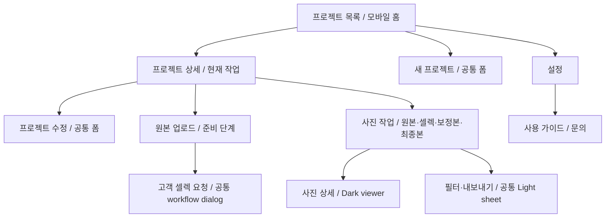

# 작가 모바일 재설계안 — 2026-09-09

> **설계 원안 / 구현 이력 연결.** 이후 모바일 구현 요청에 따라 반영했다. 아래는 설계 당시 원안이며 현재 코드와 검증 범위는 [구현 결과](mobile-design-implementation-2026-09-09.md)를 따른다. 실기기 검증을 의미하지 않는다.
> **정밀 검수 반영:** [M11–M17 및 증거](mobile-design-deep-audit-2026-09-09.md). 상태 계약과 구현 우선순위를 보완했다.
> 근거: [현재 화면 검수와 재현 기록](mobile-design-audit-2026-09-09.md).
> 시각 검토: [3개 핵심 화면 구조 시안](assets/mobile-audit-2026-09-09/proposal.svg). 샘플 데이터이며 완성된 pixel 시안이나 현재 서비스 화면이 아니다. [PNG 미리보기](assets/mobile-audit-2026-09-09/proposal.png)도 제공한다.

## 1. 설계 방향

모바일의 주 작업은 **프로젝트 찾기 → 현재 해야 할 일 확인 → 사진 확인/작업 → 고객에게 요청**으로 정리한다. PC와 같은 색·상태·업무 모델을 사용하고, 모바일에서는 정보량과 조작 배치를 다르게 구성한다.

프로젝트 목록을 홈으로 유지한다. 별도 Dashboard·bottom navigation은 추가하지 않는다. 사진의 원본 확인·비교는 Dark viewer, 목록·폼·설정·작업 시트는 Light를 사용한다. 고객 UI palette와 화면 구조는 별도 `customer-design.md`의 경계를 유지한다.

## 2. 탐색과 화면 구조

이 그림은 **제안하는 화면 탐색**이다. 기존 프로젝트 상태에 따른 tab 표시·action 허용·업로드 route 보호는 그대로 적용한다. 도움말 진입점과 depth header 변경은 아직 구현하지 않았다.

### Header 계약 — proposal

| 상황 | 표시 | 소유자/재사용 |
|---|---|---|
| 목록 홈 | A-CUT + 설정, 아래 프로젝트 제목·검색 | `MobileHeader` + `PhotographerMobilePageHeader` |
| 일반 상세/폼/설정 | 뒤로 + 화면명/프로젝트명 + 필요한 overflow | 같은 header의 명시적 mode; 로컬 새 header를 페이지마다 만들지 않음 |
| 사진 작업 | 뒤로 + 프로젝트명(상세 링크), 고객명 보조 → file tabs | `MobileHeader`의 project context와 `ProjectAssetWorkspaceHeader` |
| immersive | 프로젝트 식별을 최소 한 줄 유지, tab 유지, 도구만 접기 | 기존 scroll hook을 재사용하고 안정화/방향 조건 유지 |
| modal/sheet | 제목 + 닫기, 배경 header 조작 차단 | 공통 dialog 기반 |

목표는 **한 화면에 제목을 한 번 표시하고 프로젝트 식별을 잃지 않는 것**이다. 모바일 depth header와 page intro가 같은 제목을 반복하면 intro를 접는다. 현행 Header 56/44px 두 상태를 우선 활용한다. 작업 화면 맥락을 추가하면서 고정 영역을 무조건 여러 줄로 늘리지 않는다.

## 3. 화면별 재설계

### A. 프로젝트 목록

- 상단: 프로젝트 제목 + 작은 사용량 정보. 73px UsageRing의 공간 부담은 한도 경고가 필요한 경우의 compact usage 표현으로 줄이는 안을 권장한다. 기존 quota 계산을 재사용한다.
- 검색: 48px input, 이름을 명시. 별도 ‘필터’ 44px 이상 버튼에 이름·expanded 상태·적용 수를 제공한다.
- 일상 조회: 전체/내 작업/고객 대기/완료를 짧은 가로 control로 제안한다. 상태 계산은 기존 actor helper 기반. 화면 크기가 좁으면 wrap 또는 가로 스크롤을 명확히 제공한다. ‘내 작업’과 진행중의 의미를 같게 처리하지 않는다.
- 카드: 64px 내외 thumbnail + 2줄 프로젝트명 + 고객명. 그 아래 ‘작가 · 보정 진행’처럼 actor/현재 단계를 한 줄로 표시한다. ID는 고객명보다 낮은 위계, 기한은 날짜와 현재 기한 초과만 강조한다.
- 큰 tint 장식과 상태 안의 중첩 card를 줄인다. 상세의 6단계 모델과 같은 상태를 쓰되 모든 카드에 단계별 이름을 반복하지 않는다.
- 제목/thumbnail 영역은 하나의 의미 있는 상세 링크로, 필요한 다음 행동은 독립된 버튼으로 구성한다. 전체 card를 button으로 만들고 그 안에 다른 button을 중첩하지 않는다.
- 대기/완료는 설명으로 표시한다. 완료 결과를 열 수 있으면 ‘결과 보기’ Neutral action, 해야 할 일이 없다고 disabled CTA를 만들지 않는다.
- 새 프로젝트 FAB는 기존 52px을 재사용한다. 리스트 마지막 행을 가리지 않도록 하단 여백 확보. 빈 목록에서는 onboarding의 단일 생성 CTA를 사용한다.

### B. 프로젝트 상세

순서: **프로젝트명/고객 → 현재 단계 요약 → 현재 작업/단일 Primary → 프로젝트 정보 → 고객 링크**.

현재 모바일은 작업 패널을 이미 정보 위에 배치한다. 이 순서는 유지한다. Expanded Stepper의 실제 6단계를 재사용하고 해당되지 않는 재보정 단계는 기존 모델대로 표시한다. 단계 수를 5개로 다시 계산하지 않는다.

정보 카드의 변경은 더보기에서 수정/삭제로 진입한다. 파괴 action은 현재 확인창을 재사용한다. 고객 링크는 주소/암호/복사를 제공하되 full URL보다 공유에 필요한 정보에 집중한다. PIN 노출 기본값·copy 동작·권한을 디자인을 이유로 바꾸지 않는다.

### C. 생성·수정 폼

- 현재 공통 2개 section(`기본 정보 / 고객 갤러리 설정`) 구성과 field 순서를 유지한다. 최초 proposal의 3개 표기는 실제 Create/Edit 호출부 기준으로 정정했다. 새 wizard·중간 저장·필드 생략 기능을 도입하지 않는다.
- input은 현행 16px / 최소 48px, section은 16px radius, section body 16px inset 유지.
- label, hint, error는 `ProjectFormField`와 control wrapper가 소유. helper 숨김 때문에 핵심 조건이 사라지면 `hint` 또는 설명 trigger로 제공한다.
- 하단: Secondary ‘나중에 올리기’ 또는 ‘취소’ + Primary ‘원본 올리기’ 또는 ‘저장’. 같은 행 48px 높이, 가능하면 Primary가 더 넓은 공간을 사용한다.
- invalid 제출 시 첫 오류 field로 이동하고 label+error를 읽을 수 있게 한다(현재 오류 연결은 구현되어 있지만 첫 오류 focus는 별도 acceptance 항목).
- 짧은 화면/keyboard에서는 입력 field와 오류가 보이는 것을 우선한다. 고정 하단 bar가 keyboard 위에 붙는지 숨겨지는지는 실제 기기에서 검증 후 확정한다. CSS `100dvh`만으로 해결됐다고 간주하지 않는다.

### D. 원본 업로드·사진 선택 관리

- ‘원본 업로드’ 문맥과 사진 수, Secondary ‘사진 추가’, 명시적 ‘선택’을 제공한다.
- 원본 3열 grid와 가상화는 유지. filename 식별이 필요하면 현재 공통 list view로 전환한다.
- 길게 누르기는 선택 모드의 단축 진입. 별도 ‘선택’으로도 동일 상태에 진입할 수 있어야 한다.
- 선택 모드: 상단 ‘N장 선택 / 전체 선택 / 취소’, 하단 ‘선택한 N장 삭제’. 일반 toolbar의 ‘전체삭제’는 관리 영역으로 이동한다. 확인/잠금/삭제 API 보호는 기존 그대로 사용한다.
- 업로드 단계: 빈 상태 / 준비 / 압축·전송 / 일부 실패 / 완료를 구분한다. 전체 페이지에 여러 progress 표시를 복제하지 않고 작업 영역의 요약과 action bar 한 곳에서 다음 행동을 설명한다.
- 이미지 처리 pipeline·동시성·재시도 정책은 이 디자인 변경 범위가 아니다.

### E. 원본·셀렉·보정본·최종본 자산

공통 순서: **프로젝트 header → file tabs → 44px toolbar → gallery/list → 필요한 action bar**.

| 탭 | 유지/제안 |
|---|---|
| 원본 | 3열 탐색 + list 전환. 유사컷은 보조 도구, 검색·정렬은 공통 sheet |
| 셀렉 | 2열 thumbnail과 코멘트. 선택 결과 확인 후 보정으로 이동하는 action만 하단 |
| 보정본 | 작업용 list를 기본으로 하는 안 권장. 각 행 filename 전용 줄, 원본→보정본, 업로드 상태. grid toggle은 유지 |
| 최종본 | 납품 결과 이미지/파일명과 다운로드. Neutral 완료 summary, 다음 작업 없는 disabled Primary 제거 |

보정본 목록에서는 44px 이상 원본 열기, filename을 눌러 전체 확인, 실제 업로드된/남은 수를 보존한다. ‘파일을 놓기’ 대신 ‘파일 선택 즉시 업로드’처럼 기기에 맞는 문구를 사용한다. 공통 `UploadVersionsPanel`은 현재 모바일에서도 V1 업로드0장의 첫 진입에 자동 노출된다. 별도 모바일 업로드 로직을 복제하지 않고 기존 shell을 반응형으로 보완한다. 닫은 후 다시 여는 일괄 업로드 action을 명시하며 다중 선택/메모리/매칭 화면을 검증한다.

하단 검토 요청이 disabled라면 `0/3장 · 3장 업로드 후 요청할 수 있어요`처럼 현재 도메인 조건에서 나온 이유를 함께 표시한다. 조건은 페이지가 계산하고 action bar는 표시만 담당한다. 공간 때문에 실패 메시지나 제한을 무조건 숨기지 않는다.

### F. 설정·도움말

프로필 / 알림 / 도움말 / 계정 순으로 정리한다. 기존 공통 form을 유지하고 알림 switch row의 label까지 터치 영역으로 포함한다. 계정 삭제는 낮은 위계의 마지막 영역에 둔다.

도움말에 사용 가이드·문의 진입점을 제공한다. 기존 Manual 내용과 Feedback API를 재사용한다. 모바일 가이드를 허용하려면 현재 redirect와 메뉴를 함께 수정해야 하므로 단순 링크 추가로 완료 처리하지 않는다. 문의창은 Light dialog, 오류 입력 유지·pending 잠금·성공 안내를 기존 계약으로 연결한다.

## 4. 공통 규격 — 모두 proposal

다음은 외부 표준 인증이나 기존 구현값의 단정이 아니라 이 제품의 제안 기준이다. 구현 시 선언 위치와 실제 computed value를 함께 문서화한다.

| 항목 | 제안 | 구현 소유 위치 |
|---|---|---|
| Palette | 현행 photographer Light tokens; actor Orange/Teal, completed Neutral | `PhotographerLightTheme.module.css`; 별도 모바일 palette 금지 |
| 콘텐츠 inset | 운영 화면 20px, form/card body 16px, photo workspace 12px | 기존 `--mobile-page-gutter`, 공통 frame/gallery 규격 |
| Type | page title 20/28 Bold, project title 최대 2줄, section 16/24, body14/20, input16px, filename12/18 | `PhotographerMobilePageHeader`, Form/Asset slot |
| 주요 action | 높이 48px, 14/20 Semibold 또는 Bold, 8px radius | `PhotographerLightButton`의 명시적 모바일 규격 확장 |
| 보조/icon action | hit area 최소 44×44px; glyph18~22px | 공통 button/toolbar; 시각 switch와 hit area 분리 |
| Card/sheet | card16px radius, sheet 상단16px radius; card 안의 장식 card 최소화 | 기존 section/card/sheet 소비자 |
| Footer | 48px action + 위아래12px + safe-area; 추가 설명은 실측 높이에 포함 | `PhotographerFormActionBar` / alias |
| Fixed spacer | footer 실제 높이를 반영; 상태 설명 줄 수까지 포함 | 공통 ActionBar; 페이지별 고정 68px 복제 금지 |
| Sheet | 최대 viewport-safe-area 범위, header/닫기 유지, content 스크롤, 배경 전체 차단 | `ProjectAssetMobileSheet` + 공통 modal 동작 |
| Focus/pending | title/name, 초기 focus, Tab trap, 복귀, Escape, pending 잠금 | 기존 `useDialogAccessibility`, `PhotographerModal` |
| Motion | 기존 scroll threshold 활용, reduced-motion 존중 | 기존 scroll/header hook, 공통 CSS |

## 5. 재사용 책임과 변경 경계

| 기존 구현 | 유지할 책임 | 후속 개선 |
|---|---|---|
| `MobileHeader` / `PhotographerMobilePageHeader` | global/depth header, 정렬/텍스트 | 제목 중복·back·프로젝트 context 계약 정리 |
| `ProjectAssetWorkspaceHeader` / `ProjectAssetTabs` | 현재 프로젝트·탭/표시 가능 조건 | 초기 모바일 프로젝트 식별 보존 |
| `ProjectIdText` / `ProjectStepper` / actor helper | ID·상태·6단계 모델 | 목록도 같은 모델 소비, 상태 계산 중복 축소 |
| `ProjectFormFields` | label/control/hint/error, 선택 control | geometry 유지, first-error focus 연결 |
| `PhotographerLightButton` | variant·size·pending·focus | mobile 규격 한 곳에서 소유; size override 난립 방지 |
| `PhotographerFormActionBar` | footer layout/safe-area | reason slot, 실측 spacer, 주요 action 높이 |
| `ProjectAssetMobileSheet` | sheet shell/content slot | shared accessibility + portal/theme + stacking |
| `PhotographerPhotoGallery` / `PhotoThumbnailFrame` | 가상화·사진 경계 | 명시적 selection 진입, density 변경 시 row 계산 일치 |
| `UploadVersionsPanel` | 파일 매칭·업로드 업무 | 모바일 presentation 개선 시 업무 로직 재사용 |
| `FeedbackButton` | 문의 상태/전송 | 설정에 재사용, 모바일 Light dialog |

추가 컴포넌트는 실제 반복되는 presentation만 추출한다. 새 도메인 store·복제 API·사진 데이터 provider는 만들지 않는다. 기존 legacy 컴포넌트의 사용처 전환이 끝나기 전 삭제하지 않는다. 이번 단계의 결과로 ‘컴포넌트 수 감소’나 ‘재사용률 증가’ 수치를 주장하지 않는다.

## 6. 구현 순서와 완료 기준

| 단계 | 작업 묶음 | 완료 판정 |
|---|---|---|
| 1 — 대상/상태 정확성 | M11 long press, M01 상태 모델, M13 조회 실패, M14 원본 허용 정책 결정 | 한 번의 gesture는 의도한 사진만 선택; 오류/empty 구분; OFF와 실제 설정값 의미 일치. M14는 별도 동작 결정 후 구현 |
| 2 — 첫 진입/overlay/오류 | M12 업로드창, M02 sheet, M16 viewer, M15 form state | 320×568 body 확보, 모든 dialog의 배경 차단·focus·복귀, pending label/geometry 유지, 오류를 현재 화면에서 확인 가능 |
| 3 — 공통 규격/화면 composition | M03 header, M04 control/footer, M05–M09, M17 확대 과제 | 프로젝트 식별·48/44px·명시 선택·도움말, 긴 제목/파일명 식별, 0/N disabled 이유, 완료 Neutral; PC geometry 회귀 없음 |
| 4 — 실기기 검증/문서 | 실기기·상태 matrix, 현재 문서 갱신 | 아래 matrix를 통과한 범위만 implemented/verified로 승격 |

### 후속 acceptance matrix

| 축 | 확인할 내용 |
|---|---|
| 화면 폭 | 320/360/390/430, 767→768 경계, 1024/1440 PC 회귀 |
| 높이/브라우저 | 짧은 높이, iOS Safari·Android Chrome 주소창/키보드·safe-area, 가로 방향 |
| 콘텐츠 | 0/1/다수 프로젝트·사진, 한글/영문 긴 이름, 긴 파일명·큰 수치, 200% 글자 확대 |
| 상태 | preparing 0/일부/준비됨, selecting, editing, reviewing_v1/v2, editing_v2, delivered, quota 도달 |
| 폼 | label click, 오류 이동/읽기, disabled/pending, 저장 실패 입력 유지, PIN 4자리 |
| Sheet/modal | touch/keyboard/VoiceOver/TalkBack, Escape, 배경 불가, 복귀, 중첩/처리중 |
| 사진 | selection 진입/취소, 450ms long press·10px 이동 취소, scroll 상태 복원, pinch/swipe |
| 네트워크 | 지연·실패·재시도·다시 진입, 실제 전송/다운로드는 테스트 데이터로 검증 |
| 데이터 불변 | 디자인 변경이 상태 전이·권한·선택 결과·업로드/스토리지 규칙을 바꾸지 않음 |

현재 측정값과 기존 PC 개선을 baseline으로 보존한다. 구현 후 이 문서의 각 제안을 검증 결과와 연결하고, 통과한 항목만 `design-system-light.md`의 현재 계약으로 옮긴다.

## 7. 정밀 검수 후 상태별 화면 계약 — proposal

[오류·짧은 업로드창·생성 실패 상태 시안 PNG](assets/mobile-audit-2026-09-09/deep/state-proposal.png) / [SVG](assets/mobile-audit-2026-09-09/deep/state-proposal.svg). 각 320×568px 프레임의 구조 예시이며 미구현이다. 전체 폼의 모든 필드를 그린 시안은 아니다.

| 화면/상태 | 보여야 할 정보 | 허용 조작/동작 | 재사용 책임 |
|---|---|---|---|
| 목록 첫 로딩 | 조회 중임을 알리는 상태 | 중복 생성 유도 금지 | page state + 공통 loading |
| 목록 empty | 정상 조회 결과0개 + 첫 생성 안내 | 생성 CTA | 기존 onboarding |
| 목록 조회 실패 | 불러오기 실패와 재시도 | 다시 시도; 보유 데이터가 있으면 유지 | error state를 page가 소유 |
| 검색 결과0개 | 검색/필터 때문에0개임을 명시 | 조건 초기화 | 기존 filtered-empty |
| 폼 field error | label+해당 오류 | 첫 invalid input focus, 수정 즉시 검증 | Field/control wrapper |
| 폼 pending | ‘생성 중…/저장 중…’, 동일 버튼 폭/높이 | 중복 submit 차단, aria-busy/name 보존 | LightButton pending + page state |
| 폼 서버 실패 | 보이는 오류 요약, 입력 보존 | 재시도, 값 수정 | ActionBar reason/alert + page error |
| 첫 보정본 안내 | 대상/필요 파일/선택 즉시 처리 여부 | 파일 선택 또는 닫기 | 기존 UploadVersionsPanel |
| 보정본 안내 재진입 | 같은 기능의 명시 action | 일괄 업로드 다시 열기 | toolbar action slot |
| 보정본 미완료 | 업로드된/남은 수와 disabled 이유 | 파일 선택; 검토 요청 잠금 | 실제 업무 조건은 page 책임 |
| 선택 관리 | N장/현재 강조 사진/삭제 대상 동일 | 취소·전체 선택·선택 삭제 | gallery gesture + page selection |
| sheet/viewer | 현재 dialog의 제목/닫기 | 배경 불가, focus 이동/복귀, top dialog만 Escape | 공통 accessibility hook |

### Gesture 계약

- 하나의 long press가 선택하는 사진은 하나다. touchStart부터 합성 click 소비까지 같은 photoId를 기준으로 한다.
- 관리 모드 전환 중 leading cell 제거·가상화 row 재배치로 손가락 아래 사진이 바뀌어도 추가 선택이 발생하지 않는다.
- 10px 이상 이동·pointercancel·scroll은 press를 취소한다. 재진입 시 이전 gesture 상태가 남지 않는다.
- 실제 삭제는 현행 확인/잠금 절차를 유지하고, 검증은 테스트 사진과 확인창의 대상 일치까지 수행한다.

### 짧은 화면/큰 글자 계약

- modal header/body/footer를 각각 측정한다. 버튼 min-width 합계 때문에 설명을 한 글자씩 세로로 줄바꿈시키지 않는다.
- 모바일 footer는 설명 → action의 수직 조합을 기본으로 하고, body를 스크롤할 수 있어야 한다. role=status/alert를 접근 가능한 위치에 유지한다.
- PIN·label·switch는 좁은 폭/큰 글자에서 여러 행을 허용한다. 전체 화면 overflow:hidden으로 control을 감추는 해결책은 허용하지 않는다.
- 측정은 요청 viewport/visual viewport/innerWidth/scrollWidth/내부 control 경계를 함께 기록한다. 모바일이 자동 축소해 넘침을 숨긴 상태를 통과로 세지 않는다.

### 확정 전 제품 결정

M14는 ‘원본 허용’과 ‘바로 업로드’의 의미를 분리하는 안을 권장한다. 현재 강제 ON을 유지한다면 값 변경을 사용자에게 명시해야 한다. 어느 쪽도 이번 문서 작성으로 제품 동작이 바뀐 것은 아니다. M12 자동 안내는 읽을 수 있는 모바일 shell을 먼저 확보하고, 노출 유지 여부와 재진입 action을 함께 결정한다.
